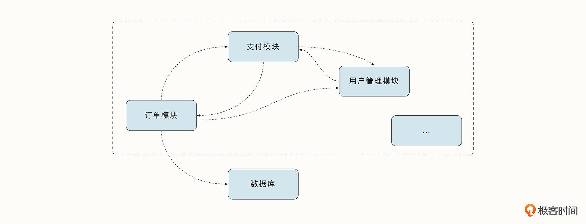
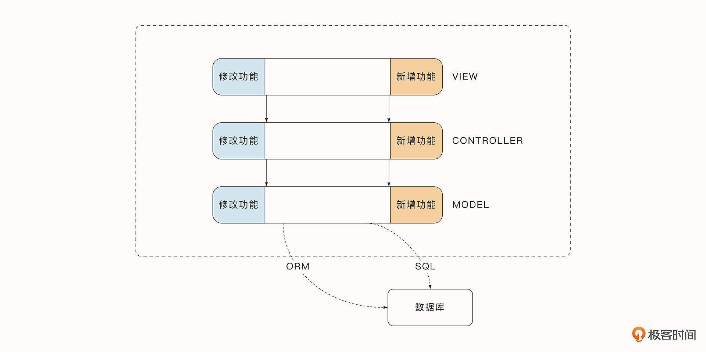
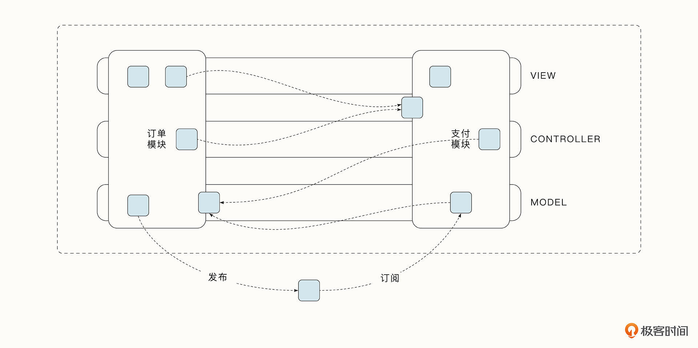
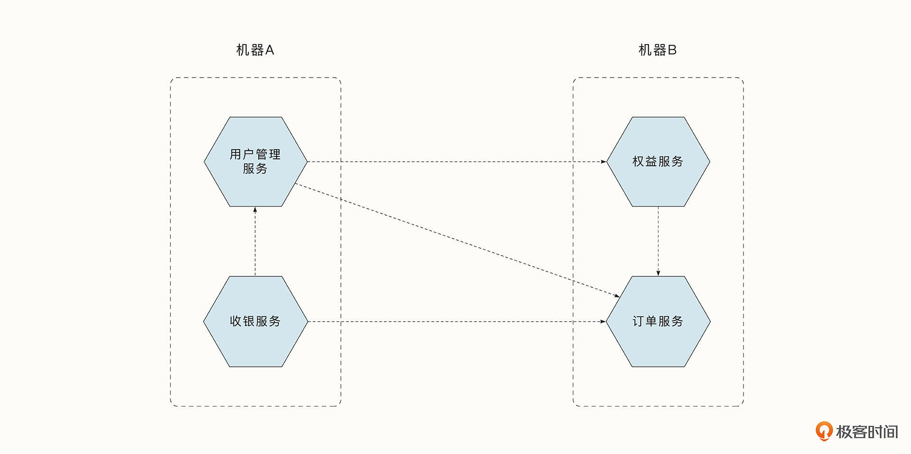
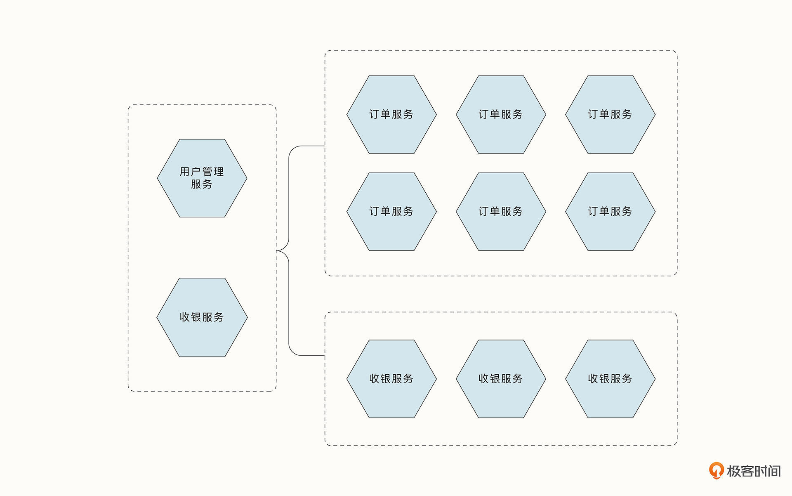
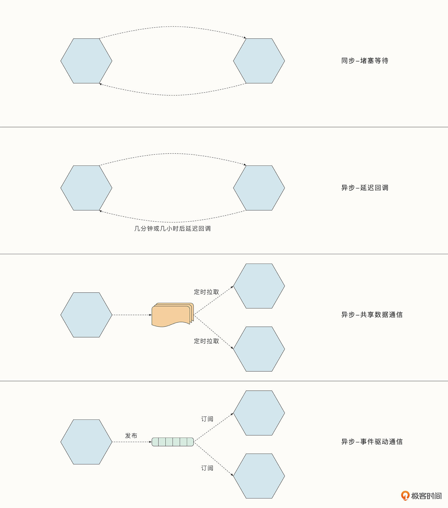
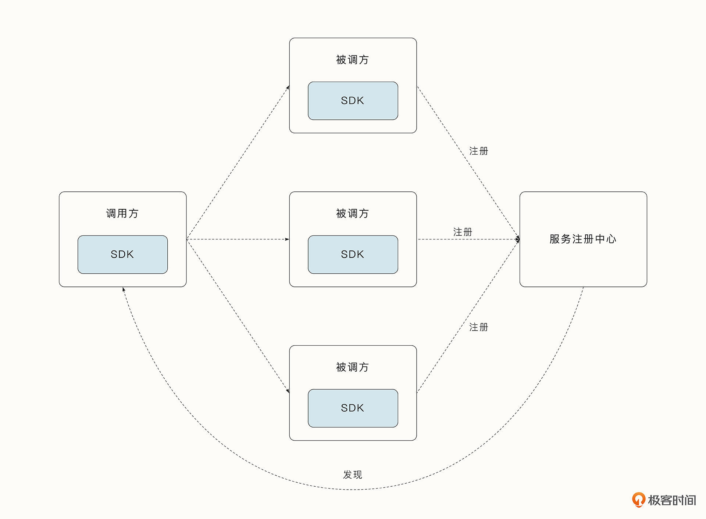

# 10｜微服务设计：微服务架构与演进
你好，我是郑建勋。

这节课我们来介绍一个重要的系统架构：微服务。

**微服务**（Microservices）是一种软件架构风格。它以职责单一、细粒度的小型功能模块为基础，并将这些小型功能模块组合成一个复杂的大型系统。

软件开发在短短十余年发生了深刻的变革，以 Docker 为代表的容器技术比传统的虚拟机更轻量，消耗的系统资源更少。同时，通过 Dockefile 等配置文件，我们不仅可以定义服务构建规则、启动参数等，还能够定义服务所需的环境依赖。我们也可以保证一个容器重建后可以和之前的容器有相同的环境和行为。这极大地降低了开发以及服务部署、运维的成本，让部署更多的原子服务成为了可能。

当前的大型互联网公司，业务规模和流量日渐增长，整个服务集群规模也越来越大，但是服务却拆分得越来越细。所以这节课，我们就来拆解一下，在构建微服务架构的过程中，我们面临的挑战以及需要具备的技术，让你对于微服务架构有更深入的理解。

## 单体服务 VS 微服务

企业的系统架构通常是由业务驱动的，小企业或新的产品线在业务刚刚起步阶段，代码少、功能也简单，这时我们一般会把所有功能打包到同一个服务中，使用单体服务具有较高的开发效率。

但是，系统的架构也需要与时俱进。随着访问量逐渐变大、业务模式越来越复杂，相似的功能开始组建起一个模块，模块与模块之间需要相互调用。

除了按照功能划分模块，我们也可以按照逻辑对模块进行划分。例如，比较经典的分层设计模式是在桌面程序和Web服务中使用广泛的MVC架构。MVC将架构分为了视图层（View）、控制层（Controller）和模型（Model）层。

分层的架构能够提供统一的开发模式，开发者容易理解。同时，模块间的解耦导致了关注点分离，避免了因为业务和开发人员越来越多导致的混乱。此外，上层和业务功能相关的代码一般更容易发生变动，而偏技术的底层代码（如操作数据库）改动较小，这使得底层代码更容易复用。

业务进一步复杂之后，分层架构的模式也逐渐带来了弊病。由于使用分层架构意味着添加或更改业务功能几乎会涉及到所有层级，这样一来，要修改单个功能就变得非常麻烦了。我们分的层级越多，这个问题就越严重。

为了解决分层架构的问题，我们会选择在分层的基础上，按照业务功能做拆分，将各分层贯穿起来，这被称为垂直切片（Vertical slice），如下图。分离出模块还有一个附加的好处，那就是模块可以简单复用到其他的单体服务中。

模块与模块之间为了实现低耦合，需要定义明确的接口进行通信。接口应该具有稳定性，职责清晰，并且能够隐藏模块内部的实现细节。

接口可以采取多种不同的实现形式。同步的方式包括，调用另一个组件库中的公共函数（在Go中为首字母大写的方法或函数）；也可能是通过异步的方式，例如通过中间件发布与订阅，或者通过共享文件、数据库的方式进行通信。

上述的单体服务在项目初期能够提供比较高的开发效率。但随着业务复杂度进一步上升，系统的复杂度通常会呈指数型上升，主要原因有下面几个。

- **与最初设计偏离**

随着系统越来越大，参与的人员变得越来越多，由于每一个开发者都有自己的开发风格（有的喜欢在View层随意加入更多的逻辑，有的为了赶项目加入了临时的解决方案），久而久之，代码的逻辑分支变得越来越多，学习维护成本大大增加。

- **模块耦合**

低耦合的模块化设计失效，不仅模块内代码耦合，模块与模块之间的依赖关系也错综复杂。通常一处修改会有牵一发而动全身的效果，开发越来越容易犯错。如果你负责的是团队的核心业务，例如订单与收银，维护屎山代码常常会背负着比较大的精神压力。

- **团队管理、开发效率变低**

经典项目管理书籍《人月神话》中曾提到，简单地增加开发人员并不会缩短项目的开发周期，甚至可能起到负面作用。现在推崇的小团队开发模式一般由6-8个人组成，它可以保证团队之间高效协作。

与此同时，随着业务日益复杂化，如果众多团队挤在同一个单体服务中，甚至可能出现排队上线的情况，不利于敏捷开发。因此，当服务进一步膨胀时，我们通常就需要将服务拆分为职责单一、功能细粒度的微服务。微服务是方法而不是目标，只有当前架构无法实现我们的最终目标时，才有必要考虑迁移到微服务架构。

说了这么多，那微服务架构是如何解决上述问题的呢？这离不开微服务自身具备的特性。接下来，我们就来聊一聊微服务的优势，也看看使用微服务需要承担的代价。

## 微服务的优势

微服务主要有下面几个方面的优势。

- **技术异质性**

对于单体应用程序，如果我们想尝试一种新的编程语言、数据库或框架，或者是对技术进行升级，任何更改都可能影响整个系统，风险巨大。而使用了微服务架构之后，就可以在风险最低的微服务中使用这门技术，让团队更快地接纳和吸收新技术。

同时，不同团队也可以根据问题的特点使用相对应的技术。例如前端服务使用React，后端Web服务使用Go，模型训练服务使用C++。

- **稳健性**

如果使用微服务架构，系统的一个组件发生故障，只要该故障没有级联，你就可以隔离问题，确保系统的其余部分继续工作。但是在单体服务中，如果服务崩溃，一切都会停止工作。

- **更易扩容、更灵活**

当系统由于请求量上涨等因素导致承载能力不足时，我们还需要对服务进行扩容。单体服务由于服务内各模块都是聚合在一起的，扩容时也必须各模块同时进行扩容。然而每一个模块的需求和承载能力未必相同。例如订单服务会被系统中更多的功能调用，需要承担更多的流量。同时扩容就容易造成资源的浪费。而微服务架构则可以根据服务的承载能力对不同服务进行不同程度的扩容。

- **团队效率更高**

小团队往往更有效率。微服务架构能够更好地与我们的组织架构保持一致。

- **可组合性**

单一功能的服务之间，通过简单的排列组合很容易灵活地构建出另一个系统。这对于代码复用、系统重构、以及快速构建新的系统都有很大帮助。

然而，微服务并不是银弹，在享受微服务好处的同时，我们也遇到了新的难题。

## 微服务的缺点

微服务主要面临下面这些问题。

- **服务太多，难以开发调试**

当我们开发服务A的一个功能时，如果服务A调用了服务B，服务B调用了服务C，而我们的操作依赖于服务C返回的数据，那么就需要在本地将服务A、服务B、服务C都启动起来，并且还要想办法配置正确，让服务A能够正确调用本地的服务B，这个过程是非常繁琐的。

对于线上的服务，由于调用链太长，我们也很难快速定位出现问题的服务是哪一个。服务的测试和调试难度也相应地变大了。

- **延迟增加**

以前，我们只需要处理单个进程中共享的信息，现在则需要对信息进行序列化、传输和反序列化，这增加了处理时间。另外，如果服务器不能正确地处理大量的网络连接，也可能导致系统延迟恶化。

- **日志聚合与监控**

系统的日志分散在各处，检索和调试都将变得非常困难，因此，需要有新的手段能够将分布式的日志聚合起来。同时，我们对系统的监控也开始变得困难，亟需单独的工具和手段对分布式系统进行统一管理，帮助我们记录并识别当前系统面临的问题。

除了上面介绍的问题，微服务还面临着分布式系统具有的固有挑战：数据一致性、可用性、安全等问题。

在设计或者将业务迁移到微服务的过程中，还有一个重要的问题是微服务的边界在哪里。

## 微服务的边界

一般来说，我们设计微服务架构的目的是方便更高效地修改业务功能。在设计业务架构时，优先考虑的是业务功能的高内聚性，我们希望将相似的业务功能聚合在同一个微服务中，并由一个小团队进行开发维护。

与此同时呢，微服务的边界并不能用服务的代码量大小来衡量，因为不同语言的代码量大小都会有所不同。微服务应该是一个足够独立的模块，这样我们才能更容易对大量的微服务进行组合，构建起更大规模的系统。

因此，设计微服务边界时重要的原则就是高内聚、低耦合。

- 高内聚

对高内聚比较有表现力的描述是：“一起改变的代码，放置在一起”。将功能相关的代码聚合到一起，能够帮助我们在尽可能少的地方做修改。例如，把和用户权益相关的功能整合在一起，当我们需要频繁变更部署用户权益系统时，就不用改动也不用重新部署其他服务了。

- 低耦合

高内聚强调的是微服务内部的关系，而低耦合强调的是服务与服务之间的关系。在微服务架构中，服务与服务之间的关系应该是松散、低耦合的。什么样的情况可能出现服务紧密耦合呢？举个例子，如果我们要对权益系统进行修改，就必须同时修改上游和下游服务。

高内聚与低耦合是一体两面的，更好地实现内聚也将降低服务间的耦合度，而低耦合同样也取决于服务与服务之间的沟通模式。对外提供的API应该更可能少，隐藏内部的实现细节，同时API提供向后兼容的能力。其他服务不需要知道当前服务内部实现的细节，将当前服务当做一个黑盒。这种服务关注点的分离，能够让我们驾驭更大规模的程序。

## 微服务的通信

当我们定义了服务的边界，完成了服务的拆分，另一个重要的问题就是如何将服务组合起来，实现更大的系统了，这涉及到服务之间的通信。

**微服务之间的通信从大的方向来看分为了两种，一种是同步通信，一种是异步通信。**

同步的方式堵塞等待服务器的返回，例如，在数据库上运行 SQL 查询，或者向下游 API 发出 HTTP 请求。这是一种最简单直接的方式。这种情况如果下游响应缓慢，或者高峰期处理不过来，会反过来影响上游服务的耗时。

**另一些情况下，我们需要使用异步通信，异步通信可以通过回调、事件驱动和数据共享的方式实现。** 例如，一些数据分析操作需要执行非常长的时间才会有结果，这时我们可以让下游服务简单地返回，等结果出来之后再以回调的方式通知上游。

**异步请求的另一种方式是事件驱动的通信。** 相较于上游服务主动通知下游服务，事件驱动的通信将处理数据的责任交给了下游服务。举一个例子，服务A检测到用户异常登陆之后，可以往消息中间件中发送消息。但是，上游服务不需要知道下游哪一个服务需要这条消息。这条消息可能会被服务B消费，用于给用户发送邮件和短信提示；也可能被风控部门获取，用于分析异常用户的行为。这样，服务间的关系就变得更加松散解耦了。

**最后一种比较特殊的异步通信是借助共享的数据库或者文件进行通信。** 例如，我们可以有一个数据推送服务A，将运营在页面修改后的数据推送到各台机器的指定位置，而服务B会定时地检查当前配置文件是否发生了变更，如果发生了变更就将新的配置加载到内存中。再比如，数据库也可以进行通信，甚至进行分布式的协调。这种借助共享数据的通信是一种简单直接的方式。

不过，由于下游一般采取轮询的方式检查变更，这种方式很难在对延迟要求比较低的场景使用。还有一点需要注意，那就是公共数据可能会让服务耦合，如果公共数据结构发生变化，通常下游服务也需要进行相应的调整。

另外，微服务通信时还涉及到通信协议和消息中间件的选型，例如同步协议应该使用HTTP、GRPC还是Thrift协议，消息中间件应该选择Kafka、RabbitMQ、还是Pulsar，甚至包括了序列化数据的方式应该选择JSON还是Protobuf。在后面的项目课程中我们将会详细分析。

## 服务发现与负载均衡

传统的应用程序，其依赖的下游服务的网络位置通常是固定的，网络地址可以直接配置在服务的配置文件中。但是，微服务架构中，服务众多，服务可以动态地进行扩容与销毁，服务的地址也是动态分配的。因此，我们需要有更灵活的服务发现机制，以便知道当前环境中运行着哪些服务。

服务发现通常包含了两个部分，第一部分涉及服务的注册，即在服务启动时告诉服务注册中心：“我在这里！”，并通过定时的心跳连接保持服务的存活状态。第二部分为服务的发现，调用者通过服务注册中心获取服务的可用节点列表。

在实践中，有多种服务发现的形式，最基本的两种形式为 **服务端发现模式与客户端发现模式**。

服务端发现模式在调用方与被调用方之间额外增加了代理网关层，代理网关接到请求后，从服务注册中心获取指定服务可用的节点列表，并且根据相应的负载均衡策略选择一个最终的节点进行访问。开源的HAproxy、Nginx等负载均衡器产品都可以作为代理模式的网关服务。

服务端发现模式的优点是服务调用方不用关注发现的细节，服务和监控等策略可以统一在代理网关进行。但是服务端发现模式的缺点是网络中多了一层，部署相对复杂，并且本身容易变成新的单点故障和性能瓶颈。

K8s 的Service资源实现服务发现本质上就是一种服务端的服务发现模式，但是它实现的方式却有很大不同。Service会生成一个虚拟的IP，通过修改iptables规则的方式，将虚拟的IP转发到指定Pod的地址中，实现服务发现与负载均衡的功能。在课程后期，我们还会详细介绍K8s相关的知识。

另一种服务发现模式为客户端发现模式。和服务端发现模式不同的是，客户端发现模式能够直接从服务注册中心获取可用的节点列表，并可以监听服务节点注册的变化。调用方集成的SDK能够根据一定的负载均衡策略选定一个最终的服务节点。

那这两种服务发现模式，选哪种更好呢？其实，根据实际的场景，我们可以选择不同的服务发现模式和对应的负载均衡策略。有些大型互联网公司可能会同时使用两种模式，并把它们混合起来。例如，服务调用方利用SDK从服务注册中心获得的是虚拟IP（ **virtual IP address**  ， **VIP**），然后借助LVS、Nginx等技术完成负载均衡。典型的服务注册中心etcd、ZooKeeper、Consul我们还会在后面的课程详细介绍。

## 总结

好了，这节课就讲到这里。

微服务是一种软件架构风格，它将相同功能的代码聚合起来形成一个服务，而不同功能的服务之间有同步和异步两种通信方式。由于服务通常可以动态地扩容、收缩和销毁，因此需要动态地获取服务的IP，我们一般是通过服务注册中心来完成IP地址的注册与发现的。

随着业务规模日益上涨、业务模式日益复杂化，微服务开始成为解决系统复杂度、保持系统扩展性、稳健性的架构选择。但是微服务不是银弹，当我们在享受微服务好处的时候，也不可避免地需要解决一些新的挑战，这些挑战包括了延迟增加、难以调试和分布式日志的聚合。下节课，我们还将会看到微服务遇到的具体挑战与解决之道。

## 课后题

最后，我也给你留两道思考题。

1. 结合你当前负责的系统，考虑一下它是否适合使用微服务的架构设计，为什么？
2. 你了解Service Mesh吗，它是为了解决微服务遇到的什么挑战而存在的？

欢迎你在留言区与我交流讨论，我们下节课再见！