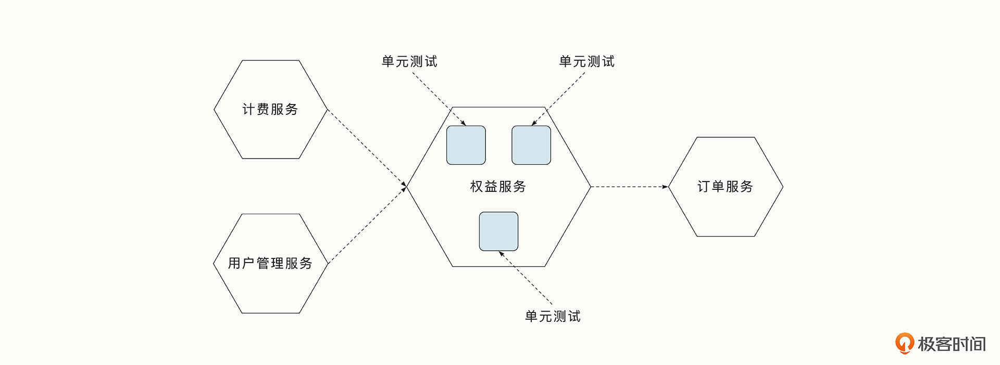
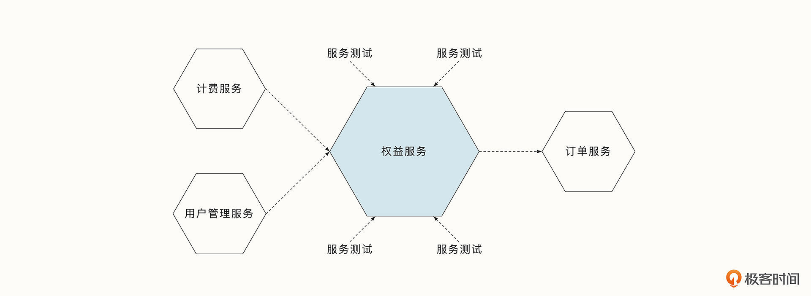
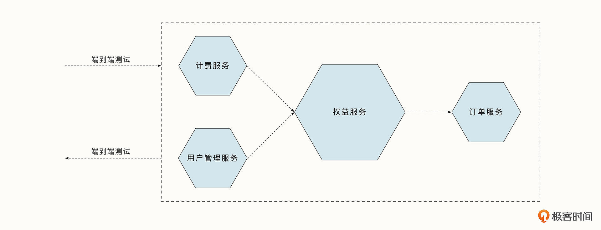
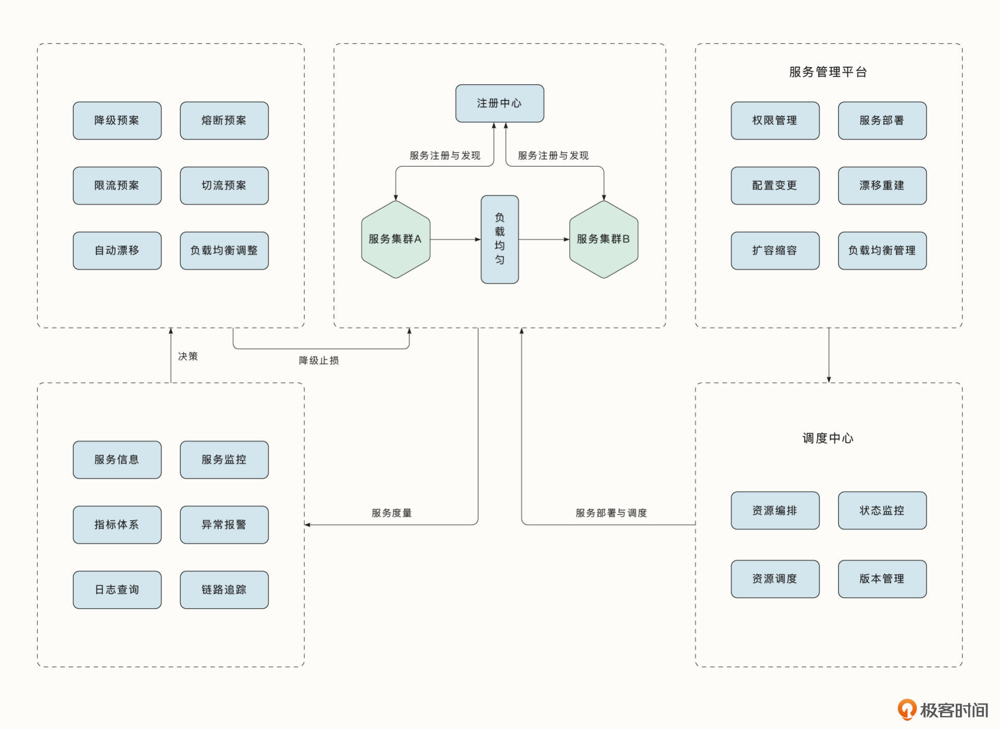

# 11｜微服务挑战：微服务治理体系与实践
你好，我是郑建勋。

上一节课，我们通过服务架构的演进过程，讲解了微服务的边界、拆分的原则以及服务间的通信。微服务架构是解决大型系统复杂性的一种选择，构建微服务本身并不是目的，我们的选择需要为我们的目标服务。

在构建微服务的过程中，不可避免地会遇到一些新的挑战。例如，分散服务的指标如何变得可观测？数据如何保证一致性？系统出现的问题如何降级止损？新的问题需要新的思维、新的手段来解决，这就要提到服务治理了。

这节课，我们就来分析一下微服务遇到的挑战，一起来看看应对这些挑战的最佳实践，了解复杂微服务架构的运作模式。

## 分布式日志与监控

在微服务架构中，由于大量的服务分散在各处，我们面临的第一个挑战就是要集中收集系统产生的日志等信息，这些信息通常是进一步完成监控、分析的基础。

目前业内通用的做法是借助一个agent服务（典型的工具有Flume、Filebeat、Logstash、Scribe），监听并增量采集日志数据到消息中间件，下游计算引擎会实时处理数据，并把数据存储到对应的数据库做进一步处理。典型的日志采集与监控链路如下所示：

日志数据写入到MQ之后，下游流式处理引擎会按照预定的处理规则对数据进行清洗、统计，还可以对错误日志进行告警。经过最终处理的数据会存储到相应的数据库中。

一般业内比较常见的做法是将清洗后的日志数据存储到 Elaticsearch 中，Elaticsearch的优势是开源、可扩展、支持倒排索引、全文本搜索，检索效率高，结合Kibana还可以对数据进行可视化处理。但是由于线上日志通常是海量的，数据在Elaticsearch中通常无法保存太久，所以我们也会有一些低成本、更持久的日志落盘方案，例如使用Hbase、ClickHouse等数据库。

而对于一些分析汇总类的数据，如果结构良好并且总量比较确定，可以选择关系型数据库MySQL、PostgreSQL来存储。

针对这些数据，我们能够更进一步地进行离线的数据分析和统计，也可以基于它建立业务指标体系的监控。如，对于打车业务，如果遇到天价账单这种异常的监控数据，我们可以同比与环比当前打车数量、特殊费用，确认是不是真的存在问题。

指标体系如果利用得好，可以有效识别系统的异常，像上线导致的系统 Bug 就能够很快在指标体系中反映出来。再配合异常事件的告警，可以将大事故降为小事故，把小事故扼杀在摇篮中。

## 分布式Metric与监控

除了分布式的日志聚合，通常我们还需要聚合起服务的其他信息，包括：

- 容器与宿主机系统资源利用率（包括CPU利用率、CPU用户态使用率、CPU内核态使用率、内存利用率、内存占用量、磁盘利用率、磁盘读写吞吐、磁盘读写次数、进程端口监控、线程数量、进程数量、网卡出入带宽等 ）；
- 服务自身错误率（包括自身核心接口错误率、下游接口错误率、基础服务错误率）；
- 服务延迟（接口平均与P99延迟、下游平均与P99耗时）；
- 服务请求量（当前接口请求量、下游接口请求量）；
- 服务运行时指标（例如对Go语言，可以上报服务的协程数量、线程数量、垃圾回收时间等重要指标）；
- 业务指标（服务内特定事件监控，例如配置参数异常等）。

采集到的信息会通过恰当的频率，或在遇到特定事件时上报到监控服务。这些数据最终会存储到时序数据库中，并由监控平台提供可视化能力。好的可视化会提供按照不同维度查看数据的能力，例如选择不同的机器，使用求和、均值、最大值、最小值等聚合方式。环比、同比可以选择不同的时间维度（例如分钟级别、小时级别、天级别、月度级别）。指标数据还可以通过标识不同的tag快速筛选不同种类的数据。

有一些指标的出现说明存在异常事件，例如当Go程序panic时我们会收到相关信息。对于其他一些信息，例如接口调用量、CPU利用率等，我们不仅希望能够监控当前时刻的指标，还希望能够查看这些指标的变化趋势。这些监控信息不仅能够反映当前系统和服务的运行状态，及时判断是否需要扩容等操作，还能够有效地检测出系统运行的变化和错误，快速发现线上问题，保障业务稳定运行。

例如，当我们发现调用下游核心系统的错误率大于了5%时，就应该立即启动一级报警策略，通过群报警、短信和电话的方式通知责任人。一些做得好的告警信息还会推荐止损办法，例如服务降级的手段，或者是下游负责人的联系方式等。

## 分布式追踪

前面两部分解决的是信息聚合问题，而微服务架构面临的另一个挑战是，需要及时感知到服务与服务的调用关系，进行调用链的跟踪。

在复杂的微服务架构中，一个开发团队通常只需要维护自己的服务，对整体的系统不甚了解。但用户的一个请求常常会跨越多个服务。如果当前的请求出现了问题，怎么快速定位到相关的服务呢? 怎么快速了解当前环境下接口调用链路是否正常运行？怎么定位到当前的调用链路中耗时最多的位置，从而找到性能瓶颈？解决这些问题就是分布式链路追踪的目的。

相对于只提供一个特殊的用于标识指定请求的 traceID，分布式追踪的方案提供了更多的链路信息，更直观的调用关系，甚至链路的可视化。

分布式跟踪有一个重要的概念: span。span表示调用链路中的单个操作，单个服务中可能有多个span，追踪重要函数的调用时就是这样。span中可以存储多个信息，在OpenTracing API中，每个span除了存储开始时间、结束时间，还可以存储额外的信息，例如客户 ID、订单 ID、主机名等。

每一个span中还保存了当前调用链唯一的traceID，当前span的ID、以及父span的ID。当 **函数调用或跨服务传递时，服务会传递span的这些上下文信息，以便跟踪span之间的调用链关系。** 如下图左侧是服务调用链构成的一个有向无环图，有些分布式追踪组件可以通过瀑布图的形式显示出在调用链中每个span的耗时，如下图右侧看到的，这种可视化的手段能直观地反应调用链的耗时情况。

当前有一些优秀的分布式追踪组件，以开源的 **Jaeger** 为代表。

## 微服务测试

上面我们介绍的分布式日志收集、分布式Metric以及分布式追踪都是为了实现运行中的微服务集群的可观测性。但由于微服务非常依赖下游服务返回的结果，所以在开发和测试阶段，我们也会面临诸多挑战。

**我们可以将微服务测试分为单元测试、服务测试和端到端测试三种。**

单元测试是在内部对于单一功能模块的测试，其测试速度快，测试范围小。对于单元测试中依赖外部组件的模块，例如数据库和外部服务，我们需要使用Mock等手段完成依赖注入。

就拿Go语言来说，我们常常利用接口的特性来实现依赖的注入。这要求代码在设计时就实现了核心功能的接口抽象，否则对于所有的依赖和功能混杂在一起的函数，是非常难进行单元测试的，我相信你也深有体会。

服务级别的测试指的是将单个微服务作为一个黑盒，测试服务的功能。服务级别测试覆盖的代码与功能范围比单元测试更大，如果我们测试的场景足够充分，就能保证大多数场景是符合预期的。但是由于服务级别的测试调用的链路更复杂，出现问题时也更难定位。如果我们模拟线上环境，真实调用数据库和下游服务，会导致该阶段测试的耗时更长。

端到端的测试要求对整个服务进行测试。例如对于一个打车服务，通常我们要模拟乘客与司机的行为，完整走一遍从乘客预估、司机接单、开始计费、行程中、结束计费等多个流程，并验证每个环节中的交互和数据准确性。端到端测试会覆盖更多的服务和代码，并让我们对发布的产品更加有信心。但是可以想象，端到端测试比服务级别的测试耗时更久，测试出问题后，也更难定位。

因为三种测试方法各有利弊，所以在真正测试服务时，绝不是范围越大越好。如果我们都使用更上层的用例来保证服务的质量，那么随着时间的推移，开发效率将变得越来越低。要始终记住，我们的目标是用更小的测试来覆盖更多的功能。一般单元测试的用例最多，服务级别的测试用例次之，端到端的测试用例最少。

## 微服务降级

好了，刚才我们讲解了微服务可观测性与微服务测试的内容。它们可以帮助我们了解当前系统的运行状态，快速发现和定位系统的问题，然后基于数据完成的指标体系和数据分析帮助我们做出科学的决策。

但发现问题只是解决问题的一小步。通常，一个服务复现故障后，这种故障会传导到上游服务。我们需要有效地对系统进行自动或手动的控制，保证服务处于正常的状态、将损失降低到最小。为了实现这个目标，我们可以采用降级、限流、熔断、切流等手段。

- **降级**

降级是服务的一种自我保护机制，它指的是对一些服务和页面有策略地不处理，或者只进行简单的处理，以此释放服务器资源，保证核心业务正常高效运行。举两个例子。

在电商的秒杀场景中，为了应对海量请求，我们可以暂时禁用用户显示页面上一些不关键的模块（例如广告），或者用预置的内容代替它，减轻服务器的压力。

在打车服务中，为了应对海量的流量，保证服务可用，我们可以短期内不调用用户的权益系统。虽然这样可能无法正确计算用户的优惠券和权益，但是能够保证用户正常的出行。

对于核心服务，我们需要梳理服务的核心依赖，知道哪些是必不可少的，哪些依赖和功能是可以降级但不影响主流程的。

除了手动地开关降级，我们还可以系统地实现自动降级。例如，核心服务比较依赖Redis，那么我们就可以借助一些第三方库自动检测一段时间内Redis的错误率与超时率，一旦超过一定的阈值，就不再访问原来的Redis，而是将数据降级到内存、文件或者是另一个临时的缓存组件中。等服务恢复后，再自动切换回正常的模式。

- **限流**

限流能够在保证自身服务正常运行的情况下，最大限度地对外提供服务。在保护自身的同时，也能保护下游。此外，在服务出现异常故障时，限流手段也能屏蔽大量的上游流量，让服务尽快恢复。

- **熔断**

熔断类似于断路器，当熔断组件发现依赖服务异常时，会禁止访问依赖服务，防止依赖服务拖垮自身。熔断可以内置在RPC框架中，可以实现自动和手动熔断的能力。可以使用一些开源组件来实现服务的熔断，例如 [Sentinel](https://github.com/alibaba/Sentinel) 是阿里开源的一套微服务降级的 SDK，目前支持 Java、Go 语言。

- **切流**

切流是保证服务高可用、异地多活的一种方式。例如当某个集群出现故障时，将流量切换到另一个正常的集群上，保证服务仍然能够正常运行。

## 微服务总体架构

上面我们看到了微服务带来的一些新的挑战和解决的工具，这些能力与工具聚合在一起，形成了一个大型的生态系统。如下图是典型的大型微服务架构，我们可以完整地看到复杂的微服务架构是如何工作的。

- 服务管理平台负责接受用户的请求。用户可以在这里发布上线单，点击集群的部署，还可以实现服务的漂移、扩容、权限管理等操作。
- 用户发布一个服务部署请求后，需要有专门的控制中心来完成用户服务的监控和调度。例如，我们所熟悉的 K8s 编排工具就能够维护服务的状态，保持服务状态与用户声明的配置一致。
- 在集群中，多个微服务之间通过注册中心实现服务发现和相互之间的通信。还会有负载均衡工具（例如LVS与Nginx）与策略将流量均衡打到下游机器中。
- 针对服务与系统中各种重要维度的数据，以及业务的各项指标的变化，监控平台都能够监控、分析，并将问题告警出来。
- 当服务出现异常时，能够通过各项监控大盘和服务链路定位到问题的根因，并采取相应的预案快速回滚、降级、止损。

## 总结

微服务不是银弹、新的架构选择带来了新的挑战，例如服务可观测性的挑战、微服务的开发与测试的挑战、服务数据的一致性挑战，服务故障导致的故障传导等挑战。解决这些问题需要新的方法论与工具，所以我们有了分布式的日志收集、分布式Metric以及分布式的调用链追踪。

在测试中，我们要尽量在单元测试阶段保证服务的质量，在发现问题时能够有降级的预案，通过降级、限流、熔断、切流等机制保证服务的隔离性和最小的故障损失，努力构建起一整套微服务架构生态。

虽然在现实中，我们关注的问题都只是这个复杂生态中的一亩三分地，但了解整个体系架构有助于我们更好地服务业务、维护服务的稳定性，而稳定性是大型互联网公司的命脉。如果你正在搭建微服务架构，或想更深入了解一下微服务架构的细节，也可以读一读《微服务治理：体系、架构与实践》这本书。

## 课后题

最后，我也给你留一道思考题。

在观察服务耗时的时候，你觉得服务的P50、P95和P99指标分别起到了什么作用？

欢迎你在留言区与我交流讨论，我们下节课再见！