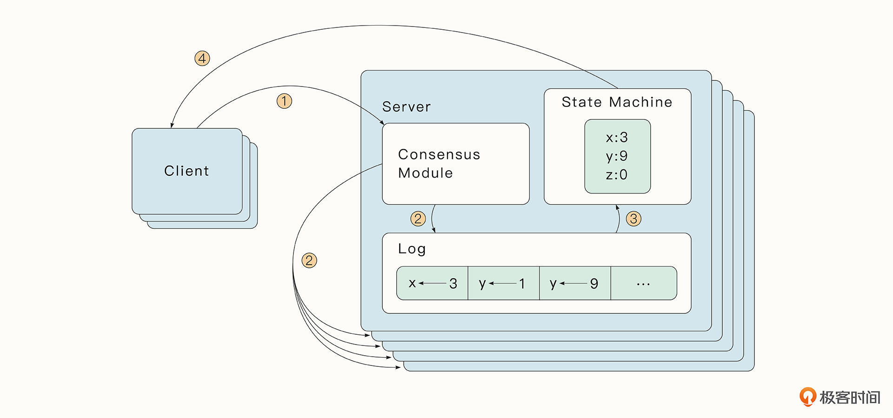
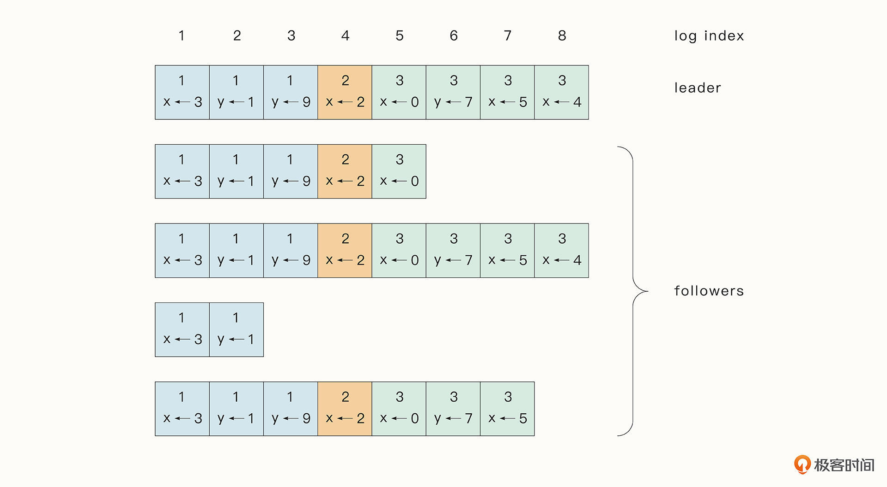
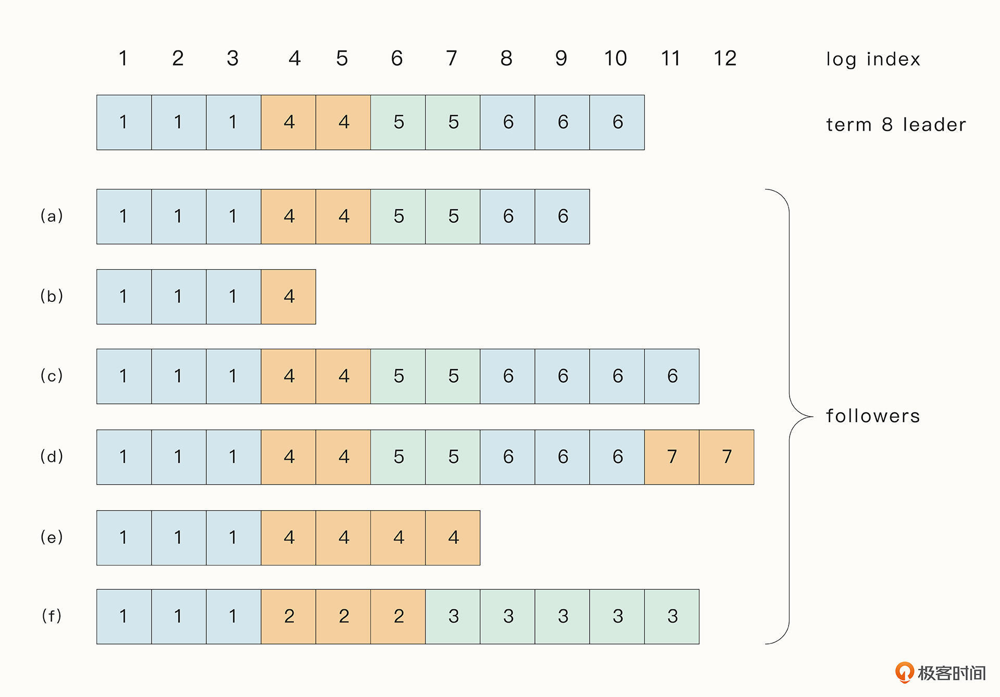
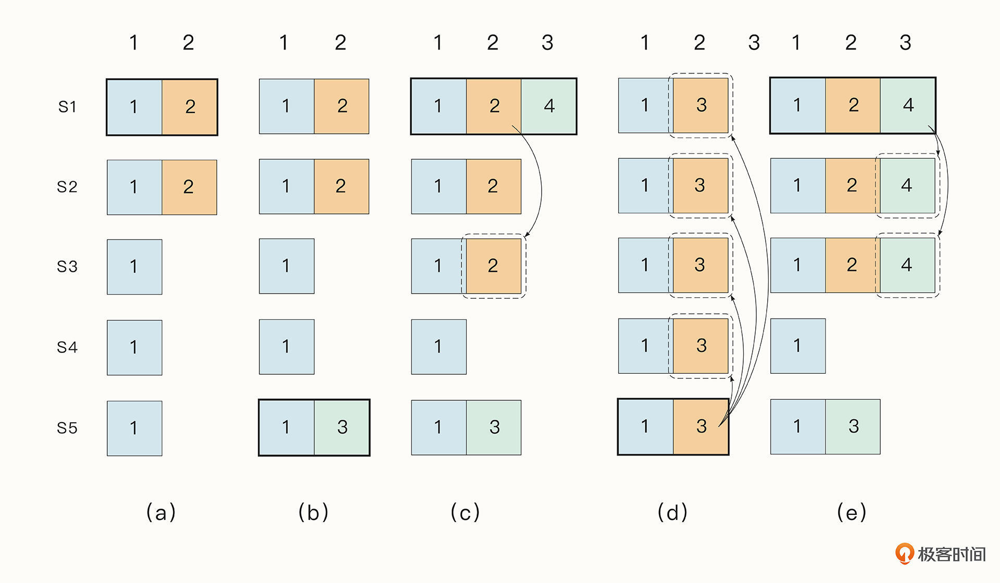

# 13｜智慧之火：详解分布式容错共识算法
你好，我是郑建勋。

上节课，我们说分布式系统总是需要在可用性和数据一致性之间找到平衡，也就是既要确保当少部分节点发生故障时，程序仍然能够正确且正常地运行，又要保证分布式节点之间对某一事件达成共识。其实这并不是一件容易的事情，好在许多容错共识算法为我们提供了经过检验的解决方案。

可用性衡量了系统面对网络延迟、网络分区、系统故障时的容错能力。显然，如果我们遇到了极端的事件，例如地球毁灭了，我们是无法保证系统可用的。因此，大多数容错共识算法都会有一个前提，也就是至少需要大部分节点是正常的，这样系统才可以正常运行。

此外，大多数容错共识算法还有第二个前提，就像我在上节课提到的，不考虑节点中可能混入了攻击者，这样才能保证系统不会出现拜占庭问题。

而要保证数据一致性，当前比较有名的算法是：Paxos、Raft和Zab。我将其称为分布式容错共识算法，容错代表了在异常情况下仍然具有可用性和正确性，而共识代表的是数据的一致性，它意味着即便是在并发、异常等情况下也能达成共识。

Raft在现代分布式系统中有着重要的地位，K8s和课程中用到的etcd组件底层都采用了Raft算法。这节课，我就以Raft算法为例讲解容错共识算法是如何实现数据的一致性与可用性的。

我们先从与Raft密切相关的Paxos算法开始讲起。

## Paxos算法

Paxos算法是历史比较悠久的容错共识算法，他由Lamport在20世纪80年代末期提出。

Paxos算法中的节点分为了3个角色。

- 提议者（proposer）：负责提出一个值。
- 接收者（acceptor）：负责选择一个值。
- 学习者（learner）： 负责学习被选中的值。

简单来说，Paxos算法可分为如下几个过程：

- 提议者选择一个提议编号n，并把prepare请求发送给大多数接收者；
- 接收者回复一个大于等于n的提议编号；
- 提议者收到回复，并记录这些回复中最大的提议编号，然后将被选中的值和这个最大的提议编号作为一个accept请求，发送给对应的接收者；
- 如果一个接收者收到一个编号为n的accept请求，那么除非它已经回复了一个编号比n大的prepare请求，否则它会接受这个提议；
- 当接收者接受一个提议后，它会通知所有的learner这个提议，最终所有的节点都会就一个节点的提议达成一致。

Paxos算法的核心思想是，通过让proposer与大多数acceptor提前进行一次交流，让proposer感知到当前提出的值是否可能被大多数acceptor接收。如果不能被接收，proposer可以改变策略之后（例如增加提议编号，或接收某一个proposer已经提出的值）再继续进行协调，最终让大多数接收者就某一个值达成共识。Paxos通过一个提议编码保证了后面被接收的值一定是编号更大的值，从而实现了写操作的线性一致性。

不过，Paxos算法虽然描述起来非常简单，但是要完全理解它的原理却比较难。并且，Paxos算法的官方描述中缺少对实现细节的诸多定义，导致实践中可以有多种灵活的实现方式。如果你对这个复杂的算法感兴趣的话，可以看看《分布式系统与一致性》这本书的第十章。

## Raft算法

总的来说，Paxos理解起来还是比较困难，在工程上也比较难以实现，所以不太常用，Raft算法就是在这一背景下诞生的。Raft算法简单、容易理解、容易实现，已经成为现代多数分布式系统（例如etcd、TiDB）采用的算法。

Raft算法实现了一种复制状态机。每个分布式的状态机中存储了一份包含命令序列的日志文件，这些文件通过复制的形式传播到其他节点中。每个日志包含相同的命令，并且顺序也相同。状态机会按顺序执行这些命令并产生相同的状态，最终所有的状态机都将达到一个确定的最终状态。

在Raft算法中，每一个节点会维护一份复制日志（Replicated Log），复制日志中存储了按顺序排列的条目（Entry），用户执行的每一个操作都会生成日志中的一个条目，稍后这个条目会通过节点之间的交流复制到所有节点上。

如果一个条目是被大多数节点认可的，那么这种条目被称为Committed Entry，这也是节点唯一会执行的条目类型。各个节点只要按顺序执行复制日志中的Committed Entry，最终就会到达相同的状态。这样，即便节点崩溃后苏醒，也可以快速恢复到和其他节点相同的状态。

总结一下Raft算法的核心思想就是，保证每个节点具有相同的复制日志，进而保证所有节点的最终状态是一致的。

### 基本原理

Raft中的节点有3种状态，领导者（Leader），候选人（Candidate）和跟随者（Follower）。

其中，Leader是大多数的节点选举产生的，并且节点的状态可以随着时间发生变化。某个Leader节点在领导的这段时期被称为任期（Term）。新的Term是从选举Leader时开始增加的，每次Candidate节点开始新的选举，Term都会加1。

如果Candidate选举成为了Leader，意味着它成为了这个Term后续时间的Leader。每一个节点会存储当前的Term，如果某一个节点当前的Term小于其他节点，那么节点会更新自己的Term为已知的最大Term。如果一个Candidate发现自己当前的Term过时了，它会立即变为Follower。

一般情况下（网络分区除外）在一个时刻只会存在一个Leader，其余的节点都是Follower。Leader会处理所有的客户端写请求（如果是客户端写请求到Follower，也会被转发到Leader处理），将操作作为一个Entry追加到复制日志中，并把日志复制到所有节点上。而Candidate则是节点选举时的过渡状态，用于自身拉票选举Leader。

Raft节点之间通过RPC（Remote Prcedure Cal，远程过程调用）来进行通信。Raft论文中指定了两种方法用于节点的通信，其中，RequestVote 方法由Candidate在选举时使用，AppendEntries则是Leader复制log到其他节点时使用，同时也可以用于心跳检测。RPC 方法可以是并发的，且支持失败重试。

Raft算法可以分为三个部分：选举、日志复制和异常处理。下面我们分阶段介绍一下。

### **选举与任期**

在Raft中有一套心跳检测，只要Follower收到来自Leader或者Candidate的信息，它就会保持Follower的状态。但是如果Follower一段时间内没有收到RPC请求（例如可能是Leader挂了），新一轮选举的机会就来了。这时Follower会将当前Term加1并过渡到Candidate状态。它会给自己投票，并发送RequestVote RPC请求给其他的节点进行拉票。

Candidate的状态会持续，直到下面的三种情况发生。

- 如果这个Candidate节点获得了大部分节点的支持，赢得选举变为了Leader。一旦它变为Leader，这个新的Leader节点就会向其他节点发送 AppendEntries RPC， 确认自己Leader的地位，终止选举。
- 如果其他节点成为了Leader。它会收到其他节点的AppendEntries RPC。如果发现其他节点的当前Term比自己的大，则会变为Follower状态。
- 如果有许多节点同时变为了Candidate，则可能会出现一段时间内没有节点能够选举成功的情况，这会导致选举超时。

为了快速解决并修复这第三种情况，Raft规定了每一个Candidate在选举前会重置一个随机的选举超时（Election Timeout）时间，这个随机时间会在一个区间内（例如150-300ms）。

随机时间保证了在大部分情况下，有一个唯一的节点首先选举超时，它会在大部分节点选举超时前发送心跳检测，赢得选举。如果一个Leader在心跳检测中发现另一个节点有更高的Term，它会转变为Follower，否则将一直保持Leader状态。

### **日志复制（Log Replication）**

一个节点成为Leader之后，会开始接受来自客户端的请求。每一个客户端请求都包含一个节点的状态机将要执行的操作（Command）。Leader会将这个操作包装为一个Entry放入到log中，并通过AppendEntries RPC 发送给其他节点，要求其他节点把这个Entry添加到log中。

当Entry被复制到大多数节点之后，也就是被大部分的节点认可之后，这个Entry的状态就变为Committed。Raft算法会保证 Committed Entry 一定能够被所有节点的状态机执行。

一旦Follower通过RPC协议知道某一个Entry被commit了，Follower就可以按顺序执行log中的Committed Entry了。

如图所示，我们可以把log理解为Entry的集合。Entry中包含了Command命令（例如x←3），Entry所在的Term（方框里面的数字），以及每一个Entry的顺序编号（最上面标明的log index，顺序递增）。

但这里还有一个重要的问题，就是Raft节点在日志复制的过程中需要保证日志数据的一致性。要实现这一点，需要确认下面几个关键的属性：

- 如果不同节点的log中的Entry有相同的index和Term, 那么它们存储的一定是相同的Command；
- 如果不同节点的log中的Entry有相同的index和Term，那么这个Entry之前所有的Entry都是相同的。

接下来我们就来看看，Raft算法是怎么在不可靠的分布式环境中保证数据一致性的。

在实际生产过程中，Raft算法可能会因为分布式系统中遇到的难题（例如节点崩溃），出现多种数据不一致的情况。如下所示，a → f分别代表Follower的复制日志中可能遇到的情况，方框中的方格表示当前节点复制日志中每一个Entry对应的Term序号。

a → e的情况你可以想一想什么时候会发生，我在这里重点解释一下f这种情况，因为f看起来是最奇怪的。

f这种情况可能是这样的：f是Term 2的Leader, 它添加Entry到log中之后，Entry还没有复制到其他节点，也就是说，还没等到commit就崩溃了。但是它快速恢复之后又变为了Term 3 的Leader， 再次添加Entry到log之后，没有commit又崩溃了。当f再次苏醒时，世界已然发生了巨变。

所以我们可以看到，在正常的情况下，Raft可以满足上面的两个属性，但是异常情况下，这种情况就可能被打破，出现数据不一致的情况。为了让数据保持最终一致，Raft算法会强制要求Follower的复制日志和Leader的复制日志一致，这样一来，Leader就必须要维护一个Entry index了。在这个Entry index之后的都是和Follower不相同的Entry，在这个Entry之前的都是和Follower一致的Entry。

Leader会为每一个Follower维护一份next index数组，里面标志了将要发送给Follower的下一个Entry的序号。最后，Follower会删除掉所有不同的Entry，并保留和Leader一致的复制日志，这一过程都会通过AppendEntries RPC 执行完毕。

不过，仅仅通过上面的措施还不足以保证数据的一致性。想想下图这个例子：

从这张图可以看出，一个已经被Committed的Entry是有可能被覆盖掉的。例如在a阶段，节点s1成为了Leader，Entry 2还没有成为Committed。在b阶段，s1崩溃，s5成为了Leader ，添加Entry到自己的log中，但是仍然没有commit。在c阶段，s5崩溃，s1成为了Leader，而且在这个过程中Entry 2成为了Committed Entry。接着在d阶段s1崩溃，s5成为了Leader，它会将本已commit的Entry 2给覆盖掉。但我们真正想期望的是e这种情况。

怎么解决这个问题呢？Raft使用了一种简单的方法。Raft为Leader添加了下面几个限制：

- 要成为Leader必须要包含过去所有的Committed Entry；
- Candidate要想成为Leader，必须要经过大部分Follower节点的同意。而当Entry成为Committed Entry时，表明该Entry其实已经存在于大部分节点中了，所以这个Committed Entry 会出现在至少一个Follower节点中。因此我们可以证明，当前Follower节点中，至少有一个节点是包含了上一个Leader节点的所有Committed Entry的。Raft算法规定，只有当一个Follower节点的复制日志是最新的（如果复制日志的Term最大，则其日志最新，如果Term相同，那么越长的复制日志越新），它才可能成为Leader。

## 总结

在分布式系统中，让大多数节点就某一事件达成一致并不是一件容易的事情，因为会存在网络延迟，节点崩溃等异常情况，而这就是分布式容错共识算法为我们解决的问题。这节课，我们看到了分布式容错共识算法Raft构建复制状态机的过程，看到了它保证数据一致性的方法和在故障情况下的容错能力。

在Raft算法中，写请求具有线性一致性，但是读请求由于Follower节点数据暂时的不一致，可能会读取到过时的数据。因此，Raft保证的是读数据的最终一致性，这是为了性能做的一种妥协。但我们可以在此基础上很容易地实现强一致性的读取，例如将读操作转发到Leader再读取数据。

在容错方面，Raft通过合理的Leader选择以及Leader与Follower之间强制的日志同步，在保证数据正确性的基础上，也能保证当前Leader崩溃、网络分区、网络延迟之后大部分节点仍然能够正常工作。

Raft在工程上实现起来是相对比较容易的。在Raft的论文中对算法的实现细节有详细的描述，感兴趣的话推荐你看看。如果你想实践一下如何把枯燥的论文变为现实，我推荐给你两份资料，一个是MIT的经典分布式课程6.824，他用实验的形式最后用Go语言实现了Raft算法，另外你还可以参考一下etcd对Raft的实现。

## 思考题

最后，还是给你留两道思考题。

1. 就像前面提到的，如果希望具有一致性读，一种手段是将读操作转发到Leader。但是当前的Leader并不一定是真正的Leader，例如，刚好网络分区导致Leader变更，这样的话，我们还是有可能读取到过时的数据。你知道怎么解决这类问题吗？
2. Raft节点出现网络分区的情况，由于一部分节点由于无法与Leader取得通信，会一直增加Term号。在网络恢复后，由于这些节点Term号更大，因此会变为Leader。 然而这种处理看起来并不太合理，你知道有什么办法可以解决这个问题吗？

欢迎你在留言区与我交流讨论，我们下节课见！