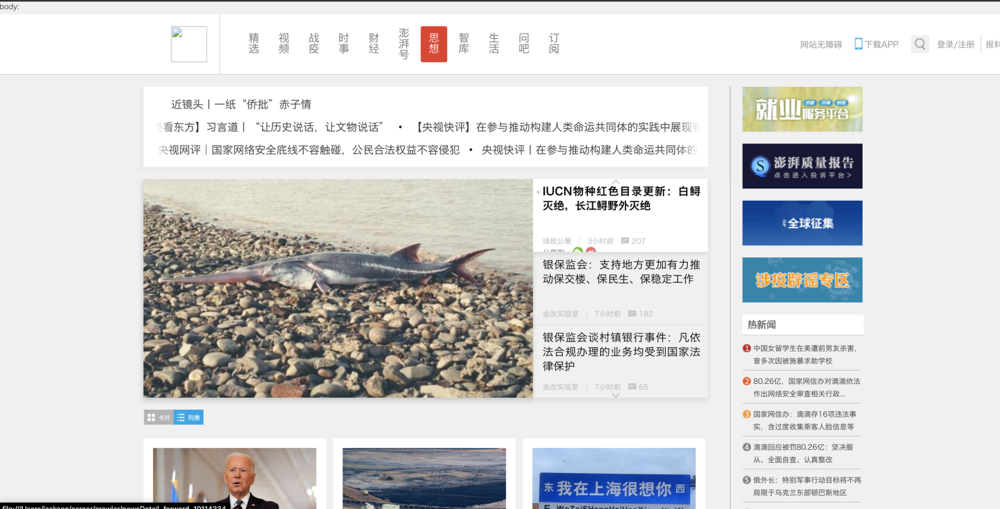

# 19｜从正则表达式到CSS选择器：4种网页文本处理手段
你好，我是郑建勋。

在上一节课程中，我们了解了Go Modules依赖管理的使用方法和原理，这有助于我们在后期管理项目的复杂依赖。我之所以提前介绍依赖管理，是因为新项目一开始一般就会通过go mod init初始化当前项目的module名。

我们之前也看到了如何在Go中通过简单的函数调用获取网页中的数据。然而单单获取服务器返回的文本数据是远远不够的，信息和知识就隐藏在这些杂乱的数据之中。因此，我们需要有比较强的文本解析能力，将有用的信息提取出来。这节课，我们就来看看如何通过Go标准库、正则表达式、XPath以及CSS选择器对复杂文本进行解析。

现在，让我们在任意位置新建一个文件：

```plain
>  mkdir crawler

```

再新建一个入口文件：

```plain
> cd crawler
> touch main.go

```

## **初始化Git仓库**

我先在GitHub上创建了一个Git仓库，名字叫crawler。接着，我在本地新建了一个README文件，并建立了本地仓库和远程仓库之间的关联（你需要将下面的仓库地址替换为自己的）：

```plain
echo "# crawler" >> README.md
git init
git add README.md
git commit -m "first commit"
git branch -M 'main'
git remote add origin git@github.com:dreamerjackson/crawler.git
git push -u origin 'main'

```

接下来，我们要初始化项目的go.mod文件，module名一般为远程Git仓库的名字：

```plain
go mod init  github.com/dreamerjackson/crawler

```

后续我会将项目的源码放置到 [GitHub](https://github.com/dreamerjackson/crawler) 中，欢迎你积极提交PR，大家一起进步。

下一步，我们创建一个 `.gitignore` 文件， `.gitignore` 文件的内容不会被Git追踪。当有一些编辑器的配置文件或其他文件不想提交到Git仓库时，可以将文件路径放入 `.gitignore` 文件。

```plain
echo .idea  >> .gitignore

```

## **抓取一个简单的网页**

假设我们希望获取一些最新的新闻资讯，但是我们却不可能时刻守在电脑旁刷新网页，这就是爬虫大显身手的地方了。我们以知名的 [澎湃新闻](https://www.thepaper.cn/) 为例，获取其首页的新闻内容。

一开始我选取澎湃新闻这个网站，是因为澎湃新闻的首页不需要登录，也没有严厉的反扒机制。这能够减轻你刚开始学习爬虫的心理负担，聚焦于这节课传授的知识。

获取新闻首页HTML文本的代码如下所示。

```plain
package main

import (
	"fmt"
	"io/ioutil"
	"net/http"
)

func main() {
	url := "https://www.thepaper.cn/"
	resp, err := http.Get(url)

	if err != nil {
		fmt.Println("fetch url error:%v", err)
		return
	}

	defer resp.Body.Close()

	if resp.StatusCode != http.StatusOK {
		fmt.Printf("Error status code:%v", resp.StatusCode)
	  return
	}

	body, err := ioutil.ReadAll(resp.Body)

	if err != nil {
		fmt.Println("read content failed:%v", err)
		return
	}

	fmt.Println("body:", string(body))
}

```

这段代码做了比较完备的错误检查。不管是http.Get访问网站报错、服务器返回的状态码不是200，还是读取返回的数据有误，都会打印错误到控制台，并立即返回。ioutil.ReadAll会读取返回数据的字节数组。然后将字节数组强转为字符串类型，最后输出结果。

在我们当前这个案例中，输出的文本是HTML格式的。HTML又被称为超文本标记语言。其中，超文本指的是包含具有指向其他文本链接的文本 。通过链接，单个网站内或网站之间就连接了起来。

标记指的是通过通常是成对出现的标签来标识文本的属性和结构。例如， `<h1>xxx</h1>` 标识元素的样式是一级标题， `<h2>xxx</h2>` 标识元素的样式是二级标题 。而 `` 标识当前元素是一张图片。其他的标签还有 `<title>, <body>, <header>, <footer>, <article>, <section>, <p>, <div>, <span> ` …

HTML定义了元素的含义和结构。不过随着CSS文件的出现，HTML在文本样式上的功能逐渐弱化了。标签和标签里的属性（例如 `<div class="news_li" id="cont19144401" >` ）一般是作为CSS选择器的钩子出现的。

我们在浏览器上看到的网页，其实是将HTML文件、CSS样式文件进行了渲染，同时，JavaScript文件还可以让网站完成一些动态的效果，例如实时的内容更新，交互式的内容等。

我们先通过Linux管道的方式将输出的文本保存到new.html文件中：

```plain
go run main.go > new.html

```

用浏览器打开之后会看到，当前的页面和真实的页面相比，还原度是比较高的。当然我们无法用这种方式100%还原网页，因为缺失了必要的文件，而且有一些数据是通过JavaScript动态获取的。



不过，就我们当下的目标而言，获取到的信息已经足够了。

在项目开发过程中，我会用Git在关键的地方打上tag，方便你之后查找当前的代码。上述代码位于v0.0.1分支中。

```plain
git commit -am "print resp"
git tag -a v0.0.1 -m "print resp"
git push origin v0.0.1

```

接下来让我们看看如何处理服务器返回的HTML文本。

## **strings**

Go语言提供了strings标准库用于字符处理函数。如下所示，在标准库strings包中，包含字符查找、分割、大小写转换、修剪（trim）、计算字符出现次数等数十个函数。

```plain
// 判断字符串s 是否包含substr 字符串
func Contains(s, substr string) bool
// 判断字符串s 是否包含chars 字符串中的任一字符
func ContainsAny(s, chars string) bool
// 判断字符串s 是否包含符文数r
func ContainsRune(s string, r rune) bool
// 将字符串s 以空白字符分割，返回一个切片
func Fields(s string) []string
// 将字符串s 以满足f(r)==true 的字符分割，返回一个切片
func FieldsFunc(s string, f func(rune) bool) []string
// 将字符串s 以sep 为分隔符进行分割，分割后字符末尾去掉sep
func Split(s, sep string) []string

```

在标准库strconv包中，还包含很多字符串与其他类型进行转换的函数：

```plain
// 字符串转换为十进制整数
func Atoi(s string) (int, error)
// 字符串转换为某一进制的整数，例如八进制、十六进制
func ParseInt(s string, base int, bitSize int) (i int64, err error)
// 整数转换为字符串
func Itoa(i int) string
// 某一进制的整数转换为字符串，例如八进制整数转换为字符串
func FormatInt(i int64, base int) string

```

让我们用strings包实战一下。

在HTML文本中，超链接一般放置在 `<a>` 标签中，因此，统计 `<a>` 标签的数量就能大致了解当前页面中链接的总数：

```plain
// tag v0.0.3
func main() {
	url := "https://www.thepaper.cn/"
	resp, err := http.Get(url)

	if err != nil {
		fmt.Println("fetch url error:%v", err)
		return
	}

	defer resp.Body.Close()

	if resp.StatusCode != http.StatusOK {
		fmt.Printf("Error status code:%v", resp.StatusCode)
	}

	body, err := ioutil.ReadAll(resp.Body)

	if err != nil {
		fmt.Println("read content failed:%v", err)
		return
	}

	numLinks := strings.Count(string(body), "<a")
	fmt.Printf("homepage has %d links!\n", numLinks)

}

```

运行上面这段代码，输出的结果显示有300余个链接。

```plain
homepage has 303 links!

```

strings包中另一个有用的函数是 `Contains`。如果你想了解当前首页是否存在疫情相关的新闻，可以使用下面这段代码：

```plain
	...
	exist := strings.Contains(string(body), "疫情")
	fmt.Printf("是否存在疫情:%v\n", exist)

```

我们知道，字符串的本质其实是字节数组，bytes标准库提供的API具有和strings库类似的功能，你可以直接查看 [标准库的文档](https://pkg.go.dev/bytes)。

```plain
func Compare(a, b []byte) int
func Contains(b, subslice []byte) bool
func Count(s, sep []byte) int
func Index(s, sep []byte) int
...

```

下面这段使用bytes标准库的代码和上面使用strings库的代码在功能上是等价的：

```plain
numLinks := bytes.Count(body, []byte("<a"))
fmt.Printf("homepage has %d links!\n", numLinks)

exist := bytes.Contains(body, []byte("疫情"))
fmt.Printf("是否存在疫情:%v\n", exist)

```

### 字符编码

服务器在网络中将HTML文本以二进制的形式传输到客户端。在之前的例子中，ioutil.ReadAll函数得到的结果是字节数组，我们将它强制转换为了人类可读的字符串。在Go语言中，字符串是默认通过UTF-8的形式编码的。

虽然目前大多数网站都使用UTF-8编码，但其实服务器发送过来的HTML文本可能拥有很多编码形式，例如ASCII、GB2312、UTF-8、UTF-16。一些国内的网站就会采用GB2312的编码方式。不过，如果编码的形式与解码的形式不同，可能会出现乱码的情况。


为了让请求网页的功能具备通用性，我们需要考虑编码问题。在这之前，我们要先将请求网页的功能用Fetch函数封装起来，用函数给一连串的复合操作定义一个名字，将其作为一个操作单元，实现代码的复用和功能抽象。要实现编码的通用性，我们使用官方处理字符集的库：

```plain
go get golang.org/x/net/html/charset
go get golang.org/x/text/encoding

```

Fetch函数的代码如下所示，其获取网页的内容，检测网页的字符编码并将文本统一转换为UTF-8格式。

```plain
// tag v0.0.4
func Fetch(url string) ([]byte, error) {

	resp, err := http.Get(url)

	if err != nil {
		panic(err)
	}

	defer resp.Body.Close()

	if resp.StatusCode != http.StatusOK {
		fmt.Printf("Error status code:%d", resp.StatusCode)
	}
	bodyReader := bufio.NewReader(resp.Body)
	e := DeterminEncoding(bodyReader)
	utf8Reader := transform.NewReader(bodyReader, e.NewDecoder())
	return ioutil.ReadAll(utf8Reader)
}

func DeterminEncoding(r *bufio.Reader) encoding.Encoding {

	bytes, err := r.Peek(1024)

	if err != nil {
		fmt.Println("fetch error:%v", err)
		return unicode.UTF8
	}

	e, _, _ := charset.DetermineEncoding(bytes, "")
	return e
}

```

在这里，我们单独封装了DeterminEncoding函数来检测并返回当前HTML文本的编码格式。如果返回的HTML文本小于1024字节，我们认为当前HTML文本有问题，直接返回默认的UTF-8编码就好了。DeterminEncoding中核心的charset.DetermineEncoding函数用于检测并返回对应HTML文本的编码。关于charset.DetermineEncoding函数检测字符编码的算法，感兴趣的同学可以查看 [这篇文章](https://html.spec.whatwg.org/multipage/parsing.html#determining-the-character-encoding)。

最后，transform.NewReader 用于将HTML文本从特定编码转换为UTF-8编码，从而方便后续的处理。

不过呢，strings、bytes标准库里对字符串的处理都是比较常规的，有时候我们需要对文本进行更复杂的处理。例如，想爬取一个图书网站不同图书对应的作者、出版社、页数、定价等信息，这些信息都包含在HTML特殊的标签结构中，并且不同书籍对应的这些信息都不太一样。

要实现这种灵活的功能，利用strings、bytes标准库都是很难做到的。这就要用到一个更强大的文本处理方法了：正则表达式。

## 正则表达式

**正则表达式是一种描述文本内容组成规律的表示方式，它可以描述或者匹配符合相应规则的字符串。** 在文本编辑器、命令行工具、高级程序语言中，正则表达式被广泛地用来校验数据的有效性、搜索或替换特定模式的字符串。

由于历史原因，正则表达式分为了两个流派，分别是 POSIX 流派和 PCRE 流派。其中，POSIX 流派有两个标准，分别是 BRE 标准和 ERE 标准。不同的流派和标准对应了不同的特性与工具，一些工具可能对标准做了相应的扩展。这就让一些没有系统学习过正则表达式的同学，对一些正则的使用和现象感到困惑了。

目前，Linux和Mac在原生集成GUN套件（例如grep命令）时，遵循了POSIX标准，并弱化了GNU BRE 和 GNU ERE之间的区别。

**GNU BRE 和 GNU ERE 的差别主要体现在一些语法字符是否需要转义上。** 如下所示，grep 属于GNU BRE标准，对于字符串"addf"，要想能够匹配字母d 重复1-3次的情形，需要对"{"进行转义：

```plain
> echo  "addf" | grep  'd\{1,3\}'

```

GNU ERE标准不需要对"{"进行转义。要使用GNU ERE标准，需要在 Linux 的 grep 中添加 -E 运行参数。

```plain
> echo  "addf" | grep -E 'd{1,3}'

```

另一种当前更加流行的流派或标准是PCRE。

PCRE标准是由perl这门语言衍生而来的，现阶段的大部分高级编程语言都使用了PCRE标准。在Go语言中，正则表达式标准库也是默认使用了PCRE标准，不过Go同时也支持POSIX标准。

要使用PCRE标准，可以在grep中添加-P 运行参数。如下所示。ERE标准不支持用 `\d` 表示数字，但是PCRE标准是支持的。

```plain
# 使用 ERE 标准
> echo  "11d23a" | grep -E '[[:digit:]]+'

# 使用 PCRE 标准
> echo  "11d23a" | grep -P '\d+'

```

除此之外，PCRE 标准还有一些强大的功能，你可以搜索“Perl regular expressions”或查看 [这篇文档](https://perldoc.perl.org/perlretut)。

在这里，让我们用正则表达式实战获取一下澎湃新闻首页卡片中的新闻。


我们在之前已经通过v0.0.1中的代码获取到了首页的内容。现在让我们来看一看HTML中这些卡片在结构上的共性。下面是我列出的两个卡片的内容，我省去了一些不必要的内容。

```plain
    <div class="news_li" id="cont19144401" contType="0">
        ...
        <h2>
            <a href="newsDetail_forward_19144401" id="clk19144401" target="_blank">在养老院停止探视的日子里，父亲不认识我了</a>
        </h2>
        ...
	</div>

    <div class="news_li" id="cont19145751" contType="0">
        ...
        <h2>
            <a href="newsDetail_forward_19145751" id="clk19145751" target="_blank">美国考虑向乌克兰提供战斗机，美参与俄乌冲突程度或将扩大</a>
        </h2>
        ...
	</div>

```

可以看到，文章的标题位于 `<a>` 标签中，可以跳转。外部包裹了 `<h2>` 标签以及属性class为news\_li的 `<div>` 标签。知道这些信息后，我们就可以用正则表达式来获取卡片新闻中的标题了：

```plain
// tag v0.0.5
var headerRe = regexp.MustCompile(`<div class="news_li"[\s\S]*?<h2>[\s\S]*?<a.*?target="_blank">([\s\S]*?)</a>`)

func main() {
	url := "https://www.thepaper.cn/"
	body, err := Fetch(url)

	if err != nil {
		fmt.Println("read content failed:%v", err)
		return
	}
	matches := headerRe.FindAllSubmatch(body, -1)
	for _, m := range matches {
		fmt.Println("fetch card news:", string(m[1]))
	}
}

```

借助 regexp 标准库，regexp.MustCompile函数会在编译时提前解析好PCRE标准的正则表达式内容，这可以在一定程度上加速程序的运行。headerRe.FindAllSubmatch 则可以查找满足正则表达式条件的所有字符串。

接下来让我们分析一下这串正则表达式：

```plain
<div class="news_li"[\s\S]*?<h2>[\s\S]*?<a.*?target="_blank">([\s\S]*?)</a>

```

在这个规则中，我们要找到以字符串 `<div class="news_li"` 开头，且内部包含 `<h2>` 和 `<a.*?target="_blank">` 的字符串。其中， `[\s\S]*?` 是这段表达式的精髓， `[\s\S]` 指代的是任意字符串。

有些同学可能会好奇，为什么不使用 `.` 通配符呢? 原因在于， `.` 通配符无法匹配换行符，而HTML文本中会经常出现换行符。 `*` 代表将前面任意字符匹配0次或者无数次。 `？` 代表非贪婪匹配，这意味着我们的正则表达式引擎只要找到第一次出现 `<h2>` 标签的地方，就认定匹配成功。如果不指定 `？`，贪婪匹配会一路查找，直到找到最后一个 `<h2>` 标签为止，这当然不是我们想要的结果。

在 `<a>` 标签中，我们加了一个括号 `()`，这是用来分组的，因为当我们用正则完整匹配到这一串字符串后，希望将括号中对应的字符串提取出来。

headerRe.FindAllSubmatch 是一个三维字节数组 `[][][]byte`。它的第一层包含的是所有满足正则条件的字符串。第二层对每一个满足条件的字符串做了分组。其中，数组的第0号元素是满足当前正则表达式的这一串完整的字符串。而第1号元素代表括号中特定的字符串，在我们这个例子中对应的是 `<a>` 标签括号中的文字，即新闻标题。第三层就是字符串实际对应的字节数组。

运行代码，会打印出首页卡片中所有的新闻（注意，新闻内容在随时变化）：

```plain
fetch card news: C919六架试飞机完成全部试飞任务，取证工作正式进入收官阶段
fetch card news: 上海高考本科各批次录取控制分数线公布，本科控分线400分
fetch card news: 甘肃一煤矿企业发生山体坍塌事故：已致3死13伤，1人失联
fetch card news: 澎湃八周年探索未停歇：2022外滩新媒体峰会汇聚融合发展新动能
fetch card news: 央广网评20家单位拒收现金被罚：货币数字化不等于摒弃现金
...

```

正则表达式虽然灵活强大，但是也不是没有成本的。正如一句老话说的那样：

> 如果你有一个问题，你想到可以用正则来解决，那么你就有两个问题了。

> Some people, when confronted with a problem, think “I know, I’ll use regular expressions.” Now they have two problems.

为了解决一个复杂的问题，我们其实引入了正则表达式这个同样复杂的工具。另外，由于回溯的原因，复杂的正则表达式可能会比较消耗CPU资源。幸运的是，由于HTML是结构化的数据，我们有了一些更好的解决办法。让我们更进一步，来看看更加高效地查找HTML中数据的方式： **XPath(XML Path Language.)。**

## Xpath

XPath 定义了一种遍历 XML 文档中节点层次结构，并返回匹配元素的灵活方法。而XML是一种可扩展标记语言，是表示结构化信息的一种规范。例如，微软办公软件Words在2007之后的版本的底层数据就是通过XML文件描述的。HTML虽然不是严格意义的XML，但是它的结构和XML类似。

Go标准库没有提供对XPath的支持，但是 [第三方库](https://github.com/antchfx/htmlquery) 提供了在HTML中通过XPath匹配XML节点的引擎。我们之前获取卡片新闻的代码可以用 [htmlquery](http://github.com/antchfx/htmlquery) 改写成下面的样子：

```plain
// tag v0.0.6
func main() {
	url := "https://www.thepaper.cn/"
	body, err := Fetch(url)

	if err != nil {
		fmt.Println("read content failed:%v", err)
		return
	}
	doc, err := htmlquery.Parse(bytes.NewReader(body))
	if err != nil {
		fmt.Println("htmlquery.Parse failed:%v", err)
	}
	nodes := htmlquery.Find(doc, `//div[@class="news_li"]/h2/a[@target="_blank"]`)

	for _, node := range nodes {
		fmt.Println("fetch card ", node.FirstChild.Data)
	}
}

```

其中，htmlquery.Parse用于解析HTML文本，htmlquery.Find则会通过XPath语法查找符合条件的节点。在这个例子中，XPath规则为：

```plain
//div[@class="news_li"]/h2/a[@target="_blank"]

```

这串规则代表查找target属性为\_blank的a标签，并且a节点的父节点为h2标签，h2标签的父节点为 class属性为news\_li的div标签。

和正则表达式相比，结构化查询语言XPath的语法更加简洁明了，检索字符串变得更容易了。但是XPath并不是专门为HTML设计的，接下来我们再介绍一下专门为HTML设计，使用更广泛，更简单的CSS选择器。

## CSS选择器

CSS（层叠式样式表）是一种定义HTML 文档中元素样式的语言。在 CSS 文件中，我们可以定义一个或多个HTML中的标签的路径，并指定这些标签的样式。在CSS中，定义标签路径的方法被称为CSS选择器。

CSS 选择器考虑到了我们在搜索 HTML 文档时常用的属性。我们前面在XPath例子的中使用的 div\[@class=“news\_li”\]，在CSS选择器中可以简单地表示为 div.news\_li。这是一种更加简单的表示方法。关于CSS选择器的语法可以查看 [这篇文章](https://developer.mozilla.org/zh-CN/docs/Web/CSS/CSS_Selectors)。

官方标准库中并不支持CSS选择器，我们在这里使用社区中知名的第三方库( `github.com/PuerkitoBio/goquery` )，获取卡片新闻的代码如下：

```plain
// tag v0.0.9
func main() {
	url := "https://www.thepaper.cn/"
	body, err := Fetch(url)

	if err != nil {
		fmt.Println("read content failed:%v", err)
		return
	}

	// 加载HTML文档
	doc, err := goquery.NewDocumentFromReader(bytes.NewReader(body))
	if err != nil {
		fmt.Println("read content failed:%v", err)
	}

	doc.Find("div.news_li h2 a[target=_blank]").Each(func(i int, s *goquery.Selection) {
		// 获取匹配标签中的文本
		title := s.Text()
		fmt.Printf("Review %d: %s\n", i, title)
	})
}

```

这里，goquery.NewDocumentFromReader 用于加载HTML文档，doc.Find可以根据CSS标签选择器的语法查找匹配的标签，并遍历打印出a标签中的文本。

## 总结

好了，这节课就讲到这里。

这节课，我们借助一个简单的新闻网站，讲解了如何应对网页的不同编码问题，我们还了解了HTML文本的多种处理方式。HTML文本的处理可以借助标准库的strings、strconv、bytes等库，也可以借助更通用更强大的正则表达式。

不过，由于正则表达式通常比较复杂而且性能低下，在实际运用过程中，我们一般采用XPath与CSS选择器进行结构化查询。比较这两种查询方法，会发现XPath是为XML文档设计的，而CSS选择器是为HTML文档专门设计的，更加简单，也更主流。我们在后面的课程中还将灵活使用各种技术来查找指定的字符串。

## 课后题

最后，我也给你留一道思考题。

在类似如下的日志文件中，包含了很多订单号的信息，即order\_id后面的一串数字。

```plain
2022-11-22  name=versionReport||order_id=3732978217343693673||trace_id=XXX
2022-11-22  name=versionReport||order_id=3732978217343693674||trace_id=XXX

```

我们可以用什么方式，将order\_id后面的订单ID都像下面这样打印出来？（提示：用grep就可以做到）

```plain
3732978217343693673
3732978217343693674

```

欢迎你在留言区与我交流讨论，我们下节课再见！