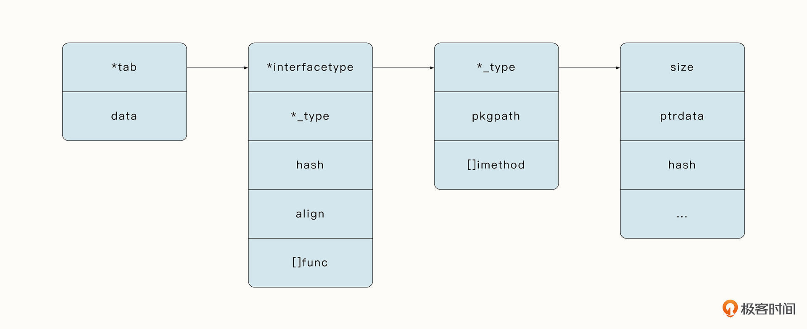

# 20｜面向组合：接口的使用场景与底层原理
你好，我是郑建勋。

在上一节课，我们讲解了文本处理技术。进行文本处理时，我们使用了函数的封装来完成过程的抽象，函数是一种复用代码、帮助我们构建大规模程序的利器。这节课，让我们来看一看另一种可以构建大规模程序的技术：接口。

## Go接口及其优势

在计算机科学中，接口是一种共享边界，计算机系统的各个独立组件可以在这个共享边界上交换信息。这些独立组件可能是软件、硬件、外围设备与人。在面向对象的编程语言中，接口指相互独立的两个对象之间的交流方式。接口有下面几个好处。

- 隐藏细节

接口可以对对象进行必要的抽象，外接设备只要满足相应标准（例如USB 协议），就可以和主设备对接；应用程序只要满足操作系统规定的系统调用方式，就可以使用操作系统提供的强大功能，而不必关注对方具体的实现细节。

- 解耦

通过接口，我们能够以模块化的方式构建起复杂、庞大的系统。将复杂的功能拆分成彼此独立的模块，不仅有助于我们更好地并行开发系统、提高系统开发效率，也能让我们在设计系统时以全局的视野看待整个系统。模块拆分还有助于我们快速排查、定位和解决问题。

- 权限控制

接口是系统与外界交流的唯一途径，例如Go语言对于垃圾回收只暴露了GOGC环境变量及 Runtime.GC API。USB 接口有标准的接口协议，如果外界不满足这种协议，就无法和指定的系统进行交流。所以，系统可以通过接口来控制接入方式和接入方的行为，降低安全风险。

## Go接口的设计理念

Java、C++这样面向对象的语言曾经为软件工程带来了一场深刻的革命。它们通过将事物抽象为对象和对象的行为，并通过继承等方式实现了对象之间的联系。相对于面向过程的编程，面向对象的编程进一步增强了对现实的解释力，也在构建大规模程序中大获成功。

Go 语言采用了一种不寻常的方法实现面向对象编程，这是因为 [Go语言的设计者](https://talks.golang.org/2012/splash.article) 认为，Java的继承带来了类型的层次结构，这让程序到了后期代码难以变动。这进一步导致了代码的脆弱性，开发者容易在前期过度设计。因此，在Go语言设计中没有基于类型的继承，取而代之的是用接口实现的扁平化、面向组合的设计模式。

在Go语言中，我们可以为任何自定义的类型添加方法，而不仅仅是对象（例如Java、C++中的class）。Go语言的接口是一种特殊的类型，是其他类型可以实现的方法签名的集合。只要类型实现了接口中的方法签名，就隐式地实现了该接口。这种隐式实现接口的方式又被叫做 duck typing。

> If it walks like duck, swims like a duck and quacks like a duck, it’s a duck.
>
> 如果它像鸭子一样走路，像鸭子一样游泳，像鸭子一样嘎嘎叫，那它就是鸭子。

这是一种非常有表现力的设计。我们接下来就一起看看怎么在程序中正确使用接口，接口又是如何帮助我们构建灵活、清晰、可维护的大规模程序的。

## 接口的最佳实践

下面我们从模块解耦和依赖注入这两个方面，来说明一下在Go中使用接口的好处。

### **模块解耦**

我们经常会使用一些在GitHub上开源的数据库来完成开发工作。同一个功能的第三方包可能有多个。比如MongoDB数据库存在 [官方维护的版本](https://github.com/mongodb/mongo-go-driver) 和多个社区版本；又比如，通过ORM方式操作数据库比较有名的有xorm和gorm。

开发者可能因为不同的原因需要对第三方包和版本进行切换。比如，使用的第三方包已经不再维护，或者功能设计上存在缺陷等。不同的第三方包可能有不同的API，不同的功能和特性。

例如，在xorm 中插入一行数据的语法是调用Insert方法。

```plain
user := User{Name: "jonson", Age: 18, Birthday: time.Now()}
db.Insert(&User)

```

而在gorm中，添加一行数据的语法是调用Create方法。

```plain
user := User{Name: "jonson", Age: 18, Birthday: time.Now()}
db.Create(&User)

```

如果程序设计有缺陷，在替换时就会出现很多问题。

初学者一般的做法是创建一个操作数据库的实例XormDB，并把它嵌入到实际业务的结构体中。

```plain
type XormDB struct{
	db *xorm.Session
	...
}
type Trade struct {
	*XormDB
	...
}
func (t*Trade) InsertTrade(){
	t.db.Insert(t)
	...
}

```

假设现在需要将xorm更换到gorm，我们就需要重新创建一个操作数据库的实例GormDB。然后把项目中所有使用了 XormDB 的结构体替换为 GormDB，最后检查项目中所有DB的操作，把不兼容的API全部替换掉，或者使用一些新的特性。

```plain
type GormDB struct{
	db *Gorm.Session
	...
}
type Trade struct {
	*GormDB
	...
}
func (t*Trade) handleTrade() error{
	t.db.Create(t)
	...
}

```

这样的替换流程在大型项目中不仅改动非常大，耗时耗力，更重要的是，我们很难对模块进行真正的拆分。

对数据库的修改可能破坏或影响项目中一些核心流程的代码（例如插入订单、修改金额等），难以保证结果的正确性。

同时，我们不希望随意操作数据库DB对象。例如，我们不想暴露删除表的操作，而只希望暴露有限的方法。

**这些问题可以通过接口的抽象很好地解决。** 现在我们看一下把上面的例子改造成接口的样子。先创建一个接口实例DBer，该接口包含一个自定义的插入方法Insert。再创建一个数据库实例XormDB，实现了Insert方法。

```plain
type DBer interface{
	Insert(ctx context.Context,instance interface{})
    ...
}
type XormDB struct{
	db *xorm.Session
}
func (xorm *XormDB) Insert(ctx context.Context,instance ...interface{}){
	xorm.db.Context(ctx).Insert(instance)
}

```

在实际业务的结构体Trade中，包含的不再是数据库实例，而是接口。InsertTrade是将订单插入到数据库中的一段业务函数。在程序初始化期间，通过 AddDB 方法将数据库实例注入接口，同时，任何业务操作数据库时，都通过接口调用的方式操作数据库。代码如下所示：

```plain
type Trade struct {
	db DBer
}
func (t *Trade) AddDB(db DBer) {
	t.db = db
}
func (t*Trade) InsertTrade() error{
    ...
	t.db.Create(ctx,t)
}

```

现在我们要实现从xorm到gorm的切换将变得非常简单，只需要新增一个实现了DBer的GormDB实例，同时在初始化时调用AddDB设置新的数据库实例就好了，其他地方的代码完全不用变动。

```plain
type GormDB struct{
	db *xorm.Session
}
func (gorm *GormDB) Insert(ctx context.Context,instance ...interface{}){
	gorm.db.Context(ctx).Create(instance)
}

```

有了接口，代码变得更具通用性和可扩展性了。而且，我们也不用修改InsertTrade等核心业务的方法，这就减少了出错的可能性。更重要的是，我们实现了模块间的解耦，修改DB模块不会影响到其他模块，每个模块都可以独立地开发、更换和调试。

### **依赖注入**

模块的解耦带来了另一个好处，那就是我们可以通过灵活的依赖注入，进行充分的单元测试。这是什么意思呢？程序中的模块通常会依赖其他模块返回的结果，但是在测试中，我们通常会面临下面这些困难。

- 第三方模块的环境不太容易和线上完全一致，依赖的模块可能又依赖了其他的模块。
- 除了依赖服务太多这个问题外，依赖配置也很繁琐。例如，要测试一个场景，需要往数据库中插入数据、删除数据，这增加了复杂性。
- 场景很难完全覆盖。打个比方，如果当前服务在进行逻辑处理时，非常依赖外部服务返回的数据，那我想测试外部服务返回特定的数据时，当前服务会有什么不同的行为就非常困难。
- 有一些第三方模块涉及到复杂逻辑，或者会sleep很长时间，这时进行完整测试需要花费很长的时间。

但是，通过接口实现的依赖注入，能够完美解决这些问题。以下面InsertTrade这个函数为例，它的内部有一个插入订单的操作，测试时不必真的启动一个数据库，也不必真的将订单插入到数据库中。下面这段代码中，EmptyDB实现了DBer接口，但是实际函数中并不执行任何操作。

```plain
type Trade struct {
	db DBer
}

func (t *Trade) AddDB(db DBer) {
	t.db = db
}

func (t*Trade) InsertTrade() error{
    ...
	t.db.Create(t)
}

// 测试代码
type EmptyDB struct {
}

func (e *EmptyDB) Insert(ctx context.Context, instance ...interface{}) {
	return
}

func TestHandleTrade(t *testing.T)  {
	t := Trade{}
	t.add(EmptyDB{})
	err := t.handleTrade()
	assert.NotNil(t,err)
}

```

我再举一个比较有意思的例子，它来自操作Redis的第三方库 [redigo](https://github.com/gomodule/redigo)。

[redigo](https://github.com/gomodule/redigo) 库的一个重要功能是维持Redis的连接池。但是连接一段时间后，需要强制断开，这段时间被称为最大连接时间。假设我们设置的最大连接时间是300秒。redigo在取出连接池的连接后，会先判断当前时间减去连接创建时间是否超过300秒。如果超过，则立即销毁连接（这段代码省略掉了不必要的细节，原始代码你可以点开 [这个链接](https://github.com/gomodule/redigo/blob/master/redis/pool.go#L231) 查看）：

```plain

var nowFunc = time.Now
func (p *Pool) GetContext(ctx context.Context) (Conn, error) {
// 从连接池获取连接
	for p.idle.front != nil {
		pc := p.idle.front
		p.idle.popFront()
		 // 当前时间减去连接创建时间未超过300秒，立即返回。
		if (nowFunc().Sub(pc.created) < p.MaxConnLifetime) {
			return &activeConn{p: p, pc: pc}, nil
		}
	}

}

```

这里比较有意思的是，获取当前时间的方式通过了一个nowFunc变量。nowFunc是一个函数变量，其本质上也是time.Now函数。但是这里为什么不直接使用我们比较熟悉的time.Now()，而是额外增加了一层呢？ 其实这样做是为了方便测试。你试想一下，如果我们想测试函数在300s之后能否断开，那么我们的单元测试必须要等300s这么久吗？显然是不可能的，这样做效率太低了。

[Redigo的做法](https://github.com/gomodule/redigo/blob/master/redis/pool_test.go#L324-L335) 是，通过修改now函数变量对应的值，我们可以任意修改当前时间，从而影响GetContext函数的行为。当时间未超过最大连接时间时，我们预期连接会被复用，达不到测试超时的效果，所以我们可以设置now = now.Add(p.MaxConnLifetime + 1) ，巧妙地让当前时间超过最大连接时间，看连接是不是真的和预期一样被销毁。

```plain
// pool_test.go
func TestPoolMaxLifetime(t *testing.T) {
	d := poolDialer{t: t}
	p := &redis.Pool{
		MaxIdle:         2,
		MaxConnLifetime: 300 * time.Second,
		Dial:            d.dial,
	}
	defer p.Close()
  // 设置now为当前时间
	now := time.Now()
	redis.SetNowFunc(func() time.Time { return now })
	defer redis.SetNowFunc(time.Now)

	c := p.Get()
	_, err := c.Do("PING")
	require.NoError(t, err)
	c.Close()

	d.check("1", p, 1, 1, 0)

  // 设置now为最大连接时间+1
	now = now.Add(p.MaxConnLifetime + 1)

	c = p.Get()
	_, err = c.Do("PING")
	require.NoError(t, err)
	c.Close()

	d.check("2", p, 2, 1, 0)
}

```

redigo的例子让我们看到，在特殊情况下添加额外的抽象层可以方便我们完成逻辑的测试。虽然这个例子不是用接口完成的，但是可以预料到，合理使用接口具有类似的好处。

## 接口原理

看过了接口的最佳实践之后，我们来试着理解一下接口的本质。了解接口的本质有助于我们更好地使用接口。

接口的底层结构如下，它分为tab和data两个字段。

```plain
type iface struct {
	tab *itab
	data unsafe.Pointer
}

```

其中，data字段存储了接口中动态类型的数据指针。tab字段存储了接口的类型、接口中的动态数据类型、动态数据类型的函数指针等。在这里我不会详细介绍每个字段的含义，如果你感兴趣可以查阅《Go语言底层原理剖析》这本书。



接口能够容纳不同的类型的秘诀在于，接口中不仅存储了当前接口的类型，而且存储了动态数据类型、动态数据类型对应的数据、动态数据类型实现接口方法的指针。这种 **为不同数据类型的实体提供统一接口的能力被称为多态。实际上，接口只是一个容器，当我们调用接口时，最终会找到接口中容纳的动态数据类型和它所对应方法的指针，并完成调用。**

### 接口的成本

不过，使用接口也需要付出一些成本。由于动态数据类型对应的数据大小难以预料，接口中使用指针来存储数据。同时，为了方便数据被寻址，平时分配在栈中的值一旦赋值给接口后，Go运行时会在堆区为接口开辟内存，这种现象被称为内存逃逸，它是接口需要承担的成本之一。内存逃逸意味着堆内存分配时的时间消耗。

接口的另一个成本是调用时 **查找接口中容纳的动态数据类型和它对应的方法的指针带来的开销。**

**这种开销的成本有多大呢？**

这里我们用一个简单的Benchmark测试来说明一下。在下面这个例子中，BenchmarkDirect测试直接调用调用的开销。BenchmarkInterface测试进行接口调用的开销，但其函数接收者是一个非指针。BenchmarkInterfacePointer也是测试接口调用的开销，但其函数接收者是一个指针。

```plain
package escape

import "testing"

type Sumifier interface{ Add(a, b int32) int32 }

type Sumer struct{ id int32 }

func (math Sumer) Add(a, b int32) int32 { return a + b }

type SumerPointer struct{ id int32 }

func (math *SumerPointer) Add(a, b int32) int32 { return a + b }

func BenchmarkDirect(b *testing.B) {
	adder := Sumer{id: 6754}
	b.ResetTimer()
	for i := 0; i < b.N; i++ {
		adder.Add(10, 12)
	}
}

func BenchmarkInterface(b *testing.B) {
	adder := Sumer{id: 6754}
	b.ResetTimer()
	for i := 0; i < b.N; i++ {
		Sumifier(adder).Add(10, 12)
	}
}

func BenchmarkInterfacePointer(b *testing.B) {
	adder := &SumerPointer{id: 6754}
	b.ResetTimer()
	for i := 0; i < b.N; i++ {
		Sumifier(adder).Add(10, 12)
	}
}

```

在Benchmark测试中，我们静止编译器的优化和内联汇编，避免这两种因素对耗时产生的影响。测试结果如下。可以看到直接函数调用的速度最快，为1.95 ns/op， 方法接收者为指针的接口调用和函数调用的速度类似，为2.37 ns/op， 方法接收者为非指针的接口调用却慢了数倍，为14.6 ns/op。

```plain
» go test -gcflags "-N -l"   -bench=.
BenchmarkDirect-12                      535487740                1.95 ns/op
BenchmarkInterface-12                   76026812                 14.6 ns/op
BenchmarkInterfacePointer-12            517756519                2.37 ns/op

```

方法接收者为非指针的接口调用速度之所以很慢是受到了内存拷贝的影响。由于接口中存储了数据的指针，而函数调用的是非指针，因此数据会从对堆内存拷贝到栈内存，让调用速度变慢。

这个结果对我们有几个启发：

- 在使用接口时，方法接收者使用指针的形式能够带来速度的提升；
- 接口调用带来的性能损失很小，在实际开发中，不必担心接口带来的效率损失。

## 总结

好了，这节课就讲到这里。今天，我们学习了Go语言的接口和使用原理。

Go 语言采用了一种不同寻常的方法实现面向对象编程。它通过接口的组合而不是继承的方式来组装代码，让代码变得更加灵活、稳健。接口有利于我们完成模块化的设计。通过让模块暴露最小的接口，模块之间实现了解耦，减少了依赖。每一个模块之间都可以进行独立地开发、更换和调试。

接口本质上存储了接口的类型、动态数据类型的类型、以及动态数据指针。在使用接口时，建议方法接收者尽量使用指针的形式，这能够提升速度。同时，接口作为Go语言官方鼓励并推荐的用法，在Go源代码中也经常看到它们的身影，这一事实已经足够让我们相信，接口动态调用的效率损失是很小的。在开发过程中，完全不必担心接口会影响效率。

在go1.18之后，泛型扩展了接口的能力，实现类型的约束。我会在特别篇详细介绍泛型。

## 课后题

最后，我也给你留一道思考题。

1. 除了带方法的接口，其实还有可以容纳任何类型的空接口。你觉得他们分别在什么场合使用更好呢？
2. 在对接口方法进行设计时，一般有一个原则是方法参数应该抽象，例如为空接口。但是方法的返回值应该具体，例如为实际的结构体，你觉得这种设计正确吗？

欢迎你在留言区与我交流讨论，我们下节课再见！