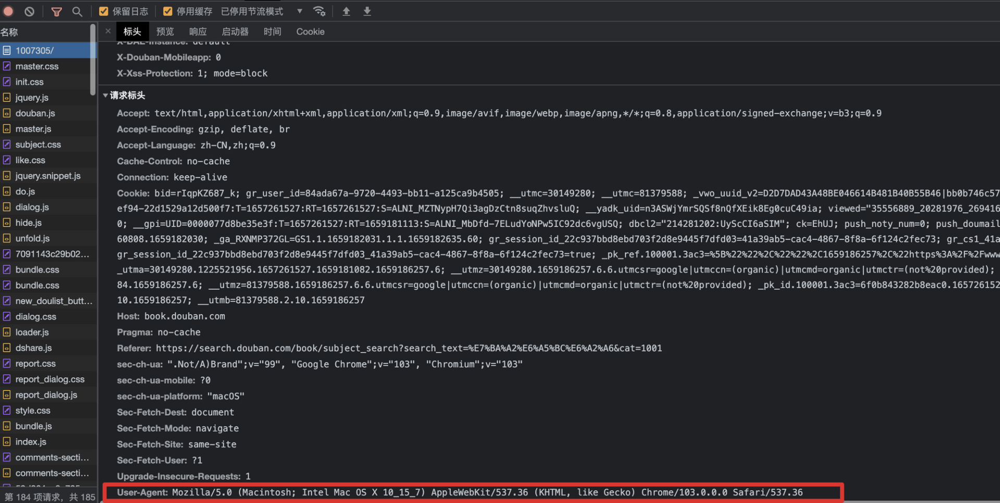
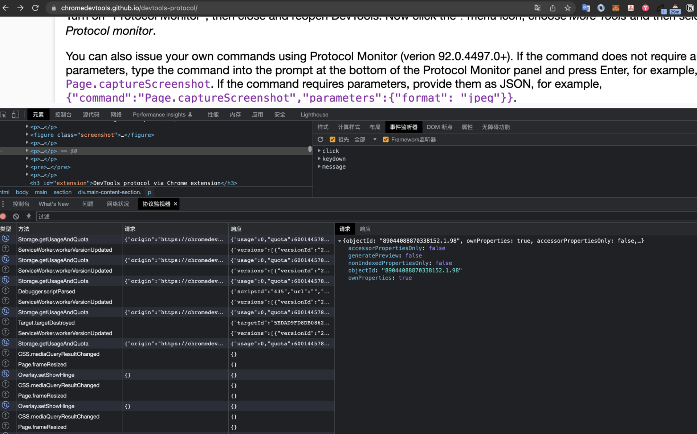
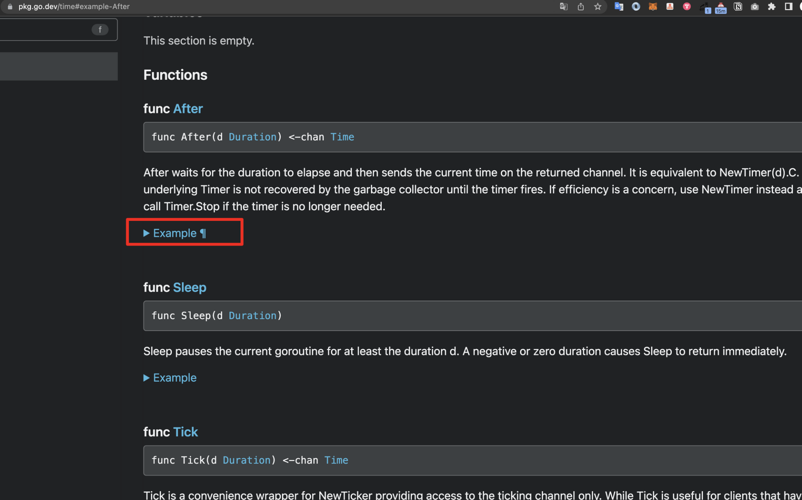
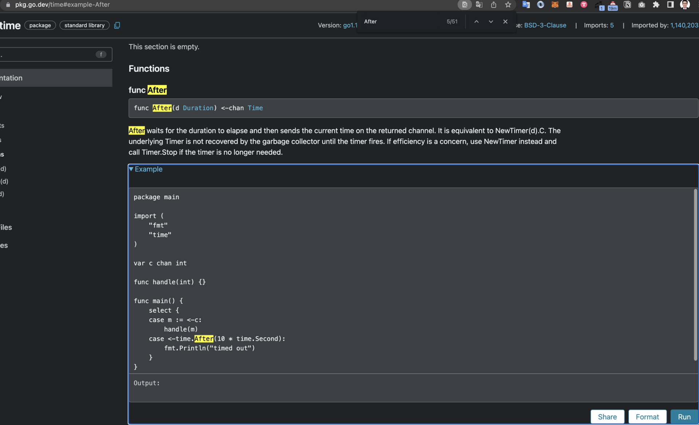
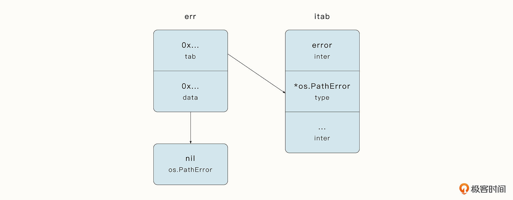

# 21｜采集引擎：实战接口抽象与模拟浏览器访问
你好，我是郑建勋。

我们知道，接口是实现功能模块化、构建复杂程序强有力的手段。在上一节课，我介绍了接口的最佳实践和原理。这一节课，让我们在爬虫程序中实战接口，对采集引擎完成接口抽象。

## 接口抽象

在 [第19讲](https://time.geekbang.org/column/article/606005)，我们已经将爬取网站信息的代码封装为了fetch函数，完成了第一轮的功能抽象。但是随着爬取的网站越来越复杂，加上服务器本身的反爬机制等原因，我们需要用到不同的爬取技术。例如后面会讲到的模拟浏览器访问、代理访问等。要想比较容易地切换不同的爬取方法，用模块化的方式对功能进行组合、测试，我们可以很容易地想到可以对爬取网站数据的代码模块进行接口抽象。

### 实战接口

具体的做法，我们首先要创建一个新的文件夹，将package命名为collect，把它作为我们的采取引擎。之后所有和爬取相关的代码都会放在这个目录下。

```plain
mkdir collect
touch collect/collect.go

```

接着我们要定义一个Fetcher接口，内部有一个方法签名Get，参数为网站的URL。后面我们还将对函数的方法签名进行改变，也会添加其他方法签名，比如用于控制超时的Context参数等。不过要知道的是，在Go语言中，对接口的变更是非常轻量的，我们不用提前费劲去设计。

```plain
type Fetcher interface {
	Get(url string) ([]byte, error)
}

```

接下来，我们要定义一个结构体BaseFetch，用最基本的爬取逻辑实现Fetcher接口：

```plain
func (BaseFetch) Get(url string) ([]byte, error) {
	resp, err := http.Get(url)

	if err != nil {
		fmt.Println(err)
		return nil, err
	}

	defer resp.Body.Close()

	if resp.StatusCode != http.StatusOK {
		fmt.Printf("Error status code:%d", resp.StatusCode)
	}
	bodyReader := bufio.NewReader(resp.Body)
	e := DeterminEncoding(bodyReader)
	utf8Reader := transform.NewReader(bodyReader, e.NewDecoder())
	return ioutil.ReadAll(utf8Reader)
}

```

在main.go中定义一个类型为BaseFetch的结构体，用接口Fetcher接收并调用Get方法，这样就完成了使用接口来实现基本爬取的逻辑。

```plain
var f collect.Fetcher = collect.BaseFetch{}
body, err := f.Get(url)

```

### 模拟浏览器访问

上面BaseFetch的Get函数是比较简单的，但有时我们需要对爬取进行更复杂的处理。例如我们用上面的代码去爬取豆瓣读书网站上的页面，则会失败。

```plain
url := "https://book.douban.com/subject/1007305/"
var f collect.Fetcher= collect.BaseFetch{}
body, err := f.Get(url)

```

报错为 `Error status code:418` ，服务器会返回一个不正常的状态码，并且没有正常的HTML内容。

为什么这个网站可以通过浏览器正常访问，但是通过程序却不行呢？这二者的区别在哪里？

显然，豆瓣现在有一些反爬机制阻止了我们对服务器的访问。如果我们使用浏览器的开发者工具（一般在windows下为F12快捷键），或者通过wireshark等抓包工具查看数据包，会看到浏览器自动在HTTP Header中设置了很多内容，其中比较重要的一个就是 **User-Agent字段，它可以表明当前正在使用的应用程序、设备类型和操作系统的类型与版本。**



大多数浏览器使用 [以下格式](https://developer.mozilla.org/en-US/docs/Web/HTTP/Headers/User-Agent) 发送 **User-Agent：**

```plain
Mozilla/5.0 (操作系统信息) 运行平台(运行平台细节) <扩展信息>

```

我当前的Chrome（谷歌浏览器）发送的信息如下：

```plain
Mozilla/5.0 (Macintosh; Intel Mac OS X 10_15_7) AppleWebKit/537.36 (KHTML, like Gecko) Chrome/103.0.0.0 Safari/537.36

```

其中，Mozilla/5.0由于历史原因，是现在的主流浏览器都会发送的。

`Macintosh; Intel Mac OS X 10_15_7` 代表当前操作系统的版本号。

`AppleWebKit/537.36` 是在 Apple 设备上使用的 Web 渲染引擎标识符。

`KHTML` 是在 Safari 和 Chrome 上使用的引擎。

`Chrome/103.0.0.0  Safari/537.36` 指代浏览器的名字和版本号。

**使用不同的浏览器、设备，User-Agent都会略有不同。** 不同应用程序的User-Agent参考如下：

```plain
Lynx: Lynx/2.8.8pre.4 libwww-FM/2.14 SSL-MM/1.4.1 GNUTLS/2.12.23

Wget: Wget/1.15 (linux-gnu)

Curl: curl/7.35.0

Samsung Galaxy Note 4: Mozilla/5.0 (Linux; Android 6.0.1; SAMSUNG SM-N910F Build/MMB29M) AppleWebKit/537.36 (KHTML, like Gecko) SamsungBrowser/4.0 Chrome/44.0.2403.133 Mobile Safari/537.36

Apple iPhone: Mozilla/5.0 (iPhone; CPU iPhone OS 10_3_1 like Mac OS X) AppleWebKit/603.1.30 (KHTML, like Gecko) Version/10.0 Mobile/14E304 Safari/602.1

Apple iPad: Mozilla/5.0 (iPad; CPU OS 8_4_1 like Mac OS X) AppleWebKit/600.1.4 (KHTML, like Gecko) Version/8.0 Mobile/12H321 Safari/600.1.4

Microsoft Internet Explorer 11 / IE 11: Mozilla/5.0 (compatible, MSIE 11, Windows NT 6.3; Trident/7.0; rv:11.0) like Gecko

```

**有时候，我们的爬虫服务需要动态生成 User-Agent 列表，方便在测试、或者在使用代理大量请求单一网站时，动态设置不同的User-Agent（我会在后面的课程中给出相关的代码）。**

因为有些服务器会检测User-Agent，以此识别请求是否是特定的应用程序发出的，阻止爬虫机器人访问服务器。而使用正确的User-Agent会让我们的请求看起来更有“人性”，让我们能够更自由地从目标网站收集数据。

接下来我们就来实验一下。如下所示，我们创建一个新的结构体BrowserFetch并让其实现Fetcher接口。为了能够设置 HTTP 请求头，我们不能够再使用简单的http.Get方法了。

我们首先要创建一个HTTP客户端http.Client，然后通过http.NewRequest创建一个请求。在请求中调用req.Header.Set设置User-Agent请求头。最后调用client.Do完成HTTP请求。

```plain
type BrowserFetch struct {
}

//模拟浏览器访问
func (BrowserFetch) Get(url string) ([]byte, error) {
	client := &http.Client{}

	req, err := http.NewRequest("GET", url, nil)
	if err != nil {
		return nil, fmt.Errorf("get url failed:%v", err)
	}

	req.Header.Set("User-Agent", "Mozilla/5.0 (Macintosh; Intel Mac OS X 10_15_4) AppleWebKit/537.36 (KHTML, like Gecko) Chrome/80.0.3987.149 Safari/537.36")

	resp, err := client.Do(req)
	if err != nil {
		return nil, err
	}

	bodyReader := bufio.NewReader(resp.Body)
	e := DeterminEncoding(bodyReader)
	utf8Reader := transform.NewReader(bodyReader, e.NewDecoder())
	return ioutil.ReadAll(utf8Reader)
}

```

其实http.Get方法之所以简单，只是对上面这些步骤完成了封装。如下所示，http.Get会默认生成内置的http.Client，创建请求NewRequest，并调用client.Do函数，client.Do最终会调用Transport.roundTrip函数发送请求。

```plain
var DefaultClient = &Client{}
func Get(url string) (resp *Response, err error) {
	return DefaultClient.Get(url)
}

func (c *Client) Get(url string) (resp *Response, err error) {
	req, err := NewRequest("GET", url, nil)
	if err != nil {
		return nil, err
	}
	return c.Do(req)
}

```

现在我们只要在main函数中将采集引擎替换为collect.BrowserFetch，就可以轻松获取到豆瓣网站中的内容了。

```plain
func main() {
	url := "https://book.douban.com/subject/1007305/"
	var f collect.Fetcher = collect.BrowserFetch{}
	body, err := f.Get(url)
	if err != nil {
		fmt.Println("read content failed:%v", err)
		return
	}
	fmt.Println(string(body))
}

```

### 远程访问浏览器

仅仅在请求头中传递User-Agent是不够的。正如我们之前提到过的，浏览器引擎会对HTML与CSS文件进行渲染，并且执行JavaScript脚本，还可能会完成一些实时推送、异步调用工作。这导致内容会被延迟展示，无法直接通过简单的http.Get方法获取到数据。

更进一步的，有些数据需要进行用户交互，例如我们需要点击某些按钮才能获得这些信息。这就迫切地需要我们具有模拟浏览器的能力，或者更简单一点：直接操作浏览器，让浏览器来帮助我们爬取数据。

要借助浏览器的能力实现自动化爬取，目前依靠的技术有以下三种：

- 借助浏览器驱动协议（WebDriver protocol）远程与浏览器交互；
- 借助谷歌开发者工具协议（CDP，Chrome DevTools Protocol）远程与浏览器交互；
- 在浏览器应用程序中注入要执行的JavaScript，典型的工具有Cypress， TestCafe。

由于第三种技术通常只用于测试，所以下面我们就重点来说说前面两种技术。

#### **Webdriver Protocol**

Webdriver协议是操作浏览器的一种远程控制协议。借助Webdriver协议完成爬虫的框架或库有Selenium，WebdriverIO，Nightwatch，其中最知名的就是Selenium。 [Selenium](https://www.selenium.dev/documentation/webdriver/getting_started/install_library/) 为每一种语言（例如Java、Python、Ruby等）都准备了一个对应的clinet库，它整合了不同浏览器的驱动（这些驱动由浏览器厂商提供，例如谷歌浏览器的驱动和火狐浏览器的驱动）。

Selenium通过 [W3C 约定的 WebDriver 协议](https://www.w3.org/TR/webdriver1/) 与指定的浏览器驱动进行通信，之后浏览器驱动操作特定浏览器，从而实现开发者操作浏览器的目的。由于 Selenium 整合了不同的浏览器驱动，因此它对于不同的浏览器都具有良好的兼容性。

#### Chrome DevTools Protocol

第二种远程与浏览器交互的协议叫做 [Chrome DevTools Protocol](https://chromedevtools.github.io/devtools-protocol/)（谷歌开发者工具协议）。顾名思义，该协议最初是由谷歌开发者工具团队维护的，负责调试、操作浏览器的协议。目前，现代大多数浏览器都支持谷歌开发者工具协议。我们经常使用到的谷歌浏览器的开发者工具（快捷键CTRL + SHIFT + I 或者 F12）就是使用这个协议来操作浏览器的。

查看谷歌开发者工具与浏览器交互的协议的方式是，打开谷歌浏览器，在开发者工具 →设置→ 实验中勾选 Protocol Monitor（协议监视器）。


接下来，我们要重启开发者工具，在右侧点击更多工具，这样就可以看到协议监视器面板了。面板中有开发者工具通过协议与浏览器交互的细节。



与Selenium需要与浏览器驱动进行交互不同的是，Chrome DevTools协议直接通过Web Socket协议与浏览器暴露的API进行通信，这使得 Chrome DevTools 协议操作浏览器变得更快。

所以，相比Selenium，我更推荐使用Chrome DevTools协议来访问浏览器。Selenium 4虽然已经提供了对于Chrome DevTools协议的支持，但是它目前还没有对Go的官方的Client库。

在Go中实现了Chrome DevTools协议的知名第三方库是 [chromedp](https://github.com/chromedp/chromedp)。它的操作简单，也不需要额外的依赖。借助 [chromedp](https://github.com/chromedp/chromedp) 提供的能力与浏览器交互，我们就具有了许多灵活的能力，例如截屏、模拟鼠标点击、提交表单、下载/上传文件等。 [chromedp](https://github.com/chromedp/chromedp) 的一些操作样例你可以参考 [example代码库](https://github.com/chromedp/examples)。

这里我模拟鼠标点击事件，给你做一个演示。假设我们访问 [Go time 包的说明文档](https://pkg.go.dev/time)，例如After函数，会发现下图的参考代码是折叠的。



通过鼠标点击，折叠的代码可以展示出time.After函数的参考代码。



我们经常面临这种情况，即需要完成一些交互才能获取到对应的数据。要模拟上面的完整操作，代码如下所示：

```plain
package main

import (
	"context"
	"log"
	"time"

	"github.com/chromedp/chromedp"
)

func main() {
	// 1、创建谷歌浏览器实例
	ctx, cancel := chromedp.NewContext(
		context.Background(),
	)
	defer cancel()

	// 2、设置context超时时间
	ctx, cancel = context.WithTimeout(ctx, 15*time.Second)
	defer cancel()

	// 3、爬取页面，等待某一个元素出现,接着模拟鼠标点击，最后获取数据
	var example string
	err := chromedp.Run(ctx,
		chromedp.Navigate(`https://pkg.go.dev/time`),
		chromedp.WaitVisible(`body > footer`),
		chromedp.Click(`#example-After`, chromedp.NodeVisible),
		chromedp.Value(`#example-After textarea`, &example),
	)
	if err != nil {
		log.Fatal(err)
	}
	log.Printf("Go's time.After example:\\n%s", example)
}

```

解释一下。 **首先我们导入了chromedp库，并调用chromedp.NewContext为我们创建了一个浏览器的实例。** 它的实现原理非常简单，即查找当前系统指定路径下指定的谷歌应用程序，并默认用无头模式（Headless模式）启动谷歌浏览器实例。通过无头模式，我们肉眼不会看到谷歌浏览器窗口的打开过程，但它确实已经在后台运行了。

```plain
func findExecPath() string {
	var locations []string
	switch runtime.GOOS {
	case "darwin":
		locations = []string{
			// Mac
			"/Applications/Chromium.app/Contents/MacOS/Chromium",
			"/Applications/Google Chrome.app/Contents/MacOS/Google Chrome",
		}
	case "windows":
		locations = []string{
			// Windows
			"chrome",
			"chrome.exe", // in case PATHEXT is misconfigured
			`C:\\Program Files (x86)\\Google\\Chrome\\Application\\chrome.exe`,
			`C:\\Program Files\\Google\\Chrome\\Application\\chrome.exe`,
			filepath.Join(os.Getenv("USERPROFILE"), `AppData\\Local\\Google\\Chrome\\Application\\chrome.exe`),
			filepath.Join(os.Getenv("USERPROFILE"), `AppData\\Local\\Chromium\\Application\\chrome.exe`),
		}
	default:
		locations = []string{
			// Unix-like
			"headless_shell",
			...
		}
	}

```

所以说，当前程序能够运行的重要前提是在指定路径中存在谷歌浏览器程序。当然，一般我们系统中可浏览的谷歌浏览器的大小都是比较大的，所以chromedp还好心地为我们提供了一个包含了无头谷歌浏览器的应用程序的镜像： [headless-shell](https://hub.docker.com/r/chromedp/headless-shell/)。

**第二步，用 context.WithTimeout 设置当前爬取数据的超时时间，这里我们设置成了15s。**

**第三步，chromedp.Run执行多个action，chromedp中抽象了action和task两种行为。** 其中，action指的是爬取、等待、点击、获取数据这样的行为。而task指的是一个任务，task是多个action的集合。因此，chromedp.Run会将多个action封装为一个任务，并依次执行。

```plain
func Run(ctx context.Context, actions ...Action) error {
	...
	return Tasks(actions).Do(cdp.WithExecutor(ctx, c.Target))
}

```

- chromedp.Navigate指的是爬取指定的网址： [https://pkg.go.dev/time](https://pkg.go.dev/time)。
- chromedp.WaitVisible指的是“等待当前标签可见”，其参数使用的是CSS选择器的形式。在这个例子中，body > footer标签可见，代表正文已经加载完毕。
- chromedp.Click指的是“模拟对某一个标签的点击事件”。
- chromedp.Value用于获取指定标签的数据。


  最终代码执行结果如下，这样我们就成功获取到了time.After的代码示例。

```plain
2022/10/24 17:26:46 Go's time.After example:
package main

import (
        "fmt"
        "time"
)

var c chan int

func handle(int) {}

func main() {
        select {
        case m := <-c:
                handle(m)
        case <-time.After(10 * time.Second):
                fmt.Println("timed out")
        }
}

```

在后面的课程中，我们还会对 [chromedp](https://github.com/chromedp/chromedp) 进行封装，实现我们定义的采集引擎的接口。你也可以先试着使用 [chromedp](https://github.com/chromedp/chromedp) 来构建一下自己的采集引擎。

可以看到，接口在这里再次发挥了巨大作用。只要合理地组合设计，我们的程序就可以很方便地切换任何的采集引擎。不管是用原生还是模拟浏览器方式，不管是使用Selenium、chromedp的方式，亦或是未来新的采集方式，都不会破坏我们其他模块的代码。

## 空接口

好了，前面我们介绍的接口都是带有方法签名的。其实还有一类特殊的接口不带任何的方法签名，被称为空接口。我们在后面的项目中还会频繁使用到它。

任何类型都隐式实现了空接口。正如Go的创始人Rob Pike所说：“Empty interface say nothing”，空接口并没有任何的含义，既然如此，空接口有什么作用呢？

由于Go是强类型的语言，使用空接口可以为外界提供一个更加通用的能力。然而在处理接口的过程中却需要默默承受解析空接口带来的痛苦。通过使用空接口，常见的fmt.Println函数提供了打印任何类型的功能。

```plain
func Println(a ...interface{}) (n int, err error) {
	return Fprintln(os.Stdout, a...)
}

```

如果不使用空接口，那么每一个类型都需要实现一个对应的Println函数，是非常不方便的。

**不过，空接口带来便利的同时，也意味着我们必须在内部解析接口的类型，并对不同的类型进行相应的处理。** 以fmt.Println为例，Println函数内部通过检测接口的具体类型来调用不同的处理函数。如果是自定义类型，还需要使用反射、递归等手段完成复杂类型的打印功能。

```plain
func (p *pp) printArg(arg interface{}, verb rune) {
		switch f := arg.(type) {
			case bool:
				p.fmtBool(f, verb)
			case float32:
				p.fmtFloat(float64(f), 32, verb)
			case float64:
				p.fmtFloat(f, 64, verb)
			case complex64:
				p.fmtComplex(complex128(f), 64, verb)
			....
}

```

类似的API设计还有用于序列化与反序列化的JSON标准库等。

```plain
func Marshal(v interface{}) ([]byte, error) {
	e := newEncodeState()

	err := e.marshal(v, encOpts{escapeHTML: true})
	if err != nil {
		return nil, err
	}
	buf := append([]byte(nil), e.Bytes()...)

	encodeStatePool.Put(e)

	return buf, nil
}

```

JSON标准库内部使用了反射来判断接口中存储的实际类型，以此分配不同的序列化器。

```plain
func newTypeEncoder(t reflect.Type, allowAddr bool) encoderFunc {
	...
	switch t.Kind() {
		case reflect.Bool:
			return boolEncoder
		case reflect.Int, reflect.Int8, reflect.Int16, reflect.Int32, reflect.Int64:
			return intEncoder
		case reflect.Uint, reflect.Uint8, reflect.Uint16, reflect.Uint32, reflect.Uint64, reflect.Uintptr:
			return uintEncoder
			...

}

```

**除此之外，对于跨服务调用的API，使用空接口可以提高它们的扩展性。因为在这种场景下，修改API的成本通常比较高，服务器需要改造并发布新的SDK，客服端还需要适配新的SDK并联调测试。**

如下所示，在Info结构体中增加扩展类型 `map[string]interface{}`，新的功能如果需要传递新的信息，当前服务甚至可以不用修改API。

```plain
type info struct{
  ExtraData               map[string]interface{}        `json:"extra_data"`
  ...
}

```

在后面的课程中我们还会看到，由于爬虫爬取的数据是多种多样的，我们也会用空接口来实现数据存储的拓展性。

可以看出，空接口为API带来了扩展性和灵活性，但是也为模块的内部处理增加了额外的成本。因为API内部处理空接口时使用了大量的反射，而反射通常比较消耗性能。在实际项目中，当我们JSON序列化一个复杂的结构体时，有时候会有上百毫秒的耗时。

### 空接口与反射

空接口是实现反射的基础，因为空接口中会存储动态类型的信息，这为我们提供了复杂、意想不到的处理能力和灵活性。我们可以获取结构体变量内部的方法名、属性名，能够动态地检查函数或方法的参数个数和返回值个数，也可以在运行时通过函数名动态调用函数。这些能力不使用反射都无法做到。

举一个例子，假如现在有一个 Student 结构体：

```plain
type Student struct {
	Age int
	Name string
}

```

如果我们希望写一个可以将该结构体转换为SQL语句的函数，按照过去的实现方式，可以为这个结构体添加一个CreateSQL方法：

```plain
func (s*Student) CreateSQL() string{
	sql := fmt.Sprintf("insert into student values(%d, %s)", s.Age, s.Name)
	return sql
}

```

这样当调用CreateSQL方法时，可以生成一条SQL语句：

```plain
func main() {
	o := Student{
		Age: 20,
		Name: "jonson",
	}
	fmt.Println(o.CreateSQL())
}

```

结果打印为：

```plain
insert into student values(20, jonson)

```

但是，假如我们的其他结构体也有相同的需求呢？很显然，按照之前学过的知识，我们可以为每个类型都添加一个CreateSQL方法，并生成一个接口：

```plain
type SQL interface{
	func CreateSQL() string
}

```

这种方法在项目初期，以及结构体类型简单的时候是比较方便的。但是如果项目中定义的类型非常多，而且可能当前类型还没有被创建出来（需要运行时创建，或者通过远程过程调用触发），我们就要书写很多逻辑相同的重复代码。有没有一种更加简单通用的办法可以解决这一类问题呢？如果可以在运行时探测到结构体变量中的方法名就好了。

这恰恰就是反射为我们提供的便利。如下所示，我们可以将上面的场景改造成反射的形式。在createQuery函数中，我们可以传递任何的结构体类型，该函数会遍历结构体中所有的字段，并构造Query字符串。

```plain
func createQuery(q interface{}) string{
	// 判断类型为结构体
	if reflect.ValueOf(q).Kind() == reflect.Struct {
		// 获取结构体名字
		t := reflect.TypeOf(q).Name()
		// 查询语句
		query := fmt.Sprintf("insert into %s values(", t)
		v := reflect.ValueOf(q)
		// 遍历结构体字段
		for i := 0; i < v.NumField(); i++ {
			// 判断结构体类型
			switch v.Field(i).Kind() {
			case reflect.Int:
				if i == 0 {
					query = fmt.Sprintf("%s%d", query, v.Field(i).Int())
				} else {
					query = fmt.Sprintf("%s, %d", query, v.Field(i).Int())
				}
			case reflect.String:
				if i == 0 {
					query = fmt.Sprintf("%s\\"%s\\"", query, v.Field(i).String())
				} else {
					query = fmt.Sprintf("%s, \\"%s\\"", query, v.Field(i).String())
				}
				...
			}
		}
		query = fmt.Sprintf("%s)", query)
		fmt.Println(query)
		return query
	}
}

```

现在，假设我们新建了一个Trade结构体，任意结构体都可以通过createQuery方法完成构建过程。

```plain
type Trade struct {
	tradeId int
	Price int
}

func main(){
	createQuery(Student{Age: 20, Name: "jonson",})
	createQuery(Trade{tradeId: 123, Price: 456,})
}

```

结果输出为：

```plain
insert into Student values(20, "jonson")
insert into Trade values(123, 456)

```

通过反射，我们动态获取到了结构体中字段的名字，这样就可以灵活生成SQL语句了。

如果我们把上面这个例子中的函数改造为递归，然后处理更多的类型，这个函数将更加具备通用性，甚至可以作为一个好用的第三方库了。

## 接口的陷阱

刚才我们说了接口的很多好处，但是由于接口的特性和内部实现，使用接口时也容易出现几类经典的错误。

**第一类错误是，当接口中存储的是值，但是结构体是指针时，接口动态调用无法编译通过。** 如下所示：

```plain
type Binary struct {
	uint64
}
type Stringer interface {
	String() string
}
func (i *Binary) String() string {
	return "hello world"
}
func main(){
	a:= Binary{54}
	b := Stringer(a)
	b.String()
}

```

Go 语言在编译时阻止了这样的写法，原因在于这种写法会让人产生困惑。如果转换为接口的是值， 那么由于内存逃逸，在转换为接口时必定已经把值拷贝到了堆区。因此如果允许这种写法存在，那么即便看起来在方法中修改了接口中的值，却无法修改原始值，这非常容易引起误解。

**第二类错误是将类型切片转换为接口切片。** 如下所示：

```plain
func foo() []interface{} {
	return []int{1,2,3}
}

```

这种情况仍然会在编译时报错：

```plain
cannot use []int literal (type []int) as type []interface {} in return argument

```

Go 语言禁止了这种写法，就像前面所说的，批量转换为接口是效率非常低的操作。因为每个元素都需要完成内存逃逸的额外开销。

**接口的第三类陷阱涉及接口与nil之间的关系。当接口为nil时，接口中的动态类型itab和动态类型值data必须都为nil，初学者常常会在这个问题上犯错。** 例如在下面的foo函数中，由于返回的err没有任何动态类型和动态值，因此err等于nil。

```plain
func foo() error {
	var err error // nil
	return err
}
func main() {
	err := foo()
	fmt.Println(err == nil) // true
}

```

然而，如果在foo函数中将错误类型定义为自定义类型，例如\*os.PathError ，我们会发现err不等于nil。

```plain
func foo() error {
	var err *os.PathError
	return err
}
func main() {
	err := foo()
	fmt.Println(err != nil) // true
}

```

这是因为当接口为nil时，代表接口中的动态类型和动态类型值都为nil，而当前由于接口error具有动态类型\*os.PathError，接口的内部结构体itab不为空。如下图所示：



避免这一问题需要谨慎地使用自定义的Error作为定义，而更多的使用内置的errors.New或fmt.Errorf来生成和包裹错误。我在之后的课程还会详细介绍错误处理的最佳实践。

## 总结

这节课，我们通过一个模拟浏览器访问的案例实战了采集引擎的抽象。 **由于User-Agent标识了应用程序的类型和版本，所以我们将User-Agent设置成了真实浏览器的值，绕过了这个例子中服务器的反爬机制。** 不过这只是众多反爬机制中最简单的一种，通过对采集引擎接口的抽象，我们能够比较轻松地实现采集引擎的切换，并进行模块化的测试。

带方法的接口帮助我们完成了功能的模块化，而不带方法的空接口则增加了API的扩展性。同时，空接口是反射实现的基础，有了它我们才能有“获取字段名”、“通过函数名动态调用方法”这样复杂灵活的能力，因此空接口在一些基础库、RPC框架中的应用也非常广泛。

不过空接口带给我们的扩展性也有一定的代价，那就是它的内部需要解析繁琐的多种类型，使用反射导致效率变低。

## 课后题

最后，我也给你留一道思考题。

如果一个网站需要登录才可以访问，我们应该如何实现自动登录的能力？

欢迎你在留言区与我交流讨论，我们下节课再见！