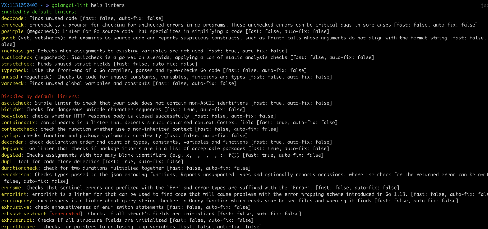

# 35｜未雨绸缪：怎样通过静态与动态代码扫描保证代码质量？
你好，我是郑建勋。

这节课让我们继续优化代码，让程序可配置化。然后通过静态与动态的代码扫描发现程序中存在的问题，让代码变得更加优雅。

## micro中间件

首先，让我们紧接上节课的go-micro框架，对代码进行优化，设置go-micro的中间件。如下，我们使用了Go函数闭包的特性，对请求进行了一层包装。中间件函数在接收到GRPC请求时，可以打印出请求的具体参数，方便我们排查问题。

```plain
func logWrapper(log *zap.Logger) server.HandlerWrapper {
	return func(fn server.HandlerFunc) server.HandlerFunc {
		return func(ctx context.Context, req server.Request, rsp interface{}) error {
			log.Info("recieve request",
				zap.String("method", req.Method()),
				zap.String("Service", req.Service()),
				zap.Reflect("request param:", req.Body()),
			)
			err := fn(ctx, req, rsp)
			return err
		}
	}
}

```

接下来，使用micro.WrapHandler将中间件注入到micro.NewService中，这样就大功告成了。

```plain
service := micro.NewService(
		...
		micro.WrapHandler(logWrapper(logger)),
	)

```

当GRPC服务器收到请求之后，会打印出下面这样的请求信息。

```plain
{"level":"INFO","ts":"2022-11-28T00:29:28.287+0800","caller":"crawler/main.go:148","msg":"recieve request","method":"Greeter.Hello","Service":"go.micro.server.worker","request param:":{}}

```

## 静态扫描

接下来，让我们用静态扫描把代码变得更优雅一些。

当前大多数公司采用的静态代码分析工具都是golangci-lint 。Linter 本来指的是一种分析源代码以此标记编程错误、代码缺陷和风格错误的工具，而golangci-lint就是集合多种Linter的工具。要查看golangci-lint支持的 Linter 列表，以及它启用/禁用了哪些Linter，可以使用下面的命令：

```plain
> golangci-lint help linters

```

Go语言定义了实现Linter的API，它还提供了golint工具，golint集成了几种常见的Linter。在 [源码](https://cs.opensource.google/go/x/tools/+/refs/tags/v0.1.11:go/analysis/passes/unreachable/unreachable.go) 中，我们可以查看在标准库中如何实现典型的Linter。

Linter的实现原理是静态扫描代码的AST（抽象语法树），Linter的标准化意味着我们可以灵活实现自己的Linters。不过，golangci-lint里面其实已经集成了包括golint在内的众多Linter，并且具有灵活的配置能力。所以如果你想自己写Linter，我也建议你先了解一下golangci-lint现有的能力。

使用golangci-lint的第一步就是安装，不同环境下的安装方式你可以查看 [官方文档](https://golangci-lint.run/usage/install/)。下面我来演示一下如何在本地使用golangci-lint。最简单的方式就是执行下面的命令：

```plain
golangci-lint run

```

它等价于：

```plain
golangci-lint run ./...

```

我们也可以指定要分析的目录和文件：

```plain
golangci-lint run dir1 dir2/... dir3/file1.go

```

就像前面所说，golangci-lint是众多lint的集合，要查看golangci-lint默认启动的lint，可以运行下面的命令：

```plain
golangci-lint help linters

```

可以看到，golangci-lint内置了数十个lint：



为了能够灵活地配置golangci-lint的功能，我们需要新建对应的配置文件。golangci-lint会依次查找当前目录下的文件，实现启用或禁用指定的Linter，并指定不同Linter的行为。具体的配置说明你也可以查看 [官方文档](https://golangci-lint.run/usage/configuration/)。

- .golangci.yml
- .golangci.yaml
- .golangci.toml
- .golangci.json

现在让我们在项目中创建.golangci.yml文件，具体的配置如下：

```plain
run:
    tests: false
    skip-dirs:
        - vendor

linters-settings:
    funlen:
        # Checks the number of lines in a function.
        # If lower than 0, disable the check.
        # Default: 60
        lines: 120
        # Checks the number of statements in a function.
        # If lower than 0, disable the check.
        # Default: 40
        statements: -1

# list all linters by run `golangci-lint help linters`
linters:
    enable-all: true
    disable:
        # gochecknoglobals: Checks that no globals are present in Go code
        - gochecknoglobals
        # gochecknoinits: Checks that no init functions are present in Go code
        - gochecknoinits
        # Checks that errors returned from external packages are wrapped
        - wrapcheck
        # checks that the length of a variable's name matches its scope
        - varnamelen
        # Checks the struct tags.
        - tagliatelle
        # An analyzer to detect magic numbers.
        - gomnd
				...

```

其中，run.tests选项表明我们不扫描测试文件，run.skip-dirs表示扫描特定的文件夹，linters-settings选项用于设置特定Linter的具体行为。funlen linter 用于限制函数的行数，默认的限制是60行，在这里我们根据项目的规范，将其配置为了120行。Linter的特性你可以根据自己项目和团队的要求动态配置。

另外，linters.enable-all表示默认开启所有的Linter，linters.disable表示禁用指定的Linter。存在这个设定是因为在golangci-lint中有众多的Linter，但是有些Linter相互冲突，有些已经过时，还有些并不适合你当前的项目。例如，gochecknoglobals禁止使用全局变量，但是有时候我们在项目中确实需要全局变量，这时候就要根据实际需求来调整了。

添加完配置文件之后，执行 golangci-lint run 可以看到静态扫描之后的众多警告，如下图所示：


有很多Linter对提高代码的质量是非常有帮助的。例如在下面这个例子中，golangci-lint会打印出文件、行号、不符合规范的位置以及原因。其中，第一行最后的(golint)表明问题是由golint这个lint静态扫描出来的。这里它提示我们应该将sqlUrl的命名修改为sqlURL。

```plain
sqldb/option.go:9:2: struct field `sqlUrl` should be `sqlURL` (golint)
        sqlUrl string

```

再举个例子，这里，wsl linter要求我们在特定的场景下在continue前方空一行，这样可以方便阅读。

```plain
engine/schedule.go:242:4: branch statements should not be cuddled if block has more than two lines (wsl)
                        continue

```

我将项目中所有的代码都根据Linter的提示进行了修改，完整的代码见 [v0.3.1](https://github.com/dreamerjackson/crawler)。

## 动态扫描

不过，有一些问题是很难通过静态扫描发现的，例如数据争用问题。数据争用是并发系统中最常见且最难调试的错误类型之一。在下面这个例子中，两个协程共同访问了全局变量count，乍看之下可能没有问题，但是这个程序其实是存在数据争用的，count 的结果也是不明确的。

```plain
// race.go
var count = 0
func add() {
	count++
}
func main() {
	go add()
	go add()
}

```

count++操作看起来是一条指令，但是对 CPU 来说，需要先读取 count 的值，执行+1 操作， 再将count 的值写回内存。大部分人期望的操作可能是下面这样： R←0 代表读取到0，w→1 代表写入count 为1；协程1写入数据1后，协程2再写入，count 最后的值为2。


但是由于count++并不是一条原子指令，情况开始变得复杂。如果执行的流程如下所示，那么count 最后的值为1。


这两种情况告诉我们，当两个协程发生数据争用时，结果是不可预测的，这会导致很多奇怪的错误。

再举一个 Go 语言中经典的数据争用错误。如下伪代码所示，在Hash 表中，存储了我们希望存储到 Redis 数据库中的data数据。但是在 Go 语言中使用Range时，变量k是一个堆上地址不变的对象，该地址存储的值会随着 Range 遍历而发生变化。

如果此时我们将变量 k 的地址放入协程save，以此提供并发存储而不堵塞程序，那么最后的结果可能是，后面的数据会覆盖前面的数据，同时导致一些数据没有被存储，并且每一次完成存储的数据也是不明确的。

```plain
func save(g *data){
	saveToRedis(g)
}
func main() {
	var a map[int]data
	for _, k := range a{
		go save(&k)
	}
}

```

数据争用可以说是高并发程序中最难排查的问题，原因在于它的结果是不明确的，而且可能只在在特定的条件下出错，这导致很难复现相同的错误，在测试阶段也不一定能测试出问题。

Go 1.1 后提供了强大的检查工具 race 来排查数据争用问题。如下所示，race 可以用在多个Go 指令中。当检测器在程序中找到数据争用时，将打印报告。这个报告包含发生 race 冲突的协程栈，以及此时正在运行的协程栈。

```plain
$ go test -race mypkg
$ go run -race mysrc.go
$ go build -race mycmd
$ go install -race mypkg

```

如果对上面这个例子的 race.go 文件执行go run -race ，程序在运行时会直接报错，如下所示。从报错后输出的栈帧信息中可以看出发生冲突的具体位置。

```plain
» go run -race race.go
==================
WARNING: DATA RACE
Read at 0x00000115c1f8 by goroutine 7:
main.add()
bookcode/concurrence_control/race.go:5 +0x3a
Previous write at 0x00000115c1f8 by goroutine 6:
main.add()
bookcode/concurrence_control/race.go:5 +0x56

```

Read at 表明读取发生在race.go 文件的第 5 行，而Previous write 表明前一个写入也发生在race.go 文件的第 5 行，这样我们就可以非常快速地发现并定位数据争用问题了。

不过，竞争检测也有一定成本，它因程序的不同而有所差异。对于典型的程序来说，内存使用量可能增加5~10 倍，执行时间会增加 2~20 倍。同时，竞争检测器还会为当前每个 defer 和 recover 语句额外分配 8 字节，在Goroutine退出前，这些额外分配的字节不会被回收。这意味着，如果有一个长期运行的 Goroutine，而且定期有 defer 和 recover 调用，那么程序的内存使用量可能无限增长（有关race工具的原理你可以参考《Go底层原理剖析》）。

## 配置文件

看完静态和动态的代码扫描，我们接着来让代码可配置化，这是我们项目一直没有实现的功能。很多人可能直接会书写JSON、TOML等配置文件并在程序启动时读取配置文件。不过一个优秀的处理配置的库要考虑更多内容。go-micro的配置库提供了下面这几种能力。

- **动态配置**


  大多数程序在初始化时会读取应用程序配置，之后就一直保持静态状态。 如果需要更改配置，则需要重新启动应用程序，这有时候会显得比较繁琐。而动态配置通过监听配置的变化，实现了动态化的配置。

- **支持多种后端数据源**


  它可以支持文件、flags、环境变量、甚至etcd等数据源获取源数据。

- **支持多种数据格式的解析**


  它可以解析包括JSON、TOML、YML在内的多种数据源格式。

- **可合并**


  它支持将多个后端数据源读取到的数据合并到一起进行处理。

- **安全性**


  当配置文件不存在时，go-micro的配置库支持返回默认的数据。


关于go-micro代码的设计你可以参考 [这篇文章](https://micro.dev/blog/2018/07/04/go-config.html)。

我们举一个简单的例子来说明go-micro配置库的使用方式。假设我们有配置文件config.json：

```plain
{
  "hosts": {
    "database": {
      "address": "10.0.0.2",
      "port": 3306
    },
    "cache": {
      "address": "10.0.0.2",
      "port": 6379
    }
  }
}

```

获取配置文件的实例代码如下：

```plain
package main

import (
	...
	"go-micro.dev/v4/config"
	"go-micro.dev/v4/config/source/file"
)
func main() {

	// 导入数据
	err := config.Load(file.NewSource(
		file.WithPath("config.json"),
	))
	if err != nil {
		fmt.Println(err)
	}
	type Host struct {
		Address string `json:"address"`
		Port    int    `json:"port"`
	}

	var host Host
	// 获取hosts.database下的数据，并解析为host结构
	config.Get("hosts", "database").Scan(&host)

	fmt.Println(host)

	w, err := config.Watch("hosts", "database")
	if err != nil {
		fmt.Println(err)
	}

	// 等待配置文件更新
	v, err := w.Next()
	if err != nil {
		fmt.Println(err)
	}

	v.Scan(&host)
	fmt.Println(host)
}

```

在这里，config.Load用于导入某一个数据源中的config.json文件，config.Get用于获得某一个层级下的数据，Scan函数用于将数据解析到结构体中。config.Watch函数用于监听指定的配置文件更新。

在项目中，我们使用 [TOML](https://toml.io/en/) 来作为配置文件。TOML相比JSON文件的优势在于，能够书写注释，阅读起来相对清晰，但是它不适合表示一些复杂的层次结构。要想在项目中读取TOML数据并将其转化为类似JSON的层次结构，需要导入 [TOML插件库](https://github.com/go-micro/plugins/v4/config/encoder/toml) 并做额外的处理：

```plain
enc := toml.NewEncoder()
cfg, err := config.NewConfig(config.WithReader(json.NewReader(reader.WithEncoder(enc))))
err = cfg.Load(file.NewSource(
   file.WithPath("config.toml"),
   source.WithEncoder(enc),
))

```

之前我们有许多项目的配置是写死在代码中的，例如数据库的地址、etcd的地址、GRPC服务器的监听地址，以及超时时间、日志级别等等。现在我们需要将这些配置迁移到配置文件中，实现可配置化。

项目中配置文件的处理方法我这里就不再赘述了，具体你可以查看 [v0.3.2 分支](https://github.com/dreamerjackson/crawler)。

```plain
logLevel = "debug"

Tasks = [
    {Name = "douban_book_list",WaitTime = 2,Reload = true,MaxDepth = 5,Fetcher = "browser",Limits=[{EventCount = 1,EventDur=2,Bucket=1},{EventCount = 20,EventDur=60,Bucket=20}],Cookie = "xxx"},
    {Name = "xxx"},
]

[fetcher]
timeout = 3000
proxy = ["<http://127.0.0.1:8888>", "<http://127.0.0.1:8888>"]

[storage]
sqlURL = "root:123456@tcp(127.0.0.1:3326)/crawler?charset=utf8"

[GRPCServer]
HTTPListenAddress = ":8080"
GRPCListenAddress = ":9090"
ID = "1"
RegistryAddress = ":2379"
RegisterTTL = 60
RegisterInterval = 15
ClientTimeOut   = 10
Name = "go.micro.server.worker"

```

## Makefile

将配置文件准备好之后，我们就可以构建并运行程序了。在构建程序时，输入一长串的构建命令比较繁琐。为了解决这样的问题，我们可以把一些构建的脚本写入Makefile文件中。如下所示：

```plain
VERSION := v1.0.0

LDFLAGS = -X "main.BuildTS=$(shell date -u '+%Y-%m-%d %I:%M:%S')"
LDFLAGS += -X "main.GitHash=$(shell git rev-parse HEAD)"
LDFLAGS += -X "main.GitBranch=$(shell git rev-parse --abbrev-ref HEAD)"
LDFLAGS += -X "main.Version=${VERSION}"

ifeq ($(gorace), 1)
	BUILD_FLAGS=-race
endif

build:
	go build -ldflags '$(LDFLAGS)' $(BUILD_FLAGS) main.go

lint:
	golangci-lint run ./...

```

其中，build下的命令就是构建程序的命令。在这段命令中，LDFLAGS为编译时的一些选项，我们在编译时注入了程序的版本号、分支、构建时间、git commit号等信息。这些信息会注入到main.go中的全局变量中。在main.go中，我们还要进行一些配套的处理，用来打印一些程序的版本信息。

```plain
// Version information.
var (
	BuildTS   = "None"
	GitHash   = "None"
	GitBranch = "None"
	Version   = "None"
)

func GetVersion() string {
	if GitHash != "" {
		h := GitHash
		if len(h) > 7 {
			h = h[:7]
		}
		return fmt.Sprintf("%s-%s", Version, h)
	}
	return Version
}

// Printer print build version
func Printer() {
	fmt.Println("Version:          ", GetVersion())
	fmt.Println("Git Branch:       ", GitBranch)
	fmt.Println("Git Commit:       ", GitHash)
	fmt.Println("Build Time (UTC): ", BuildTS)
}

var (
	PrintVersion = flag.Bool("version", false, "print the version of this build")
)

func main(){
	flag.Parse()
	if *PrintVersion {
		Printer()
		os.Exit(0)
	}
}

```

如下所示。当我们执行make build 构建可运行程序，并传递 -version运行参数时，就会打印出程序的版本信息了：

```plain
> make build
> ./main -version

Version:           v1.0.0-ed89d91
Git Branch:        master
Git Commit:        ed89d91d03834fe85b1ca7f74f0cca305b8e516a
Build Time (UTC):  2022-11-30 04:52:45

```

同时在Makefile中，BUILD\_FLAGS表示构建可执行文件的参数。当我们设置环境变量gorace=1时，go build会将 race 工具编译到程序中。最后我们会看到完整的构建命令：

```plain
» export gorace=1
» make build
go build -ldflags '-X "main.BuildTS=2022-12-03 05:48:59" -X "main.GitHash=e73f1126031f56178ca86deda7fceb0a71b5314e" -X "main.GitBranch=master" -X "main.Version=v1.0.0"'  main.go

```

## 总结

这节课，我们使用了静态与动态的代码扫描来发现代码的Bug和不太规范的代码，这可以帮助开发者遵循团队的编码规范，书写出更优雅的程序。

同时我们还看到了如何用go-micro的config库来更灵活地对配置文件进行管理。它不仅提供了配置化的能力，还实现了动态配置、配置合并的能力，在这个过程中，我们看到了功能全面的配置管理需要考虑的因素。

最后，通过书写Makefile文件，我们可以执行预先定义好的脚本，更快、更优雅地书写项目代码。

## 课后题

1. golangci-lint中包含了众多的lint，其中有些lint的功能是过时的，重复的。那么我们在项目中应该让哪些lint生效呢？
2. 配置文件、JSON格式与TOML格式分别适用于哪一种场景？

欢迎你在留言区与我交流讨论，我们下节课见！