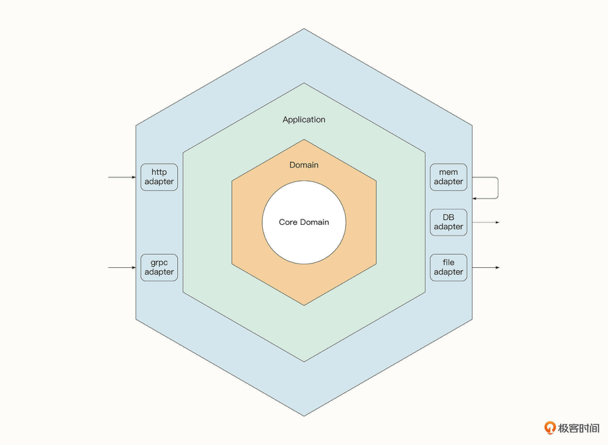
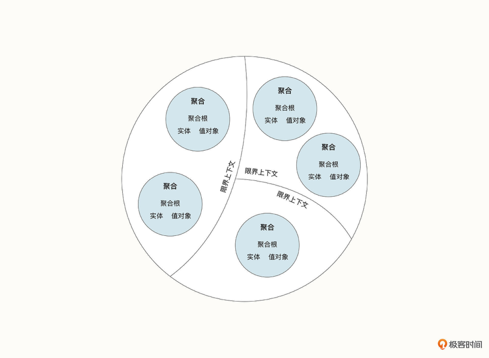

# 特别放送｜回头看：如何更好地组织代码？
你好，我是郑建勋。

在利用Go语言进行系统开发时，相信你或早或晚都会思考这样一个问题：如何更好地组织代码？或者说如何更好地构建项目的目录结构？

这并不是一个容易回答的问题，因为这通常不会有标准的答案。开发者对Go语言和软件开发的理解不同、面临的业务场景不同，代码的组织方式也会截然不同。

然而，如果我们对这个问题不管不顾，会发现代码书写起来越来越别扭。代码越来越难做大的调整了。因此，在完成对爬虫系统的开发后，让我们重新来思考一下如何更好地组织代码。

## 按照功能划分组织代码

我们之前设计的爬虫系统有对代码进行组织吗？

当然是有的，依靠我们软件开发的经验，代码中有很多增加代码扩展性的设计。包括Option模式、大量使用接口解耦依赖、在main函数中统一注入依赖等等。从整体上来看，我们也使用了扁平化的目录结构，没有嵌套太深的层次结构。同时，为了便于对代码进行管理，我们根据功能对代码结构进行了划分。例如，auth负责权限验证，collect包用于网络爬取，storage用于数据的存储。上面的这些设计保证了我们对这个爬虫系统仍然有较强的控制力。

通过功能对代码结构进行划分是一种比较常见的也比较容易想到的模式。但是在开发过程中，我们会遇到不少的难题，这些问题也存在于我们开发爬虫系统的过程中， **比较严重的两个就是命名问题和循环依赖问题。**

先来看命名问题。

我们之前抽象出了一个Fetcher接口来采集网站信息，并且实现了直接爬取与模拟浏览器访问两种模式。对于网站信息采集这一重要的功能，我们很容易想到要使用一个package单独管理它，也很容易想到将package命名为fetch。这时问题就出现了，我们要引用fetch包时，命名就变成了 `fetch.Fetcher, fetch.BrowserFetch`，类似的命名还有 `task.Task` 等等。这些命名包含着重复语义代码，让人感到很别扭。

```plain
package fetch

import (
	"xxx/task"
	"net/http"
)

type Fetcher interface {
	Get(url *Request) ([]byte, error)
}

type Request struct {
	Task *task.Task
	URL  string
}

type BrowserFetch struct{}

func (b BrowserFetch) Get(request *Request) ([]byte, error) {
	req, _ := http.NewRequest("GET", request.URL, nil)
	if len(request.Task.Cookie) > 0 {
		req.Header.Set("Cookie", request.Task.Cookie)
	}
	// ...
	return nil, nil
}

```

我们再来看看循环依赖问题。假设我们又新建了一个Task的 package 用于处理和任务相关的工作，很快我们就会发现出现了循环依赖问题。在fetcher包中的Request结构体引用了Task包中的Task结构。而Task结构中包含了规则树RuleTree，RuleTree中引用了fetch.Request。这导致fetch package与task package相互依赖。

```plain
package task

import (
	"xxx/fetch"
	"sync"
)

type Task struct {
	Visited     map[string]bool
	VisitedLock sync.Mutex
	Cookie      string
	Rule        RuleTree
}

type RuleTree struct {
	Root func() ([]*fetch.Request, error) // 根节点(执行入口)
}

```

可以看到，简单地按照功能组织代码，命名问题和循环依赖问题都是非常让人头疼的。

## 按照单体划分组织代码

为了解决上面的问题，我们能否把所有的代码都放入同一个package中呢？这样就不存在命名的问题了，同时也就没有了循环依赖的问题。但是这种方式一般只适合于小型的应用程序，一旦代码数量超过一定大小（例如1万行代码），阅读和管理代码都会越来越困难。

## 按照层级划分组织代码

在实践中，我们还经常看到分层的代码组织方式。比较经典的分层模式是MVC模式。MVC模式一般用于Web服务和桌面端应用程序，在典型的MVC模型中，代码被分为了视图层（View）、控制层（Controller）和模型层（Model）。

其中，View层用于数据或者页面展示，而比较少进行逻辑处理。Controller层负责在模型和视图之间进行通信。Model层用于管理应用程序的数据和业务规则，并负责与数据库进行交互。典型的MVC目录结构如下所示。

```plain
app/
  models/
    user.go
    course.go
  controllers/
    user.go
    course.go
  views/
    user.go
    course.go

```

分层的架构能够提供统一的开发模式，让开发者容易理解。但是使用分层架构意味着，只要添加或更改业务功能就几乎要涉及到所有层级，这样一来，要修改单个功能就变得非常麻烦了。

分层架构还面临着和功能架构相同的问题。例如，出现controller.UserController这样不太优雅的命名。如果多个层之间共用了同一个结构，这个结构应该放在哪里呢？随着代码量的上涨，层与层之间，甚至是同层的不同子模块之间的依赖关系会非常混乱，依然容易出现循环依赖的问题。

我举一个例子，Model层提供了一个用于存储数据的Storage接口，NewStorage函数会根据storageType类型的不同，决定是使用数据库存储引擎还是内存存储引擎。

```plain
package models
import "xxx/storage"

type Storage interface {
	SaveBeer(...Beer) error
	SaveReview(...Review) error
	FindBeer(Beer) ([]*Beer, error)
	FindReview(Review) ([]*Review, error)
	FindBeers() []Beer
	FindReviews() []Review
}

func NewStorage(storageType StorageType) error {
	var err error

	switch storageType {
	case Memory:
		DB = new(storage.Memory)

	case JSON:
		DB, err = storage.NewJSON("./data/")
		if err != nil {
			return err
		}
	}

	return nil
}

```

数据库引擎的具体实现位于storage包中。在storage包中，又引用了model包中定义的数据类型，这就导致了循环依赖问题。

```plain
package storage

import "xxx/models"

type Memory struct {
	cellar  []models.Beer
	reviews []models.Review
}

func (s *Memory) SaveBeer(beers ...models.Beer) error {
	for _, beer := range beers {
		var err error
}

```

这说明在Go中，简单地按照分层思想来组织代码仍然不足以让人满意。

## 按照领域驱动设计组织代码

为了应对上面这些挑战，我们来继续探索一下用领域驱动设计（DDD，Domain-Driven Design）组织代码。

DDD是 Eric Evans 于 2004 年提出的一种软件设计方法和理念。DDD 的核心思想是围绕核心的业务概念，定义领域模型，指导业务与应用的设计和实现。它主张开发人员与业务人员持续地沟通并持续迭代模型，保证业务模型与代码实现的一致性，最终有效管理业务复杂度，优化软件设计。

DDD拥有比较陡峭的学习曲线，因为它有许多新的术语，例如领域（Domain）、限界上下文（ Bounded Vontext）、实体（Entity）、值对象（Value Object）、聚合（Aggregate）、聚合根（ Aggregate Root）等等。我们需要对这些概念有深入的理解，才能够在不同的应用场景中灵活地使用DDD进行设计。

### 六边形架构

DDD是一种软件开发方法论，实践中比较流行的做法是将DDD与六边形架构（Hexagonal）结合起来，用DDD来指导六边形架构的设计。那什么是六边形架构呢？如下图所示， **这是一种由内而外的分层架构，每一层都有特定的职责，并与其他层级进行隔离。**



六边形架构的最内层即为核心的领域模型（Domain Model），它定义应用程序中使用的实体和关系。应用层（Application）依赖内层的领域模型，负责实现应用程序的核心业务逻辑，例如验证用户输入的数据并处理这些数据。

而外层的适配器用于接收不同形式的输入与输出。例如我们可以有HTTP或者GRPC等多种适配器来接收不同的外部输入，但是它们最终会由相同的内部处理逻辑来处理。不同形式的输出包括了服务注册、将数据发送到消息队列、持久化存储等。而每一种输出形式都可能有多个适配器，例如，持久化存储可以有多种形式的适配器，控制把数据存储到MySQL、MongoDB还是内存中。这样，程序就有了比较强的扩展性，也方便进行Mock测试。

到这里你可能会问，DDD指导六边形架构为什么能够解决我们之前面临的问题呢？

首先，现在同一个领域中的相关结构（实体、值对象）等都聚合在同一个package中。例如我们可以把爬虫领域的相关代码放置到名为spider的package中，现在要引用该领域中的结构就变为了 `spider.Task,spider.Request`，这就避免了命名问题。

同时，该架构还能够解决循环依赖问题。因为在六边形架构中，外层可以依赖内层的结构，但是内层不能够依赖外层的结构，这保证了依赖关系的单向性。层级之间一般是通过Go接口来交流的，这不仅提高了扩展性，也实现了信息的隐藏。

下面就让我们试着用六边形架构重构一下我们的爬虫系统，不过在这之前，我还需要简单解释一下DDD的术语。

### 领域与子域

**领域指的是从事一种专门活动或事业的范围。** 在DDD中，领域可以指业务的整个范围。而业务的整个范围又可以划分为多个子领域，核心的子领域可以被叫做核心域，核心域是业务成功的关键，是公司的核心竞争力，也是需要重点关注的领域。

被多个子域使用的通用功能子域叫做通用域，而不是核心功能也不是通用功能的领域被叫做支撑域，子域还可以细分为更小的问题域。

### 

### 限界上下文

如果我们的领域划分得足够好，会发现某些子域之间形成了天然的边界， **限定在边界中的上下文被称为限界上下文（ Bounded context）。** 在限界上下文中，业务人员和开发人员可以使用无歧义的统一语言来对话。

举一个例子你就明白了，我们的任务在不同的上下文中，它的含义会有变化。在Worker进行网站采集的时候，任务指的是包含了指定规则的描述爬虫任务的实例。而在Master添加任务时，任务只是一个能够唯一用名字标识的资源。再举一个例子，一个到酒吧买醉的人，在外人的眼中就是酒鬼，而在酒吧老板的眼中他其实是一个顾客。

所以，相同的事物在不同的上下文当中具有不同的内涵和外延。限界上下文将事物限制在一定的上下文当中进行讨论，这可以让代码更真实地反映业务，让开发人员与业务人员有共同的语言。同时，限界上下文的边界通常还是进行微服务拆分的基础。

我们当前项目的核心就是开发的爬虫系统，核心域是爬虫域。我们将爬虫域的相关代码放置到spider package中，并开始在爬虫域的限界上下文中构建业务模型。最终我们会构建出实体、值对象、聚合等对象。让我们挨个来看一看。

### 实体

首先我们来构建实体。

**DDD中的实体是在相同限界上下文中具有唯一标识的领域模型，它内部的属性可能发生变化。** 在爬虫域中，一个爬虫的请求以及一个爬虫任务可以作为一个实体，我们将其抽象为Request结构体和Task结构体。ResourceSpec结构体也可以作为一个实体，它可以描述调度的资源对象，但是否要把它放入到爬虫域中是值得推敲的，我们也许可以单独将其放入到叫做调度域的领域中。

对实体进行建模时，我们可以采取头脑风暴的方式，由开发人员与业务人员反复思考、推敲与迭代，最后根据具体的场景构建比较合适的业务模型。

```plain
package spider

type Request struct {
	Task     *Task
	URL      string
	Method   string
	Depth    int64
	Priority int64
	RuleName string
	TmpData  *Temp
}

// 请求唯一标识
func (r *Request) Unique() string {
	block := md5.Sum([]byte(r.URL + r.Method))
	return hex.EncodeToString(block[:])
}

func (r *Request) Check() error {
	if r.Depth > r.Task.MaxDepth {
		return errors.New("max depth limit reached")
	}

	if r.Task.Closed {
		return errors.New("task has Closed")
	}

	return nil
}

type Task struct {
	Visited     map[string]bool
	VisitedLock sync.Mutex
	//
	Closed bool
	Rule RuleTree
	Options
}

type ResourceSpec struct {
	ID           string
	Name         string
	AssignedNode string
	CreationTime int64
}

```

除了添加对应实体的结构体，我们还可以添加实体的方法，用它来处理与实体相关的业务行为。例如，Request.Check方法可以检查请求的有效性。这些方法我之前也已经开发好了，只是迁移到了指定的目录中，这里我就不一一列出了。

### 值对象

说完实体，我们再来看看值对象。 **值对象是一种特殊的领域模型，它内部的值是一个整体，所以我们可以通过值判断同一性。** 例如，Request结构体中的 URL 字段与 Method 字段都是一个值对象，它描述了实体的一种属性。

要注意的是，值对象不一定只是字符串、整数这样的基础类型，它还可能是一个结构体。关键在于我们需要把值对象看做一个整体，当我们需要替换实体中的值对象时，需要把值对象的整体都加以替换。所以说，我们可以把爬虫规则树RuleTree看做一个值对象，因为RuleTree是Task的一个属性，并且不能单独被修改。

```plain
type RuleTree struct {
	Root  func() ([]*Request, error) // 根节点(执行入口)
	Trunk map[string]*Rule           // 规则哈希表
}

```

### 聚合

接着我们来看看聚合。

**聚合是一组生命周期强一致，同时修改规则强关联的实体和值对象的集合，它表达的是统一的业务意义。** 比如，一个订单中有多个订单项，订单的总价是根据订单项目计算而来的。由于这些订单项和订单总价是密不可分的，因此可以把它们组合起来作为一个聚合。

在我们的爬虫项目中，用于存储爬虫任务的全局变量taskStore就可以看作一个聚合，而描述爬虫存储单元的DataCell和上下文Context也是一个聚合。聚合和实体一样可以有对应的方法来描述业务行为。

```plain
type taskStore struct {
	List []*Task
	Hash map[string]*Task
}

type Context struct {
	Body []byte
	Req  *Request
}

type DataCell struct {
	Task *Task
	Data map[string]interface{}
}

func (d *DataCell) GetTableName() string {
	return d.Data["Task"].(string)
}

func (d *DataCell) GetTaskName() string {
	return d.Data["Task"].(string)
}

```

### **服务**

上面我们构建了爬虫域中的实体、值对象、聚合以及这些对象对应的方法，但是并不是所有的操作都适合放在这些对象的方法中。例如，爬取网站数据的行为就不适合放在spider.Request的方法中，因为爬取网站数据属于对spider.Request的操作，而不是spider.Request具有的行为。

另外，我们还希望能够灵活地使用不同的采集方式，例如直接访问、代理访问或者模拟浏览器访问。因此我们还需要构建一个DDD中重要的对象：服务（Service）。 **服务是领域模型的操作者，负责领域内业务规则的实现。**

服务的结构体中一般不嵌套具体的实体、值对象和聚合，但是会在方法中串联业务逻辑。同时，服务一般会抽象出接口，这样其他的服务或者对象就可以通过依赖接口使用服务的方法，而不用管服务具体的实现了。我们将爬取网站数据的行为迁移到fetchservice.go文件中，代码如下所示。

```plain
package spider

type Fetcher interface {
	Get(url *Request) ([]byte, error)
}

type BaseFetch struct{}

func (BaseFetch) Get(req *Request) ([]byte, error){
	...
}

type BrowserFetch struct {
	Timeout time.Duration
	Proxy   proxy.Func
	Logger  *zap.Logger
}

// 模拟浏览器访问
func (b BrowserFetch) Get(request *Request) ([]byte, error){
	...
}

```

根据服务的定义，我们可以发现之前设计不太合理的地方。例如，BrowserFetch包含了Timeout与Proxy字段用于保存请求相关属性。其实，控制HTTP超时的Timeout以及控制代理的Proxy都可以放置到描述爬虫任务的Task当中。同时，在service文件中，一般还需要有一个函数NewXxxService来返回应该使用哪一种接口的具体实现，在我们的代码中函数NewFetchService用于返回具体的采集实现。改造后的代码如下所示。

```plain
package spider

type FetchType int

const (
	BaseFetchType FetchType = iota
	BrowserFetchType
)

type Fetcher interface {
	Get(url *Request) ([]byte, error)
}

func NewFetchService(typ FetchType) Fetcher {
	switch typ {
	case BaseFetchType:
		return &baseFetch{}
	case BrowserFetchType:
		return &browserFetch{}
	default:
		return &browserFetch{}
	}
}

type baseFetch struct{}

func (*baseFetch) Get(req *Request) ([]byte, error) {
	...
}

type browserFetch struct{}

// 模拟浏览器访问
func (b *browserFetch) Get(request *Request) ([]byte, error) {
	...
}

```

在这段改造后的代码中，我们将具体实现的结构体变为了小写，外部服务或对象只能够通过暴露的NewFetchService方法与采集服务交互。

### **仓储**

服务本身可能依赖其他的多个服务和仓储，并完成更高维度的业务串联，这是我们实现Worker逻辑的基础。因为我们的爬虫Worker需要完成接收请求、爬取、存储等业务逻辑。那问题来了，什么是仓储呢？

**仓储（Repository）是以持久化领域模型为职责的对象。** 仓储的目的是增加持久化基础设施的可扩展性。在核心域的datarepository文件中，我们定义了持久化存储的接口。

```plain
package spider

type DataRepository interface {
	Save(datas ...*DataCell) error
}

type DataCell struct {
	Task *Task
	Data map[string]interface{}
}

func (d *DataCell) GetTableName() string {
	return d.Data["Task"].(string)
}

func (d *DataCell) GetTaskName() string {
	return d.Data["Task"].(string)
}

```

DataRepository是一个接口，可以有多种实现了该接口的适配器，位于六边形架构的最外层。因此我们的持久化实现不能放置到核心域，而需要放置到外层的 `sqlstorage` package中。

### 服务串联业务逻辑

在完成了fetch Service 和 data Repository的建模之后，我们需要更高维度的Service完成复杂的业务逻辑的串联。我们把业务串联与请求调度相关的代码放置到核心域的子文件夹中，命名为 `workerengine`。

之前我们串联业务逻辑时，是在 Crawler 结构体的方法中完成的。那我们能够复用这个结构体吗？我们之前的Crawler结构体中还包含了visited、failures、resources等存储资源的容器。

```plain
type Crawler struct {
	id          string
	out         chan spider.ParseResult
	Visited     map[string]bool
	VisitedLock sync.Mutex

	failures    map[string]*spider.Request // 失败请求id -> 失败请求
	failureLock sync.Mutex

	resources map[string]*master.ResourceSpec
	rlock     sync.Mutex

	etcdCli *clientv3.Client
	options
}

```

但是这并不符合Service的定义。Service应该只负责调度，不具有存储等逻辑。因此，我们需要重新思考一下设计方法。我们抽象出两个Repository，其中ReqHistoryRepository用于保存Request的历史记录，保存访问过的网址或者失败的网址。

```plain
type ReqHistoryRepository interface {
	AddVisited(reqs ...*Request)
	DeleteVisited(req *Request)
	AddFailures(req *Request) bool
	DeleteFailures(req *Request)
	HasVisited(req *Request) bool
}

type reqHistory struct {
	Visited     map[string]bool
	VisitedLock sync.Mutex

	failures    map[string]*Request // 失败请求id -> 失败请求
	failureLock sync.Mutex
}

```

ResourceRepository用于存储资源，Resource是我们用于调度的实例。

```plain
type ResourceRepository interface {
	Set(req map[string]*ResourceSpec)
	Add(req *ResourceSpec)
	Delete(name string)
	HasResource(name string) bool
}

type resourceRepository struct {
	resources map[string]*ResourceSpec
	rlock     sync.Mutex
}

```

WorkerService 是我们对 Worker 服务的抽象，而workerService是具体的实现。从这里我们可以看出，workerService大量地依赖了外部的服务例如spider.Fetcher、Scheduler；也依赖了外部的Repository，例如spider.DataRepository、spider.ReqHistoryRepository、spider.ResourceRepository。

```plain

type WorkerService interface {
	Run(cluster bool)
	LoadResource() error
	WatchResource()
}

type workerService struct {
	out     chan spider.ParseResult
	rlock   sync.Mutex
	etcdCli *clientv3.Client
	options
}

type options struct {
	Fetcher            spider.Fetcher
	Storage            spider.DataRepository
	Logger             *zap.Logger
	scheduler          Scheduler
	reqRepository      spider.ReqHistoryRepository
	resourceRepository spider.ResourceRepository
}

func (c *workerService) Run(cluster bool) {
	if !cluster {
		c.handleSeeds()
	}
	c.LoadResource()
	go c.WatchResource()
	go c.scheduler.Schedule()
	for i := 0; i < c.WorkCount; i++ {
		go c.CreateWork()
	}
	c.HandleResult()
}

func (c *workerService) CreateWork() {
	...
	for {
		// 调度器中获取请求
		req := c.scheduler.Pull()

		// 检查
		if err := req.Check(); err != nil {
			c.Logger.Debug("check failed",
				zap.Error(err),
			)
			continue
		}
		if !req.Task.Reload && c.reqRepository.HasVisited(req) {
			c.Logger.Debug("request has visited",
				zap.String("url:", req.URL),
			)
			continue
		}

    // 请求放入reqRepository
		c.reqRepository.AddVisited(req)

		// 爬取请求
		body, err := req.Task.Fetcher.Get(req)
		rule := req.Task.Rule.Trunk[req.RuleName]
		ctx := &spider.Context{
			Body: body,
			Req:  req,
		}

		// 规则解析
		result, err := rule.ParseFunc(ctx)
		if err != nil {
			c.Logger.Error("ParseFunc failed ",
				zap.Error(err),
				zap.String("url", req.URL),
			)
			continue
		}

		// 请求放入调度器中
		if len(result.Requesrts) > 0 {
			go c.scheduler.Push(result.Requesrts...)
		}

    // 数据存储
		c.out <- result
	}
}

```

实际上，workerService还可以被进一步优化。因为我们这里是依赖etcd client实现资源的监听与加载，但是我们很容易再抽象出一个适配器来对接不同的注册中心，所以我将与注册中心相关的代码放置到了resourceregistry.go 中。

其实将 ResourceRegistry 接口的具体实现放置到外层的package也是可以的，可以把它作为六边形架构的最外层。

```plain
type EventType int

const (
	EventTypeDelete EventType = iota
	EventTypePut

	RESOURCEPATH = "/resources"
)

type ResourceRegistry interface {
	GetResources() ([]*ResourceSpec, error)
	WatchResources() WatchChan
}

type WatchResponse struct {
	Typ      EventType
	Res      *ResourceSpec
	Canceled bool
}

type WatchChan chan WatchResponse

type EtcdRegistry struct {
	etcdCli *clientv3.Client
}

func NewEtcdRegistry(endpoints []string) (ResourceRegistry, error) {
	cli, err := clientv3.New(clientv3.Config{Endpoints: endpoints})
	return &EtcdRegistry{cli}, err
}

func (e *EtcdRegistry) GetResources() ([]*ResourceSpec, error) {
	resp, err := e.etcdCli.Get(context.Background(), RESOURCEPATH, clientv3.WithPrefix(), clientv3.WithSerializable())
	if err != nil {
		return nil, err
	}
	resources := make([]*ResourceSpec, 0)
	for _, kv := range resp.Kvs {
		r, err := Decode(kv.Value)
		if err == nil && r != nil {
			resources = append(resources, r)
		}
	}
	return resources, nil
}

func (e *EtcdRegistry) WatchResources() WatchChan {
	ch := make(WatchChan)
	go func() {
			...
	}()

	return ch

}

```

最后，我们将所有的依赖的显式的注入到main函数中，也就是我们项目中的cmd/worker.go文件的Run函数中。

```plain
func Run() {
	 ...
	// init log
	logText := cfg.Get("logLevel").String("INFO")
	logLevel, err := zapcore.ParseLevel(logText)
	if err != nil {
		panic(err)
	}
	plugin := log.NewStdoutPlugin(logLevel)
	logger = log.NewLogger(plugin)

	// init fetcher
	proxyURLs := cfg.Get("fetcher", "proxy").StringSlice([]string{})
	timeout := cfg.Get("fetcher", "timeout").Int(5000)
	logger.Sugar().Info("proxy list: ", proxyURLs, " timeout: ", timeout)
	if p, err = proxy.RoundRobinProxySwitcher(proxyURLs...); err != nil {
		logger.Error("RoundRobinProxySwitcher failed", zap.Error(err))
	}
	f := spider.NewFetchService(spider.BrowserFetchType)

	// init storage
	sqlURL := cfg.Get("storage", "sqlURL").String("")
	if storage, err = sqlstorage.New(
		sqlstorage.WithSQLURL(sqlURL),
		sqlstorage.WithLogger(logger.Named("sqlDB")),
		sqlstorage.WithBatchCount(2),
	); err != nil {
		logger.Error("create sqlstorage failed", zap.Error(err))
		panic(err)
		return
	}

	// init etcd registry
	reg, err := spider.NewEtcdRegistry([]string{sconfig.RegistryAddress})
	if err != nil {
		logger.Error("init EtcdRegistry failed", zap.Error(err))
	}

	s, err := engine.NewWorkerService(
		engine.WithFetcher(f),
		engine.WithLogger(logger),
		engine.WithWorkCount(5),
		engine.WithSeeds(seeds),
		engine.WithScheduler(engine.NewSchedule()),
		engine.WithStorage(storage),
		engine.WithID(id),
		engine.WithReqRepository(spider.NewReqHistoryRepository()),
		engine.WithResourceRepository(spider.NewResourceRepository()),
		engine.WithResourceRegistry(reg),
	)

	if err != nil {
		panic(err)
	}

	// worker start
	go s.Run(cluster)
}

```

至此，我们就基于DDD实现了爬虫Worker的代码重构，虽然这里仍然有许多值得推敲与优化的地方，但现在代码确实变得更加清晰和优雅了，扩展性也更强了。相关的代码我放置到了 [v0.4.3 分支](https://github.com/dreamerjackson/crawler/tree/v0.4.3)，你可以对照学习。你也可以在此基础上，尝试着将Master也重构一下，相信重构的过程一定会非常有趣。

## 总结

在Go语言中，并没有一种代码组织方式适用于所有的应用场景。这节课，我们总结了按照单体、层次、或者功能来组织代码会面临的困难，并最终探索出了使用领域驱动设计和六边形架构这条路。它可以解决命名和循环依赖问题，使我们的程序具备极强的扩展性。

领域驱动设计具有较陡峭的学习曲线，且需要不断地迭代业务与领域建模。相信你能够在理论与实践中感受到领域驱动设计的好处，改善自己的代码，让编程更加高效、有趣。