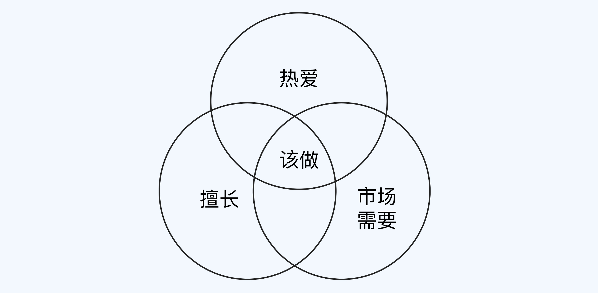

# 结束语 | 复盘，见天地见众生见自己
你好，我是张鹏！

《跟着高手学复盘》到这里就结束了，感谢你的一路坚持！

这门课有20讲，对你来说可能包括很多全新知识和案例，这也许让你感到学习压力有点大，所以能坚持到最后很不容易，让我为你点赞！

学完这门课，相信你已经熟悉了复盘的方法、工具和流程，但是我还是想提醒你，这只是做复盘的开始。复盘是一件看起来简单、按流程做起来也不难，但是想得出真正有价值的结论却非常考验水平的事情。

我从事咨询工作的这些年，去过不同的城市，了解过不同的行业，见过不同的企业和企业创始团队。我发现，成功的企业都有两大共性：

1. **极强的复盘能力**
2. **超级执行力**

执行力代表着企业能够把事情搞定，而复盘能力则意味着企业能够在成长过程中形成越来越强的深度洞察力。有了洞察力，就能够根据事物规律和人性来做针对性更强的战略制定和组织发展工作。

**在VUCA时代，企业比的不仅仅是质量、成本和效率，而是对需求的深度洞察和满足能力，这些都离不开复盘**。

## 复盘的挑战

复盘是一个在纷繁复杂的问题中抽丝剥茧的过程，最终得出的有效结论往往就是几句话，有时候甚至只有一句话，看上去似乎没有你想的那么高大上。但是， **只要有作用，能够推动业务，那就是有价值的规律。**

某个做咨询服务的公司，在招聘的时候往往会看中一个很关键的条件，那就是“颜值高”。因为他们发现在举办活动的时候，“颜值高”是自带引流能力的，很多潜在客户会主动加这些高颜值小姐姐的微信。毕竟“爱美之心”是人性啊！

有时候， **复盘的结论依然只是理论上正确的假设，可能需要你做取舍。** 如果放弃的是现实可得的利益，取得的只是未经证实的利益，你还敢不敢做这个决定？

某个高端别墅装饰的公司，最核心的竞争力之一是设计师，但是高级设计师把控了客户的多半主材供应。复盘时我们得出的结论是，需要取缔设计师对主材的把控，收归公司统一调配。

这会给公司带来更大的收益，但是也会打破设计师团队和公司原有的利益平衡，甚至可能会导致设计师大量离职。最终，公司高层还是下了这个决心，结果真的有很多设计师离职了，当年的业绩不但没有增长，反而成就了市场上大量的竞争对手。

幸运的是，之后的三年，这家公司经过一系列的改革，取得了前所未有的业绩增长。如果当时你是决策人，你会有这样的铁腕手段吗？

有时候， **复盘的结论证明你是错的，你过去的努力和认知完全不对，你真的能接受吗？**

某个公司在创业之初就高光满满，“改变世界”被每一个员工挂在嘴边，产品还没出来，就拿了中国创业史上最多的第一轮投资。结果在创业两年后，发现原有的C2C模式完全不符合市场的现实情况，后来复盘，发现公司最大的错误是创始人的战略判断失误，再后来通过无数次的复盘以及接近2年的内部创业孵化才找到新的增长点。

如果你是创始人，在复盘的时候，团队指出公司最大的失败就是创始人的战略误判，你真的能接受这样的结论吗？

## 个人成长

在前面的课程中，很多同学留言问我，对于个人成长和中长期的项目复盘，有没有更简单的做法？

关于个人成长，我给你分享一张图。

**首先是要找到你的热爱**。任何职业上的成就都是一个马拉松式的长跑过程，不可能一蹴而就。知识和技能都是可以在工作过程中学习到的，而热爱很难。如果没有热爱，工作过程中的各种困难、煎熬迟早会打败你。即使你还在工作，可能已经如同行尸走肉，缺乏生机与能量。

**其次是要找到你擅长的领域。** 擅长需要长期的磨炼，“畏难”是最大的障碍。大多数人天生会对不确定的事情感到恐惧，但是你拥有了良好的逻辑思维能力，就可以把一个复杂的事情分解成若干步骤和组成要素，制定计划总会实现目标。这也应了那句古话：“不积跬步，无以至千里。”

**最后是你所做的事情要被市场需要**。这需要深度的洞察，深度洞察多数时候都非常困难，但如果你本身是用户，那么这种洞察力就会极其敏锐。比如说你是某类产品的重度消费者，你就会非常敏锐地说出自己的痛点、产品的特性、性价比、使用场景和购买心理。生活本身就会带给你丰富的训练场景和数据。

三者的交集就是你长期的事业聚焦所在，热爱生活吧，朋友！

## 项目复盘

关于长期项目的复盘，如果你还不能得出“规律性”的复盘结论。那么，做完逻辑分析后能得到三个结论：

1. 什么该接着干（Continue doing）
2. 什么该停下(Stop Doing)
3. 什么该赶紧开始(Start to do)

这也是非常有价值的结论。等到项目做多了，对做过的项目集合做大的整合复盘的时候，你也会自然而言地洞见规律。

我在实际案例篇的导读中说过，做咨询就好比当企业医生：

一开始看到一些企业问题，也认为是个案，绞尽脑汁想办法帮助客户想方案；等到积累足够多案例的时候，了解完企业的需求，心里基本就清楚了客户的问题所在，至于业务调研和企业诊断的时候，相当于通过事实和数据来验证当初的判断。

这就像你去看医生，有经验的医生和你沟通完，看你的状态心理基本就有谱了。而中医的“望闻问切”还是西医的“验血验尿透视CT”等也是验证的过程。

我相信，当你成为业务专家的时候，也会具备这样的能力。复盘的框架再好、工具再多，也取代不了你自己对业务本身的理解。

## 复盘的关键

复盘的关键，在我看来，主要是两点。

第一个是 **频率**。我见过不同公司不同层级的员工。有些员工一开始看上去弱弱的，但是持续地每天、每周、每月复盘，一开始只是很简单地比较目标结果、逻辑分析、优化规划（洞察规律和更新认知这一块他们做得并不好）；但是他们长年累月地坚持下来，等到再次见面的时候，我发现他们简直像换了个人，精神状态、思维、行为习惯和工作结果和以前截然不同。

第二个是 **氛围**。我见过太多的复盘说好了不追责、不甩锅，一到了关键环节，依然改不了，大家争得脸红脖子粗的。一开始，我作为外部顾问也会感觉很有无力感。但是持续地讲、持续地反馈、持续地使用教练技术，效果和氛围就越来越好，复盘也有了高价值的输出。这也是很多公司把复盘纳入到企业文化的范畴的原因（不需要制度约束就能成为每个人的行事准则）。

## 最后的话

成长的快乐就像爬山。一开始，爬山开始的快乐是爬上山顶俯瞰更广阔的的天地众生，到后来，爬山本身才是最大的快乐，因为在这个过程中，你遇见了更好的自己。

复盘无论对团队还是对个人，都是帮助和记录成长的工具。祝你在复盘的过程中，遇见更好的自己！

《跟着高手学复盘》课程结束了，这里有一份 [毕业问卷](https://jinshuju.net/f/fAKgE0)，题目不多，希望你能花两分钟填一下。十分期待能听到你说一说，你对这个课程的想法和建议。