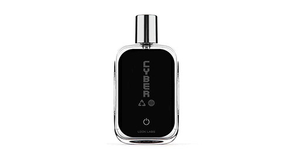

# 05 | NFT（二）：数据确权及其文化和商业价值的发现
你好，我是郭大治。

上节课里，我们主要学习了NFT在数据确权方面的低成本和永久产权的特点，也知道了NFT不仅赋予了“小图片”资产属性，同时还具有了“自我表达”的功能，NFT文化发现的价值也越来越突出。

那么今天，我们会继续了解NFT数据确权的另外两个特性，也就是“ **透明表达**”和“ **可编程**”，这两个特点都是传统的产权制度完全不具备的，并且它们还有一个 **共性**，那就是赋予NFT更加丰富的商业价值。接下来，我就带你具体看看它们究竟是如何赋予NFT商业价值的。

## **透明表达：NFT在数字化营销中的商业价值**

上节课我说过，基于低成本和永久产权的便利，NFT可以适用于大量的行为数据的记录，同时也能让数据记录成为不可篡改的可信记录，这些可信记录经过进一步地提炼和加工之后，就可以成为用户的个性化标签。而且，由于NFT是基于去中心化网络而生成的，所有的账户和数据信息对于外界而言都是透明可见的。所以， **NFT在数字化营销方面可以发挥重要作用**。

我们知道，营销的本质是消费者的需求管理，不论是在物理世界还是在虚拟世界，营销的第一步都是找到你的目标客户。一般传统的方法是通过问卷调研、渠道调研之类的来挖掘用户需求，但是这些方法成本非常高，而且调研结果的准确性也不能保证，高昂的营销成本最终还都需要用户去买单。

而如果用户的基本特征能通过持有的NFT表达出来，那么对于我们发现用户需求来说，就是一个非常便捷的渠道。而且你还要知道，如果用户对某个NFT产品厌倦的话，他早就把这些标签从自己的账户上撕掉了。所以，这些通过NFT表达的内心活动，都是用户的主动行为。

所以从这个角度来说，相对于广告等方式，通过NFT获得的用户数据的 **准确性** 还会大大提升，这一点对于基于用户画像开展个性化营销，毫无疑问是非常重要的。

此外，NFT展示的数据还是一个 **多维度的立体数据**。比如说，一个账户可以持有多个NFT，其实就是关于账户持有人多方面、多视角的综合反映：对于用户来说，是自己心理的自我表达；对于厂商来说，就是建立客户画像的基本素材，并可以用来挖掘用户更深层次的需求。

比如专业生产运动鞋的李宁，其数据库里可能拥有大量关于中国老百姓鞋码尺寸的数据，以及针对某些运动对鞋的不同部位具体磨损程度的专业数据。但是，他们对于用户在绿色环保、健身养生以及是否喜欢挑战、追求刺激、勇于探险等方面的特征，一定是缺乏了解的，而这些因素对于挖掘用户需求来说又有很大的影响，这就是NFT在“透明表达”方面的优势。

所以，用户主动的自我表达和被动的问卷调研从效果上来看，差别还是挺大的。

现阶段，我们已经看到很多的品牌和厂商，正在发行跟自己品牌相关的NFT或者数字藏品，小到服饰、香水，大到汽车、房产，还有各种装备，这个过程实际上就是一种标签导入的过程，各种品牌的各种主题的NFT不断拓展覆盖范围，一定会在一个临界点之后，形成一个覆盖大多数网民的立体的可信数据库。

到了那个阶段，大量用户的特征数据已经变得透明可见，也就意味着，在目前状态下，互联网公司对于渠道和数据的垄断能力将变得没有意义，相反的是针对公共数据进行数据分析和品牌内涵塑造的能力，会变成更核心的竞争力！

不过我猜当你看到这儿的时候，可能会产生一些疑问：如果到了那个时候，我们的个人信息数据几乎完全透明了， **那是不是也说明我们的隐私完全得不到保证？**

其实也并不会，因为基于NFT的信息表达的主体是 **账户**，而不是我们真人，而且从目前的情况来看，虚拟账户和真人是“弱绑定”，链上账户和现实世界的个人并不会一一对应。

也就是说，个人对账户的控制完全是主动的，但是从账户追溯的个人几乎是不可能的，而且这个问题在现在看来还是一个无解的问题。为什么呢？因为链上账户和个人的绑定一定需要一个中心化的机构，完全依靠互联网解决不了这个问题，这种状态可能会是一种常态。

这样的话，对于账户特征的挖掘还不能完全等同于对于个人信息的挖掘，但我们确实又能从多个角度反映出账户背后的个人的一些真实状态和喜好，虽然数据分析的难度增加了，但给我们带来的成本可能大大降低。

而且啊，对于Web 3.0来说， **打破数据垄断是必要条件，但是不代表用户没有数据披露的主动权**。恰恰相反，目前已经有大量的项目，将基于区块链公开数据库访问个人数据设置了控制权限，也就是说你想让别人知道的信息，别人才能知道，如果你选择拒绝访问，那别人是无法了解到你的任何数据的。

这样来看，NFT透明表达的数据，本质上还是一种 **主动表达**，是用户拥有明确的主观愿望，希望被外界检索到的信息，这种主动表达的信息对于厂商来说显然更有价值。

就比如，你可能也会在一些社交平台上主动设置头像，或者在简介上披露自己以往的活动经历、工作简历等信息，这些都是我们自己的主动选择。甚至说，用户主观上希望通过这种行为找到“志同道合”的朋友，或者找到满足自己需求的方案。

所以，针对这些数据的分析，对于我们做数字营销来说，还是有很重要的价值的。

也正是因为NFT在数字营销方面的商业价值，如今各大品牌也纷纷布局NFT。有的品牌选择和NFT项目打造联名款商品，比如阿迪达斯；有的品牌是选择收购专业的虚拟商品制造商，比如耐克；还有的商品选择自建元宇宙、自创NFT，比如LV。

但更多的厂商，会选择直接发行NFT或数字藏品。这样一方面，他们可以通过虚实商品的互相兑换，实现一定的销量，另一方面也是在分步为自己的用户打上标签，同时也是利用相似的方法获取新的用户。

如果你对于数据挖掘和数据分析有一定的经验，你也可以尝试着在这个领域创造一些工具，或者说，如果你对于品牌和营销感兴趣，就可以尝试通过这种方式设计一些活动方案。

总之，NFT已经成为数字营销的必修课，而这是一个全新的领域，在这个方向上越早迈出一步，就可能意味着在以后相当长的一段时间内，你会具备其他人所没有的非常显著的优势。所以，为什么不尝试一下呢？

## **可编程性：赋予NFT无限可能的应用**

作为数据确权的基础性制度，NFT还具有可编程的特点。如果说低成本和永久产权赋予了NFT文化发现的功能的话，可编程性更多体现的是NFT巨大的 **商业价值**。

通过和智能合约的结合，NFT不仅可以代表各种形式的数字创作的所有权，还可以和不同的场景结合，代表其他更多种类、更复杂的权利。比如成为某个俱乐部会员的权利、获得版权收益的权利、参与某项投资计划的机会等等。

可以说，可编程性为NFT的商业价值创造了无限的可能。

我们来看几个简单的例子。

- **第一个案例，NFT设置灵活的版权收入分配机制。**

在传统版权市场中，版权的收益只能通过一次性转让或者授权他人使用实现，如果原创作者把版权转让给了专业出版商，不论出版商凭借这个作品获得了多少利益，都和原创作者没有一点关系，这也是导致很多世界名著的原作者虽然创作了伟大的作品，但却终生贫困的主要原因。

那么，为什么传统版权市场，不能建立原创作者多级分享收益的版权机制呢？当然就是因为这种方式监督和实施的成本实在是太高了，没有必要的技术支持。

但是，NFT出现之后，原创作者就完全不必担心这种情况了。因为NFT的交易记录都完整地保存在区块链账本，而且可以通过智能合约设置多种规则，当然也可以设置一种“不论该作品经过多少次转让，每次转让都按照一定比例向原创作者支付版税”的机制。而且这种机制可以完全自动执行，一旦发生交易，原创作者以及出版商应该分别获得多少收入，都会通过智能合约计算得清清楚楚，并且可以自动转账至个人的账户。

可见，这种兼顾风险和收益的分配制度，对于鼓励原创作者来说，无疑具有非常积极的效果。

- **第二个案例，HashMask，不仅可以收藏还可以参与创作的数字艺术品。**

[HashMask](https://www.thehashmasks.com/) 是一个数字艺术收藏品项目。在2021年，HashMask计划邀请世界各地的数字艺术家共同创作一批数字画作，不过在项目的推进过程中，他们发现这个工作量太大，于是改变了工作方式，把画作创作改为“元素创作”，然后再通过算法将这些元素进行组合，最终他们得到了16384件组装式的作品。

这个数字并没有任何特殊的涵义，只是项目团队根据自己设置的标准，在随机生成的画作中筛选出来的数量。所以，我们从这一点可以看出，同样都是算法生成的作品，HashMask相对CryptoPunk之类的头像还是不太一样的。

对于PFP来说，头像离开账户之后，并没有太多独立的使用价值。但是对于艺术品来说， **它本身是一个文化层面的完整表达**，比如艺术品需要有一个反映其文化诉求的名称，而头像只用数字编码即可。

HashMask也是看到了这一点，所以别出心裁地设计了收藏者为艺术创作命名的环节。那收藏者如何命名呢？HashMask的做法是推出了一种 **治理代币**，收藏者从一级市场购买画作，可以获得治理代币的奖励，收藏者持有画作的每一天，都可以获得一定数量代币的奖励。但是收藏者要为画作命名或者改名，就需要消耗治理代币，而且每幅画作终生只有两次改名的机会。

通过这样的方式，收藏者可以按照自己对画作的理解为画作更名，也算是参与了艺术创作。NFT就是通过这种方式，为数字艺术品的价值实现找到了新的途径。

此外，NFT和游戏、社交以及金融都可以进行结合，并产生新的业务模式。比如NFT使游戏资产能够独立于游戏而存在，且可能建立一种更具开放性的虚拟生态，在这个虚拟生态中，土地、资源、角色、产出都可以基于NFT技术进行确权、定价和交易，NFT成为虚拟世界数据确权的基础设施。

NFT还可以用于非标金融资产的标记，比如一份保险、一笔贷款、某种结构化金融产品的一个份额，当然也可以是具有不同属性的股权、收益权或者是分红权，都可以成为一个NFT，然后再和智能合约配合起来，构造很多复杂逻辑的金融产品。

而且，以上这些都可以是为了元宇宙而准备的前戏，我认为，NFT将成为元宇宙最基础的产权制度。所以我在前面才会说，可编程性赋予了NFT无限可能的应用。

## 小结

这节课，我们从透明表达和可编程的特点出发，一起了解了NFT在商业方面的应用价值。当然在课程里，我只是列举了一些已有的案例，相信未来还会有更多好玩的、有意思的东西出来，在Web 3.0这里，既有新的创业机会，也有对新的技能的需求，希望你能找到适合自己的“金铲子”，也希望你能贡献更多有意思的新玩法。

## 思考题

关于NFT的应用场景，你还能够想到哪些？欢迎在留言区分享你的答案，也欢迎你把今天的内容分享给更多的朋友。