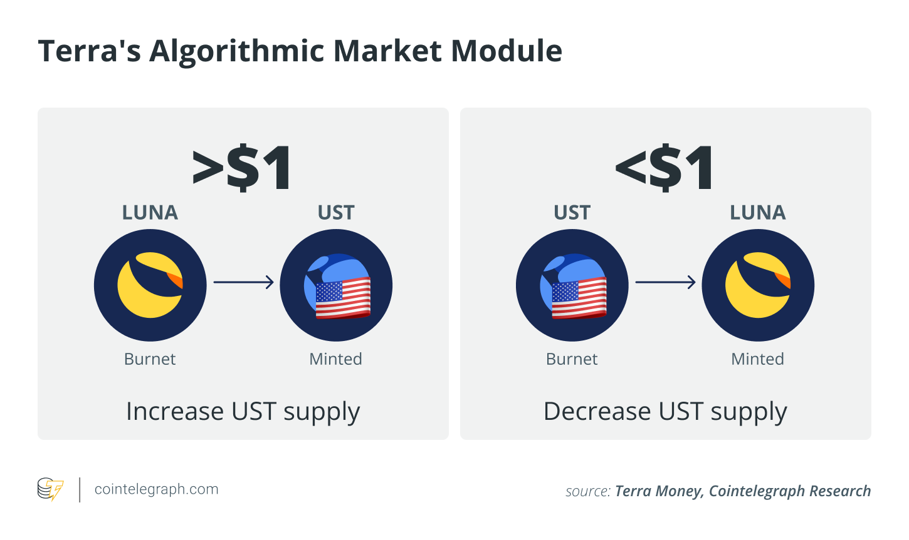
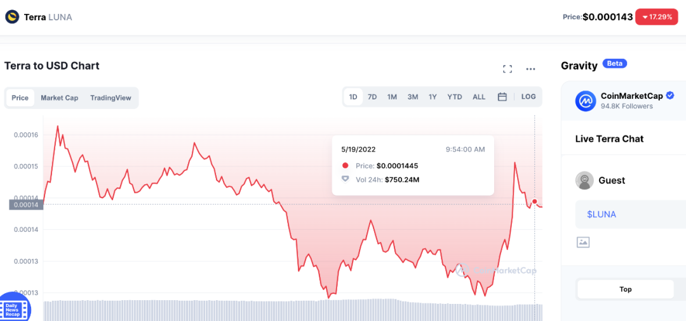
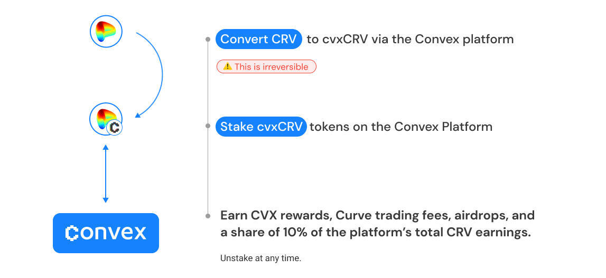

# 12 | DeFi的空中楼阁能盖多高？
你好，我是郭大治。

通过前面课程的学习，现在，我们已经清楚了为什么需要Web 3.0，也结合Web 3.0的分层架构，了解了作为通用基础设施的计算层、身份层和激励层分别是什么，另外我还重点讲了Web 3.0应用层的各个细分领域，比如NFT、游戏、音乐、社交、金融和DAO等。那在接下来的课程中，我们会开启一个全新的视角，一起来看看 **Web 3.0生态主要都面临了哪些风险**。

毕竟，没有零成本的创新，只有把创新和风险防范结合起来才有可能实现真正的创新。站在个人的视角，我们更要综合考虑风险和收益。

在刚刚过去的上半年，百亿市值的LUNA币在短短几天时间内的 [崩盘](https://www.chinanews.com.cn/cj/2022/05-18/9757696.shtml)，让太多的用户付出了惨痛的代价；曾经风光一时的三箭资本也从市场宠儿走到了 [破产清算](https://wallstreetcn.com/articles/3663394) 的地步。面对Web 3.0这场已经开启的互联网革命，对于风险的认知一点也不应该比创新少。所以，希望通过这节课，能在你因为技术之光而被点燃的激情之中，注入一份理性的思考。

好了，下面我们正式开始。

## DeFi领域里值得关注的两个问题

我们知道，Web 3.0是一个基于底层技术重构，建立的涉及从技术到应用多个领域的综合型的生态。那么，关于风险的内容，同样也涉及从技术到应用，再到市场以及法律和伦理等多个层面，每个层面的风险都有不同的成因和表现，而这些因素又相互作用和影响，交织在一起，通过各种形式表现出来。

在接下来的这两节课中，我会重点选择和我们大多数用户最有可能发生交集的几个领域，也就是 **应用和法律** 的相关领域来进行分析，帮你建立一种关于Web 3.0相关风险的系统性认知，使你在独自面对一些具体问题的时候，能够根据这些系统性的认知，进行自我思考。

今天这节课，我们重点针对DeFi领域，来讲两个问题，一个是关于抵押借贷为整个DeFi生态带来的系统性风险问题，另一个是关于流动性挖矿的收益风险问题。

**为什么要选择这两个问题呢？** 因为抵押借贷和流动性挖矿，是DeFi领域大多数用户参与度最高的两类业务，大多数用户往往会根据项目提供的年化收益率，来选择参与项目，但对于这两类业务背后的金融逻辑，以及它们分别蕴藏的风险，却并不具备十分清晰的认知。结果到最后，预期的高收益并没有获得，自己的本金还有可能造成较大的损失。

所以，我们就先从这两个问题讲起。

## 抵押借贷的系统性风险

关于这个问题，我们先来看一个案例。

尽管稳定币的核心命题是锚定目标价格，对冲价格波动，但一旦调节机制失灵，稳定币也会迅速“崩盘”。2022年5月，LUNA就给市场上演了一场活生生的“演示课”。

LUNA是Terra协议的治理代币， [Terra](https://twitter.com/terra_money) 是一条兼容EVM（ETHEREUM VIRTUAL MACHINE，以太坊虚拟机）且实现Pos共识机制的公链，所以 **LUNA的主要功能就是社区治理和支付Gas费**。

Terra团队同时还推出了一个锚定美元的稳定币项目UST，并明确规定只有抵押LUNA才可以铸造（借出）UST。这种设计是抵押借贷的典型模式，比如像合成资产类项目 [Synthetix](https://synthetix.io/)，但不同的是考虑到代币价格的波动性比较强，Synthetix将抵押率设置为750%，这样抵押资产的价格风险传递到稳定币的可能性，就大大降低了。

但是LUNA没有进行这样的设计，而是将抵押率直接设定为1，这样， **抵押资产的价格风险将“不打折扣”地全部传递给稳定币**。不仅如此，LUNA还将UST的存款利率和LUNA的Staking收益（质押挖矿）进行组合，通过 [Anchor平台](https://app.anchorprotocol.com/) 向UST用户提供固定年化利率达20%的存款产品。

这样的结果是，很多用户对于LUNA和UST的实际运行机制，其实并不是非常了解，但是对于固定年化20%的收益率却是非常“上头”，并因此而承担了巨大风险。

此外，Terra也设计了 **套利机制**，希望通过市场激励驱动UST价格锚定1美元。Terra套利机制的主要设定是，1UST始终能够兑换价值1美元的LUNA，同时价值1美元的LUNA也能够兑换回1UST。在LUNA价格相对稳定或者持续上升期间，这套机制对于UST锚定1美元确实发挥了一定的作用。

图片来源于 [Cointelegraph](https://cointelegraph.com/news/cointelegraph-consulting-the-bigger-role-of-luna-in-terra)

基于以上机制，2020年11月UST从零起步，2022年5月市值规模最高达到了180亿美元。在此期间，Terra的管理团队为了降低UST抵押物的价格风险，分批次将作为抵押物的LUNA部分调仓，买成BTC和ETH，但UST和LUNA在机制设计上的漏洞却始终存在。

### 流动池锁仓量可以引发蝴蝶效应

时间来到了2022年5月，美联储加息预期，导致BTC以及整体加密资产价格快速下跌。终于，作为抵押资产的LUNA资产价值，低于了UST流通市值，这就使得 **UST从技术层面已经破产**，这时候尽管市场还没有立即对此做出反应，但市场上做空LUNA和UST的力量已经开始聚集。

在此关键时刻，Terra团队却似乎并没有感觉到市场形势的凶险，而且还在5月8日“不失时机”地为空头（Short/Bear）送上一次“绝佳的助攻”——项目方于5月8日开始，主动将Curve3币池中的流动性撤回，并计划创造一个新的由4种稳定币构成的流动池。

我们知道，稳定币以价格稳定为首要目标，但在DeFi已经逐渐流行的今天，稳定币的价格并不是主要由中心化交易所主导的，而是通过Curve这样的DEX（去中心化交易所）反映出来的。在Curve为UST和其他稳定币设置的流动池中，因为UST和一系列的稳定币都锚定美元，所以UST的数量应该等于其他稳定币的数量之和。 **而且，所有稳定币加总的锁仓量（Total Value Locked，TVL）越多，UST的币值就越稳定。**

因为流动池锁仓量对于UST的币价来说，就像是一条护城河，河面越宽，河水越深，城池也就越安全。如果市场对UST的币值没有信心，那么上述流动池中，其他稳定币的数量就会逐渐减少，而UST的数量将逐渐增加。

所以，Curve中UST相关流动池的锁仓资金量，对于UST的币值稳定不仅是非常重要的，甚至可以说是决定性的。但这些信息却又都是公开透明、所有人可见的，这种公开透明就在客观上为市场上的空头，提供了一种可以利用的机会。

要知道，在一般情况下，市场对UST币值的稳定越有信心，则参与提供流动性挖矿的锁仓资金量就越大，这些资金的TVL甚至可以看成是稳定币币价的基本面。但在极端的情况下，流动池TVL又会成为在市场上引起连锁反应的导火索。

假如因为技术原因或者其他偶然因素，这个TVL发生了剧烈变化，即使是短暂的剧烈变化，如果被市场空头所利用，并在价格上引起快速波动的话，不仅会对市场发出错误的价格信号，同时也会 **通过以Curve报价作为价格输出的预言机，传导给其他DeFi协议**，比如抵押借贷协议，并造成一系列的连锁反应。

当市场空头利用稳定币的锁仓资金量快速下跌的时机，大量抛售稳定币，那么稳定币在Curve的短时报价，就会大大低于锚定价格。这时候，DeFi中的抵押借贷协议就会根据这个价格信号开始清算。

而我们也清楚，中心化的抵押借贷平台虽然不是基于智能合约执行清算的，但对于清算条件的设置也和抵押借贷协议大体相似，如果短期内稳定币的价格不能迅速恢复正常，那么中心化借贷平台也会开始启动清算，大规模清算一旦启动，稳定币将在市场上被大量抛售，并可能形成价格踩踏。

### 稳定币基本面的重要性

这时候，发挥关键作用的就应该是 **稳定币的基本面** 了，如果市场认为稳定币项目的基本面还可以，有望最终稳住价格，那市场上就会有抄底资金介入，帮助币价稳定；但如果市场认为稳定币的价格缺乏支撑，那么币价就很难恢复到稳定水平。这样，本来是非市场原因造成的价格波动，最后在事实上就演变成了一次市场的出清。

Terra的经历正好验证了上述推断。就在Terra团队开始流动性调仓的时候，有机构开始大量卖出UST，UST随之开始脱锚。

而UST一旦脱锚，在前面我们介绍的套利机制的作用下，用户的反应就是卖出UST换成LUNA。如果LUNA的价格可以保持稳定或者回升，用户的操作也就到此为止了。但是市场并没有为LUNA提供这样的一个机会，BTC都在连续回调，LUNA更不可能独善其身。

由此一来，LUNA价格持续下跌，导致用户卖出LUNA，这时候LUNA已经不再能承担UST价值稳定的作用了，而是 **成为了UST价格继续下滑的催化剂**，这就是所谓的“死亡螺旋”。

从2022年5月8日开始到5月28日，UST市值从187亿美元跌到2亿，LUNA市值从265亿美元跌到6亿。在LUNA身上，我们见证了加密资产市场涨跌幅度和速度最快的演变，但无论如何，UST作为一个稳定币确实是崩盘了。

好了，通过UST的案例我们可以看出，抵押借贷作为一种具备一定杠杆效应的金融工具，通过 **DeFi协议之间的可组合性**，已经给不同资产之间的价格风险建立起了一种联系，由于这种联系是基于智能合约实现的，所以也具有高度的 **灵敏性和扩散性**。而加密市场各种 **资产价格上的强一致性**，如比特币的涨跌，往往会带动大部分资产价格发生同方向上的调整，这种强一致性，又进一步放大了这种“抵押借贷”带来的扩散效应。

所以说，抵押借贷已经成为一种具有较强系统性风险的业务。对于我们用户而言，使用抵押借贷一定要关注这方面的风险，如果是出于对冲风险的目的而使用抵押借贷，则一定要 **控制好时间期限**，参与抵押借贷的时间越长，可能承受的系统性风险越大。

## 流动性挖矿的风险

下面，我们再来看看流动性挖矿的相关风险。流动性挖矿的原理，在前面讲 [DeFi](https://time.geekbang.org/column/article/561514) 的时候已经说明过了，这里就不再详述。在这里，我们主要强调的是参与流动性挖矿的收益风险问题，以及为了争夺流动性挖矿奖励而产生的多层嵌套问题。

### 流动性挖矿的收益风险问题

我们先来看流动性挖矿的收益风险问题。

首先，流动性挖矿可能会获得两种奖励：一种是 **手续费分成**，但手续费分成需要按照你提供的资金量去分配手续费，对于资金量不大的用户，其实收益也非常有限；另外一种是 **去中心化交易所平台币的奖励**，这种奖励虽然也是根据你提供的资金量进行分配的，但是奖励的年化收益率可能会很高，年化上百甚至数百的项目非常普遍，所以很多用户冲着这种高收益，就投入了自己的资金。但是一段时间之后，挖矿收益却少得可怜，甚至本金也无法收回。

为什么出现这种情况呢？因为流动性挖矿的预期收益率，是按照奖励代币的实时价格计算的。在产品上线初期，挖矿奖励产出少，流动性挖矿又需要两种代币配对（ETH和USDT），所以奖励代币价格高，流动挖矿收益率也高，大量用户参与挖矿，就导致奖励代币价格和挖矿收益率形成了一种相互加强的正循环，从而导致年化收益率达到了一种“离谱”的高度。

但是，这种正向循环一定是不可持续的， **一旦流量增长遇到拐点，用户快速抛售挖矿奖励所得资产就会导致其价格加速下跌**，不仅预期的高收益不再存在，而且本金都有可能损失。

你可能会问，为什么还会造成本金损失呢？这是因为，流动性挖矿需要两种代币配对，当你只有ETH或者USDT的时候，你需要买进另外一种代币组成LP Token，才能参与流动性挖矿。

在挖矿初期，这种“配对”需求就造成代币价格大涨，挖矿收益率也达到了一个很高的数值，但当流量反转的时候，不仅挖矿收益率大跌，代币本身的价格也大跌，当你准备退出挖矿而卖出代币的时候，大概率情况下本金是无法回收的，所以本金也可能损失。

### 为争夺流动性挖矿奖励产生的多层嵌套问题

然后我们再来看看为了争夺流动性挖矿收益，而产生的多层嵌套问题，这个问题主要是因为Curve产生的。

前面我们也简单介绍过，Curve是一个主要针对“类似资产”，提供低滑点交易的去中心化交易协议，“类似资产”指的是具有相同价格锚定对象的资产，比如与美元挂钩的各种稳定币。

我们在前面 [DEX](https://time.geekbang.org/column/article/561514) 一节曾经提到过，AMM模式最大的缺陷在于无常损失，而无常损失的大小，又只和价格波动幅度相关联，“类似资产”之间是所有资产中价格波动最小的交易对。所以，Curve通过一种“舍得”的方式，找到了最适合AMM发挥作用的场景。

我们在前面提到过，对于各种稳定币来说，在Curve **设立流动池** 是其体现币值稳定的必要条件。所以，在Curve整合USDC、USDT和DAI创建的三币池的基础上，组建“X+CRV3”的四币池，就成为了众多稳定币创建流动性的标配。

但是创建流动池，需要添加流动性，仅仅依靠项目方自己添加显然是不够的。于是，吸引用户添加流动性就成为各个稳定币的基本动作。

那么，如何吸引用户添加流动性呢？ **激励方法只有流动性挖矿**，每一个稳定币要想获得更多的流动性，就看这个稳定币能不能在Curve池提供更具竞争力的奖励。Curve推出按照时间加权分配CRV（币池）的方案，正好为各个稳定币激励竞争提供了一个良好的舞台，由此Curve War拉开了序幕！

在Curve War中，最主要的就是两个选手，一个是 [Yearn](https://twitter.com/iearnfinance)，另外一个是 [Convex](https://www.convexfinance.com/)。

其中，Convex的方法是 **把CRV作为流动性激励和治理投票的功能，拆分成了cvxCRV和vlCVX**，使CRV持有者既可以获得流动性奖励，又可以参与社区治理。基于这个功能，Convex不仅取得了Curve War大战的胜利，甚至Yearn也将其收集的LP转投Convex。

由此一来，在Convex已经掌握了半数以上CRV的情况下，稳定币项目方就不再尝试购买CRV质押投票，而是转向购买CVX。但购买CVX然后锁定为vlCVX，再参与治理投票，这个过程不仅麻烦，而且还会让持有人面临新的价格风险，于是一种走捷径的“贿赂网站”应运而生。

既然稳定币最需要的是CVX的投票权，而非CVX本身，那么我们就创造一个平台，在这个平台上，稳定币项目方可以为CVX持有人提供一些奖励，以换取CVX的投票权。所以，这种网站有了一个形象的名字，就是“贿赂网站”。

比如，有一个协议 [Redacted Cartel](https://www.redactedcartel.xyz/) 通过分叉Olympus的Bonding机制，建立了一个基于治理代币BTRFLY收集投票权资产的机制，之后再通过拍卖投票权获得收益，并在BTRFLY持有人之间进行分配。

那么，从Redacted Cartel的方案来看，所谓的“流动性管理创新”，好像就是没有止境地叠加，就是不断地用新的代币去收集原来具有投票权的资产，从而将投票权转移到新的资产上面。这就像一座空中楼阁一样，不断叠加、不断长高，但是却因为没有地基而随时可能坍塌。

所以我们要知道，尽管DeFi的各种协议通过组合的方式，可以创造出很多复杂的功能，但是 **没有充足的可以创造基础收益的底层资产作为支撑，DeFi的价值又有多大呢？**

## 小结

这节课，我们通过LUNA的案例，看到了抵押借贷对于价格风险的巨大的扩散性，这个对于使用抵押借贷对冲风险的用户来说，需要特别关注。

另外，我也带你分析了流动性挖矿所谓超高收益的主要来源，并发现这种收益的不可持续性，以及可能对本金造成的损失。而且我们还发现，虽然代币激励对于用户参与流动性挖矿，具有一定的积极效应，但过度嵌套无异于将DeFi变成了一座空中楼阁，同样也会加大系统性风险。

下节课，我们还会针对法律和伦理方面的风险来进行探讨，我们不见不散。

## 思考题

在你关注到的DeFi项目中，还有哪些比较隐蔽的风险？你是怎么看待这种风险的？欢迎在留言区分享你的看法和思考。另外，也欢迎你把今天的内容分享给更多的朋友。