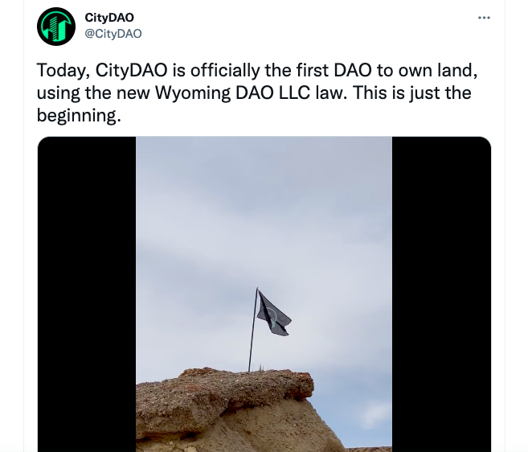

# 13 | 代码和法律，哪个更强？
你好，我是郭大治。这节课，我们继续关于风险的话题，一起来探讨下Web 3.0中与法律相关的风险。

我们知道，法律是现实世界中所有人行为规范的总和，它对于现实世界所有人的行为，具有一种 **强制性的约束力**。而基于去中心化底层架构建立的虚拟世界，是以账户为活动主体，并以智能合约体现各类活动的运行规则。

我们个人可以通过对账户的控制，来实现虚拟世界和现实世界的连接，但由于个人和账户之间并不能实行强绑定，现实世界法律规则对于个人行为的约束，并不能直接体现为对账户行为的约束。在这种情况下， **如何拓展法律的有效边际、确保法律规则的有效性**，就需要我们进行深度探讨。

在这节课程中，我会通过三个观点，来帮你更好地把控法律相关风险，进而在Web 3.0的世界里实现更大的自由。

## 观点一：金融监管的基本逻辑不因资产形态的不同而改变

代币是很多Web 3.0项目经济激励机制的基础，比如游戏中的Play to Earn模式，用户赚取的就是代币。我们在前面讲 [通证经济](https://time.geekbang.org/column/article/551261) 的内容中，也分析了关于代币的一些明显优势，比如在产权方面的个人自主性、全球范围的流动性，以及更加精细化的激励和自动执行的特点。

但是，很多国家对于代币相关的业务，又采取了严格禁止的态度，比如禁止开展ICO（Initial Coin Offering，首次代币发行）和数字资产交易所等业务。那么， **关于代币本身，是否具有法律风险？如何界定这些风险？** 这些问题，需要我们根据代币相关业务的具体属性进行分析。

### 交易、持有、转让代币的风险

实际上，从目前各国已经出台的关于代币相关政策的内容来看，对于代币相关的业务，各国并没有采取“一刀切”的方式笼统性地进行处理，而是从业务属性出发，针对不同的环节建立不同的政策法规进行规范。

举个例子，各国政府针对代币的持有、转让、使用和获益，都并没有进行相关限制，对于代币的资产属性还进行了保护，包括我国在内的不少国家，都有关于加密资产被盗并通过法律手段进行判罚处理的案例。

但是在我国，2021年9月，央行等十部委在 [《关于进一步防范和处置虚拟货币交易炒作风险的通知》](https://baike.baidu.com/item/%E5%85%B3%E4%BA%8E%E8%BF%9B%E4%B8%80%E6%AD%A5%E9%98%B2%E8%8C%83%E5%92%8C%E5%A4%84%E7%BD%AE%E8%99%9A%E6%8B%9F%E8%B4%A7%E5%B8%81%E4%BA%A4%E6%98%93%E7%82%92%E4%BD%9C%E9%A3%8E%E9%99%A9%E7%9A%84%E9%80%9A%E7%9F%A5/58639028?fr=aladdin) 中指出， **参与虚拟货币投资交易活动存在法律风险**。任何法人、非法人组织和自然人投资虚拟货币及相关衍生品，违背公序良俗的，认定相关民事法律行为无效，由此引发的损失由其自行承担。简单地说，投资等民事法律行为无效，但资产属性仍然受到法律的保护，使用代币产生的相关后果由用户自行承担。

当然，代币的持有和转让是站在用户的角度产生的行为，如果站在行业的角度来看，就是代币交易。

关于代币交易的法律属性，在不同的国家和地区有完全不同的定义。有的国家对于代币交易业务设立了明确的准入条件，比如美国纽约州推出了 [BitLicense](https://zh.wikipedia.org/zh-cn/BitLicense)，获得BitLicense的Coinbase甚至已经在纳斯达克上市，欧洲部分国家、韩国、新加坡、阿联酋等国家，也推出了加密资产交易牌照。

但是，各个国家同时又在交易所的具体业务方面，提出了一些限制，比如新加坡允许数字资产交易所在本国注册，但不允许交易所向本国居民提供数字资产交易服务。 **在我国，数字资产交易所业务是严格禁止的**，即使是在数字资产交易所就业，也会承担相关法律责任。

总体来说，各国政府对于数字资产交易业务都普遍制定了比较严格的监管政策，这种状况的主要原因在于，资本市场需要通过严格的信息披露和投资者准入制度，以保护广大投资者免受市场操纵带来的损失，以及承担超出自己承受能力的风险。

此外，各国国情的不同，也决定了对数字资产交易业务采取的不同态度。一般来说，经济体量小的国家，试错成本更低、更愿意大胆尝试；经济体量较大的国家，试错成本高，态度也会相对谨慎。

### 被严格监管的ICO

如果说各国政府对于数字资产交易业务的态度还存在一定差异的话，对于ICO，也就是所谓“首次代币发行”，则一致采取了更为严厉的监管措施，到目前为止，还没有哪个国家对ICO采取开放的态度。

出现这种情况的主要原因在于， **ICO从业务属性上来看，已经涉嫌有价证券的公开发行**。而在传统金融市场上，有价证券的公开发行，比如股票IPO或者债券发行，都会受到严格的监管，都要求发行主体进行充分的信息披露，防止欺诈行为的发生，同时也会对投资人的抗风险能力提出明确的要求，以便缺乏专业知识且抗风险能力较低的人，没办法承受资本市场风险。

虽然ICO发行的资产不是股票或债券，而是Token，但是 **发行人应该承担的信息披露的义务，针对投资人抗风险能力的筛选，不会因为资产形态的改变而改变**。所以，ICO必须受到严格监管。

不过，ICO受到严格监管，也并不意味着发行人不能通过代币的形式发行资产。只要你具备了相关技术条件，并且按照IPO的要求，履行完相关信息的披露义务，同时在经过金融监管机构批准设立的交易场所，按照具体的发行流程完成发行程序，就可以发行代币资产，这其实就是所谓的 **STO** 了，即Security Token Offering。但要注意，STO对于企业的经营状况、信息披露和参与标准也都有严格的要求，仅仅依靠一份白皮书是远远达不到STO的相关标准的。

所以我们概括地来看，代币风险的问题，主要就是来源于代币相关业务反映的金融属性。

如果是基于资金开展的相关业务会受到监管，那么以代币的形式开展同类业务，也必须受到监管， **金融的监管逻辑不因资产的存在形态不同而改变**。如果代币相关业务没有金融属性，那么关于代币的使用或持有可能面临的风险，就只能由用户自己承担。

## 观点二：和法律制度主动进行衔接，是去中心化应用获得持续运营的有效保障

关于这个观点的解释，我们可以先来看一个案例。

2021年7月，一个叫 [CityDAO](https://www.citydao.io/) 的项目在以太坊区块链上发起，这个项目计划通过DAO的形式，在现实世界建立并运营一个可以让社区成员生活的城市，这个城市会率先把各种处于行业前沿的、与去中心化社区相关的一系列新的技术和服务付诸实施，比如去中心化身份认证DID，各种NFT等。因为人类毕竟不能只是生活在虚拟世界，追求一种“虚拟和现实”结合更加彻底的生活方式，就是CityDAO设立的初衷。

凭借着这么新奇的idea，以及维塔利克（以太坊创始人Vitalik）等名人的支持，在大约两个月的时间内，CityDAO就通过发行公民身份NFT，筹集到了价值800多万美元的ETH。但是在筹集到这笔资金之后，CityDAO的运营团队却遇到了一个“棘手”的问题，就是手里有钱，却没办法启动项目。

因为，建造一个城市首先需要一块土地，而CityDAO作为一个只在链上得到公认的“去中心化自治组织”，在现实世界却没有一个身份。那么，没有一个被现实世界法律制度所认可的身份的话，买到的土地记到谁的名下？如果是以项目发起人的个人名义持有土地，不仅在社区层面很难获得认可，同时在法律层面上，也蕴含巨大的风险。

但CityDAO“碰巧”赶上了一个好时候，2021年7月1日，美国怀俄明州的“DAO法案”正式生效了，这个法案将DAO定义为一种有限责任公司，从而为DAO获得了一个明确的法律身份。有了这个身份之后，CityDAO和其他取得美国“有限责任公司”注册的DAO，就可以在怀俄明州按照一个“有限责任公司”的模式活动，比如买地、签订各种协议以及开展各种营业活动了。

这样，有了“DAO法案”的助力，在9月，CityDAO就正式在美国怀俄明州，拥有了一块40英亩的土地，印有CityDAO社区LOGO的旗帜已经插在了这块土地上，并且CityDAO的名字也被标注在了Google地图上。接下来，CityDAO就可以在这块土地上，启动社区为DAO造城的目标了。

在这个案例中，尽管CityDAO凭借代码自治的“先天优势”，让人们对一个“虚实结合”的城市空间充满了想象，但是没有怀俄明DAO法案的设立，也许这种想象将永远只是停留在想象的阶段。

由此可见，DAO通过和法律的结合，可以为自己在现实法律中找到一个具体的身份，一旦DAO具备了 **现实法律框架下的身份定位**，那么它就可以在现实世界中，按照一套明确的行为规则开展运营。

而且，对于法律身份的需求，并不仅仅只是来自于CityDAO，比如投资DAO也需要在筛选标准、投资人数量以及参与金额等方面，满足现实世界关于“基金类”产品的运营标准，如果不能满足这些标准，传统金融市场的资金就无法参与。这一点和我们在前面第一个观点强调的，“金融监管的基本逻辑不以资产形态的不同而改变”，是一个道理。

那么，为了让投资DAO拥有一个合规的身份，市场上已经出现了一种叫 [LAO](https://medium.com/openlawofficial/the-lao-a-for-profit-limited-liability-autonomous-organization-9eae89c9669c) 的协议，全称是A For-Profit, Limited Liability Autonomous Organization，意思是基于盈利目的的具有承担有限责任能力的自治组织。虽然它和DAO只有一字之差，但一个字母的改动，却实现了虚拟空间和现实世界的链接。

LAO协议是按照美国特拉华州，关于有限责任公司的相关内容所设计的法律结构，并通过一组智能合约的绑定执行，使智能合约具有法律效力。而为了合规的目标，LAO的会员权益会受到一定的限制，也会对会员的准入设定一定的条件，使其满足特拉华州法律规定的合格投资者的标准。可以说，LAO就相当于为投资DAO寻找法律定位，提供了一种通用型的解决方案。

但是我们也清楚， **任何一部法律都只是针对特定的时间、特定地点和特定行为主体而适用的**，仅仅依靠一部怀俄明DAO法案和LAO协议，远远不能适应DAO和现实世界对接的目标。

此外，作为一种创新的组织形态DAO，它与传统的公司制法人主体，在运营内容和涉及风险方面，一定会有非常明显的区别，如果我们简单地把DAO装进这些原有的模式当中，难免还会产生类似“把轮船推到铁轨上”的问题。

所以说，针对DAO的运营特点和风险属性进行制度创新，还是非常有必要的。

## 观点三：基于代码创造的虚拟空间，需要法律在新的维度提供解决方案

尽管法律是虚拟空间和现实世界实现链接的纽带，但代码创造的虚拟空间，已经产生了大量的目前已有法律体系不能覆盖的新的活动和行为，那么仅仅依靠现有的法律条文，已经不能对这类新的行为进行规范了。

这个要怎么说呢？我们还是来看个案例。2016年4月30日，“The DAO”作为有史以来第一个DAO项目主网上线，The DAO是项目名称，项目的目标就是要基于智能合约，打造一个“除了股东之外，不需要一名员工”的自动运行的风险投资机构，然后基于智能合约，来实现风险投资所需的项目筛选、信息披露、投票表决以及投后管理等一系列活动。而TheDAO上线之后开展的第一项业务，就是为自己发起众筹。

不过不幸的是，由于合约安全方面存在的问题，用户转给TheDAO的代币，都自动进入了一个“子DAO”，也就是另外一个合约地址，而这个合约地址并不受TheDAO团队控制。简单地说，就是资金被盗了，但它同时还被放在一个公开的地方，大家都知道资金在那里，但每个人都不能取回这笔资金。

所以在这个时候，社区内部就出现了很多不同的声音。有人认为，既然大家参与众筹的目标是TheDAO这个项目，现在资金被转移了，那就应该采用代码回滚的方式，让这段代码失效。这样的话，被黑客盗走的代币就像被打上标记的伪钞一样，无法继续流通了。但这样做的问题是，需要全体成员进行以太坊投票，并进行一次软件升级。

不过也有人认为，代码回滚是对去中心化的一种背叛，不应该因为一个项目就开启这种操作，甚至黑客也通过匿名的方式对外发言。去中心化的世界，Code is the Law，意味着“存在即合理”，谁能证明TheDAO合约中存在的漏洞，不是开发人员故意留出来的后门呢？既然有后门，为什么不可以被使用？

这个争论最终也导致了众筹失败，并因此造成了以太坊历史上最严重的一次分裂，以太坊通过硬分叉“一分为二”，分成了现在的以太坊和以太经典“Ethereum Classic”。这件事呢，同时也在社会层面，引起了“Code is the Law”是否成立的大讨论。

所以说， **通过The DAO事件，我们可以看出来几个问题**：

- 首先，基于智能合约运行的各种去中心化应用，其法律责任应该如何界定？
- 因为智能合约具有“自运行”的能力，那么如果智能合约执行的结果对某些人的合法权益造成损害了，应该是由项目发起人，还是由合约开发人员去承担法律责任呢？
- 另外，在一个法律文书和智能合约同时存在的系统中，如果法律文书表述的内容和智能合约运行的结果存在差异，究竟应该以哪个标准为准？

在怀俄明州的“DAO法案”中，他们明确规定，DAO普通成员免于承担相关责任，且智能合约效力优先公司章程。但对于智能合约产生的侵权事件由谁负责，这个法案也并没有给出清晰的答案。

事实上，DAO和法律的结合是一个非常前沿的话题，也是一个关系到DAO能否快速找到一条高效应用路径的现实问题。我们在这里，也不太可能为这个问题的解决提供准确的方案，但我们可以通过提出这个问题，来引发社会更多的关注，也可以通过梳理DAO在和法律结合的过程中遇到的问题，将这个宏大的问题进行拆解，以便化繁为简，寻找主要逻辑。

## 小结

在这节课中，我们强调了法律的强制属性不容置疑，比如金融监管的基本逻辑是不因资产形态的不同而改变的，还有一点就是，和法律制度主动进行衔接，是去中心化应用获得持续运营的有效保障。但基于代码创造的虚拟空间，已经产生了大量已有法律体系不能覆盖的新的活动和行为，我们也需要法律在新的维度提供解决方案。

所以，关于代码和法律谁更强大的问题，我们的答案是， **法律不会因为代码而做出改变，但代码在法律没有覆盖的空间是实际发挥作用的，法律需要自我拓展，才能实现对代码更有效的约束。**

## 思考题

你认为，关于“Code is the Law”还有哪些和现实世界法律体系发生冲突的内容？如何对这些冲突进行协调？欢迎在评论区留言，分享你的看法。另外，也欢迎你把今天的内容分享给更多的朋友，我们下节课再见。