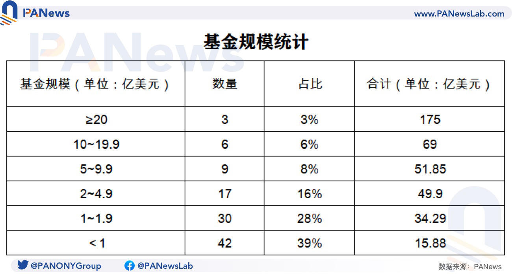

# 14 | Web 3.0正在形成的合力
你好，我是郭大治。

时间过得真快，从课程上线到现在差不多已经有5周的时间，课程也已经更新了14讲，但我们更新的速度，还是没有行业本身进展的速度那么快。比如我们在 [第2讲](https://time.geekbang.org/column/article/550345) 中提到的以太坊合并的内容，在一个多月之后，以太坊的合并已经近在眼前了。所以，在了解了Web 3.0各个领域的基本内容之后，接下来，我会再从 **宏观的视角** 给你做一些总体性的介绍，以便你可以更好地建立对于Web 3.0的理解框架。

今天这节课，我会从政府、互联网公司和风险投资基金讲起，让你知道在面对Web 3.0这一场已经开启的互联网革命的时候，我们应该要持有的基本态度和采取的主要行动。而在下节课，我们会站在行业和个人的角度，来谈谈如何把握新的机会。总之，希望能对你有些具体的帮助。

## 各国政府对Web 3.0的基本态度

在Web 3.0的实践方面，美国称得上是当前最为活跃的国家。不管是创业企业数量，还是融资规模，美国都居世界首位。而与此相对应，美国政府呢，也在Web 3.0领域采取了一种比较务实的态度。

### 美国政府的做法

美国在联邦政府层面和州政府的层面，和业界建立了一种相对透明的沟通机制，向外界表明政府的关注。同时，他们也努力向外界说明，开展Web 3.0业务需要遵循的必要规则和监管适用框架。

在2021年12月8日，美国国会众议院金融服务委员会主席马克辛·沃特斯（Maxine Waters）和首席成员帕特里克·麦克亨利（Patrick Timothy McHenry），主持了一场题为“加密资产和金融的未来：了解美国金融创新的挑战和好处” [听证会](https://m.cls.cn/detail/891990)。麦克亨利在听证会上强调了一个观点，“Web 3.0是下一代的互联网，未来的影响可能比互联网还大，应该如何确保Web 3.0革命发生在美国，让美国在这次竞赛中保持竞争力”，这个观点引起了参会者的普遍认同，这次听证会，也成为美国政界对于Web 3.0基本态度的首次公开表达。

然后，在2022年3月9日晚，美国总统拜登正式签署14067号《关于确保负责任地发展数字资产》的行政命令，该命令主要强调了围绕消费者和投资者保护、金融稳定、非法金融活动，其在全球金融系统及经济竞争中的领先地位、金融包容性以及负责任的创新等领域，美国政府应该采取的积极态度，并督促政府部门关注风险，积极探索和建立相关的监管政策。

接着，2022年6月7日，美国共和党参议员辛西娅·鲁米斯（Cynthia Lummis）和民主党参议员科尔斯藤·吉利布兰德（Kristen Gillibrand），发起了一份跨党派提案《负责任的金融创新法案》（The Responsible Financial Innovation Act），希望针对Web 3.0监管中遇到一些具体问题，比如税收、证券属性、支付、银行、监管以及消费者保护等方面，提出具体的方案。

举例来说，在 **税收** 方面，提案希望针对个人以及DAO，通过各种Web 3.0相关应用获得的收入，提出明确的税务征收和豁免的说明，比如在“挖矿”和“质押（Staking）”业务中，如果收益没有被处置，则不应被计入应税所得；而如果收益已经被处置，则应计入应税所得。

在 **借贷** 业务中，参照美国目前已有的证券借贷相关的规定，贷方获得的超过其自行持有的可获收益部分的超额收益，在处置之前不应计为应税收入，但在处置之后应被计为应税收入。

然后，因为“分叉”和“空投”获得的收入，应该被计为应税收入；因为“加密资产交易”发生的损失，则应计为个人收入；而去中心化自治组织（DAO），则应被接受为税法意义上的商业实体，相应地，其实现的一切收入，需要按照税法规定进行税务申报。

另外 **在州政府层面**，2022年5月4日，美国加州州长加文·纽森姆（Gavin Christopher Newsom）签署了一项行政命令，强调加州将通过和美国联邦政府加强合作、为区块链应用创造机会以及加强消费者保护等方式，来促进加州为区块链创业公司提供一个公平、包容和利益均衡的商业环境。

而在加州之外，迈阿密对于Web 3.0的发展也非常积极，他们提出了一个把迈阿密建成Web 3.0新硅谷的计划，迈阿密不仅每年一次举办NFT全球大会，还积极支持基于加密资产进行支付，甚至包括房产。迈阿密还成为了美国第一个将数字货币收益作为股息，发放给城市居民的城市，而市民需要通过去中心化钱包，来接收和使用这些资金。

### 日本、新加坡以及其他各国政府的做法

再说说 **日本政府**，他们对于Web 3.0也表现出了非常明确的积极态度。

2022年6月7日，日本政府批准了《2022年经济财政运营和改革的基本方针》，该计划提出，日本将为建设一个去中心化数字世界，创造必要的环境。

而为了实现这一承诺，日本政府设立了专门的Web 3.0部长，发布了《NFT白皮书》《关于在日本社会开放Web 3.0稳定币的提案》，以及世界上第一部关于稳定币的法案《资金决算法案修订案》，旨在为Web 3.0创业者提供指引，推动日本Web 3.0发展。

还有 **新加坡**。新加坡一直以开放而积极的产业政策，以及透明和高效的营商环境而称著，对于Web 3.0的态度也不例外。

新加坡已经建立起了一个包括会展、投资、孵化等多种业态在内的Web 3.0产业生态，新加坡最大的国企，也是最大的投资机构 [淡马锡](https://zh.wikipedia.org/zh-cn/%E6%B7%A1%E9%A9%AC%E9%94%A1%E6%8E%A7%E8%82%A1)，也多次出手，投资Web 3.0项目，包括专注于游戏领域的公链 [Immutable](https://twitter.com/immutable)、投资和行研机构 [Amber Group](https://www.ambergroup.io/)，以及数字资产交易平台 [FTX.US](https://ftx.us/)。

另外就是 **欧盟**，他们通过制定《加密资产市场条例》（MiCA），为Web 3.0涉及加密资产的相关业务提供指引。在这个条例中，主要是提出他们会严格监管加密资产交易所和稳定币，而对于NFT、Pow挖矿则不予监管，DeFi暂时不予监管。但在2023年之后，欧盟会试点以嵌入式的方式来进行监管。

OK，我们再把目光转到 **阿联酋**。2022年3月，阿联酋的迪拜，设立了虚拟资产监管局（VARA），而且还通过了第一部关于加密资产交易的法律，规范了加密资产交易相关业务。迪拜希望通过立法，促进其成为全球加密资产市场的关键一环。

而且，阿联酋还通过设立免征所得税和公司税的特区，允许设立外资独资型加密资产公司，以及专门针对这一领域的孵化器，来吸引全球Web 3.0公司入驻。

最后是 **帕劳**，他们推出了数字居民身份项目RNS，为世界各地的人们提供加入帕劳体验Web 3.0的机会，并且也允许加密资产交易平台在本地注册。

所以，基于以上内容，我们能发现，多国政府不仅对于Web 3.0创意发展的意义有深度的认知，同时也在采取积极的行动，为Web 3.0的具体业务设置基本框架。不论是美国、欧洲，还是迪拜、帕劳等小型经济体，他们都在结合自己的资源情况，积极探索Web 3.0的应用落地。

## 互联网公司对Web 3.0的基本态度和采取的行动

2022年，新冠疫情在全球的肆虐进入第三年，虽然受疫情影响人们对线上场景的依赖进一步加强，但全球大型互联网公司的经营业绩，却难言乐观。

就拿Facebook的母公司Meta公布的2022年第一季财报来说，其总营收同比增加了7%，但是净利润却同比下降21%；谷歌母公司Alphabet，在2022年第一季度的净利润，同比下滑8%，虽然总营收增幅达23%，但这已经是2020年以来的最低记录；还有微软发布2022年财年第四季度财报，其第四财季营收统计增长12%，净利润同比增长2%。

其实，以上数字都说明了同一个问题， **从移动互联网开始的一波红利已经遇到了天花板**，考虑到各国政府针对数据泄露和数据滥用的监管力度，都在持续加强，那么以大型互联网公司为代表的消费互联网，实际上已经很难持续原来的高速增长了。

大型互联网公司要想在Web 3.0掀起的这场互联网革命中，找到自己的新的成长空间，首先需要的就是 **对于自己功能的重新定位**。

那么，从目前大型互联网的实践来看，主要体现在了两个方向，一个是以Facebook为代表的元宇宙路线，另外一个是以谷歌为代表的基础设施路线。

### 以Facebook为代表的元宇宙路线

先说Facebook，他们向元宇宙进发的决心和行动市场都是有目共睹的。

早在2014年，Facebook就收购了 [Oculous](https://zh.wikipedia.org/zh-cn/Oculus)，并经过数年的连续投资，推出了在VR市场占据绝对优势的Oculous Quest系列成品。

然后在2021年10月，Facebook更名Meta，Oculous产品线被整合为了 **Reality Labs**，专门负责元宇宙相关产品的研发。截至2022年第一季度，Reality Labs已有员工近万名，已经占Meta全体员工总数的20%，目前也已经推出了Horizon Workroom等产品（Horizon Workroom可以为用户提供一种虚拟和现实相混合的办公环境，用户可以将自己的办公桌、电脑等设备带到这个虚拟空间，并进行多人互动和会议）。

此外，Facebook还积极推广 **稳定币** 项目，2019年，他们就发布了Libra项目白皮书，计划为多国货币打造一个通用的稳定币的发行平台，后来项目方案几经修改，最终改名为Diem并上线，现在也已经可以在Shopify、Uber和Sportify等平台支付使用了。

### 以谷歌为代表的基础设施路线

OK，然后我们再来看谷歌。

2022年5月，谷歌组建一个Web 3.0团队，目标是为区块链开发人员提供后端服务。谷歌的Web 3.0团队设置在了谷歌云旗下，这种组织架构的设计，显然就是希望谷歌云能在不断增长的区块链基础设施服务市场中，获得更大的份额。

那么，虽然说，区块链是以去中心化的节点为基本计算单元的，但是目前其实有相当多的节点，是运营在云计算平台上的，比如微软2015年在Azure云服务平台中，加入了BaaS（Blockchain as a Service）服务，为企业客户、合作伙伴和开发人员，提供一键式基于云的区块链开发环境，让他们可以快速创建基于公有云、私有云以及混合云的区块链环境。

另外，亚马逊云也针对区块链节点运营服务，推出过专门的产品，并且已经在这一领域获得了比较大份额的市场。比如曾经有一次，亚马逊云宕机，就同时导致了Coinbase和Binance暂停服务。

所以说， **以“自下而上”重构互联网为目的的Web 3.0，对于中心化的基础设施服务既存在着一种心理上的排斥，又存在着一种事实上的依赖。** 谷歌正是瞄准了这一机会，为其正处于上升势头的云服务，增添了一份新的发展空间，毕竟谷歌云相对于亚马逊云和微软云来说，还处于明显的劣势。

而相对于谷歌和Facebook，微软在Web 3.0领域的发力，更具有一种多元化的色彩。

微软早年就布局了 **去中心化身份认证**，希望通过提供一种跨平台的、通用的数字身份，来为用户使用各种数字化应用提供便利，也希望能对用户产生一种新的粘性。

2021年4月， **Microsoft Azure Active Directory** 可验证凭证的预览版上线，这个系统最大的特点，就在于可以给用户创造一种具有隐私保护功能，并且不受某一种应用限制的身份体系。

此外，微软在内容创作方面也频频出手，不仅在2014年收购了曾经占据游戏流量榜首的《我的世界》，还在2022年1月斥资687亿美元收购动视暴雪，从而为其游戏及内容层面增添了新的砝码。

## Web 3.0在部分领域形成的热点效应

而在这些互联网巨头之外，Web 3.0也正在某些领域，形成了非常明显的 **热点效应**。

**其一是支付。** 包括Mastercard、Paypal和Square在内的美国支付巨头都已入局，而且也推出了相应的产品开始抢占市场。

其中，Square主打法币入金业务，通过支持多种法币买卖加密资产，这类业务的收入已经在Square的总收入中占据了相当比例的份额；Paypal是主动出击日本、英国等海外市场；而MasterCard则推进到项目层面，通过接入Immutable等公链，为其应用生态提供支付服务。

**其二是社交。** 一方面，Twitter、Instagram等社交平台，都在纷纷测试NFT展示功能，使得用户通过这些已有账户，就可以展示自己的身份和个性。另一方面，不同的平台如Instagram和Facebook，也正在探讨用户数据的可迁移性，目标是用户可以把自己的社交关系，在不同的平台之间进行融合，从而使用户能够对自己的数据掌握主动权。

## 风险投资基金

不过，如果说大型互联网公司，对于Web 3.0还是在采取一种局部适应的态度的话，那么风险投资基金对于Web 3.0的态度，可谓是 **毫无保留地全面拥抱**。作为最聪明、也是对趋势最敏感的资金，风险投资机构针对Web 3.0的投资规模在迅速加大，对于赛道选择也更加全面。

首先，我们可以根据01区块链、零壹智库 [《中国区块链产业发展普查报告（2021）》](https://www.01caijing.com/finds/details/310635.htm) 的数据来看。

2021年，全球区块链产业一共发生了1812笔融资事件，其中1433笔披露金融的融资，涉及的金额总计达486.74亿美元，而这里面有70%的融资事件，是战略投资或种子/天使轮投资，14%的融资事件为A轮，4%的融资事件为B轮，其余都是并购。

我们从 **融资发生的地域** 来看，融资发生数量最多的国家是美国，在全球总体融资事件中，占比达42.54%。其次是中国，占比为8.33%，英国、加拿大发生的融资事件略少于中国，占比分别约为8%左右。

再从 **融资项目所在的细分赛道** 来看，加密资产交易相关项目占比最高，大约接近项目总数的30%。另外，NFT相关、DeFi和链游等赛道获得的融资，也比较可观，而分布式存储/计算、身份认证等赛道，则处于第三梯队。

事实上，进入2022年，虽然加密资产市场行情出现了比较大的回调，但风险投资基金对于Web 3.0的热情依然不减。

[根据PANews不完全统计](https://www.panewslab.com/zh/articledetails/e4inotkt.html)，2022年上半年，全球范围共推出了107支Web 3.0相关主题基金，总金额达399亿美元。其中，资金规模排在前三位的，分别是Tiger Global于2月推出的新基金Private Investment Parters（110亿美元）、a16z的第四支加密货币基金Crypto Fund 4（45亿美元），以及加密资产交易所FTX推出的风险投资基金（20亿）。

那么，我们从 **发起设立投资基金的机构类型** 来看，这107支基金，主要是由6类机构发起的，分别是传统风险投资机构、Crypto Fund（即加密行业原生的投资机构）、生态基金、加密资产交易所、Web 3.0应用类项目以及其他机构。而其中，Crypto Fund、生态基金和传统风投机构，在基金数量上相对其他类型机构来说，都表现出了比较明显优势。

我们再从 **基金规模** 上看，仅传统风投机构，就占到了全部基金的一半以上，而且从基金的平均规模上来看，传统风投机构成立的基金，也还是占据了明显的优势，同时加密资产交易所成立的基金，也有一定的规模优势。

另外从 **基金公布的拟投资对象** 来看，基础设施、工具、元宇宙、NFT及游戏，都是各基金相对聚焦的投资领域，而DeFi、DAO和中心化交易所则涉及得比较少。当然，也还有专门针对链游和基础设施的专项基金。

所以可见，对于风险投资基金来说，就算是处于市场比较低迷的状态下，其对于融资金额也还是保持在了比较高的水平上。

## 小结

这节课，我们主要介绍了各国政府对于“确保Web 3.0首先发生在本国”的基本态度，同时也了解了大型互联网公司，在Web 3.0基础设施和应用方面的探索。另外，风险投资基金作为推动Web 3.0发展的重要力量，即使在市场低迷的上半年，其融资金额仍然保持在较高的水平。

可见，作为世界上对趋势最敏感，也是最聪明的几类机构，他们已经用实际行动，表明了自己对于Web 3.0的基本态度。

## 思考题

除了政府、互联网公司和风险投资基金之外，你认为还有哪类机构对于Web 3.0的发展感兴趣？他们的出发点是什么呢？

欢迎在评论区留言，分享你的看法。另外，也欢迎你把今天的内容分享给更多的朋友。